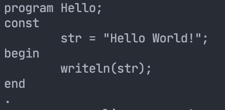

### 序言

## 1. 引言

#### 1.1 文件结构


*  根目录
   *  Code：工程代码区域，**为了跨系统路径统一的方便，只能在这一目录运行可执行文件**`bin/main`。
      *  bin：可执行文件生成路径
      *  build：编译产生的目标文件`.o`和`makefile`自动生成的依赖文件`.d`
      *  include：头文件路径`.hpp`，包括bison编译产生的头文件
      *  source：源文件路径`.cpp`，包括flex和bison编译产生的文件
      *  lex_yacc：flex和bison源文件路径
      *  Test：用于测试的`.spl`代码路径
      *  Makefile
   *  Output：程序运行过程中产生的文件，比如语法树
   *  Resource：存放文档所用图片

#### 1.2 工程编译

采用全自动的`Makefile`文件编译。在路径`./Code`下执行指令

```bash
make
```

即可。下面的Makefile对任何工程都适配，只需要简单修改自定义的路径名，以及`flex`和`bison`文件的名字即可

```makefile
#The Target Binary Program
LEX			:= flex
YACC		:= bison
TARGET      := main
CC			:= g++
#The Directories, Source, Includes, Objects, Binary and Resources
SOURCE_DIR  := source
INCLUDE_DIR := include
LEX_YACC	:= lex_yacc
BUILD_DIR   := build
TARGET_DIR  := bin
SRC_EXT     := cpp
DEP_EXT     := d
OBJEXT      := o

#Flags, Libraries and Includes
CPPFLAGS	:= -std=c++17
INCLUDE     := -I$(INCLUDE_DIR)
DEPENDENCY  := -I$(INCLUDE_DIR)

# flex和bison文件名
FLEX_FILE	:= lex
BISON_FILE	:= yacc

#---------------------------------------------------------------------------------
#不要修改下面
#---------------------------------------------------------------------------------
SOURCES     := $(shell find $(SOURCE_DIR) -type f -name *.$(SRC_EXT))
OBJECTS     := $(patsubst $(SOURCE_DIR)/%,$(BUILD_DIR)/%,$(SOURCES:.$(SRC_EXT)=.$(OBJEXT)))

#Defauilt Make
all: lex yacc resources $(TARGET)

lex:
	$(LEX) -o $(SOURCE_DIR)/$(FLEX_FILE).yy.cpp $(LEX_YACC)/$(FLEX_FILE).l

yacc:
	$(YACC) -o $(SOURCE_DIR)/$(BISON_FILE).tab.cpp $(LEX_YACC)/$(BISON_FILE).y -d
# 把生成的yacc.tab.hpp转移到include路径
	@mv $(SOURCE_DIR)/$(BISON_FILE).tab.hpp $(INCLUDE_DIR)/

#Remake
remake: cleaner all

#Make the Directories
directories:
	@mkdir -p $(TARGET_DIR)
	@mkdir -p $(BUILD_DIR)

#Clean only Objecst
clean:
	@$(RM) -rf $(BUILD_DIR)

#Full Clean, Objects and Binaries
cleaner: clean
	@$(RM) -rf $(TARGET_DIR)

#Pull in dependency info for *existing* .o files
-include $(OBJECTS:.$(OBJEXT)=.$(DEP_EXT))

#Link
$(TARGET): $(OBJECTS)
	$(CC) $^ -o $(TARGET_DIR)/$(TARGET) 

#Compile
$(BUILD_DIR)/%.$(OBJEXT): $(SOURCE_DIR)/%.$(SRC_EXT)
	@mkdir -p $(dir $@)
	$(CC) $(CPPFLAGS) $(INCLUDE) -c -o $@ $<
	@$(CC) $(CPPFLAGS) $(DEPENDENCY) -MM $(SOURCE_DIR)/$*.$(SRC_EXT) > $(BUILD_DIR)/$*.$(DEP_EXT)
	@cp -f $(BUILD_DIR)/$*.$(DEP_EXT) $(BUILD_DIR)/$*.$(DEP_EXT).tmp
	@sed -e 's|.*:|$(BUILD_DIR)/$*.$(OBJEXT):|' < $(BUILD_DIR)/$*.$(DEP_EXT).tmp > $(BUILD_DIR)/$*.$(DEP_EXT)
	@sed -e 's/.*://' -e 's/\\$$//' < $(BUILD_DIR)/$*.$(DEP_EXT).tmp | fmt -1 | sed -e 's/^ *//' -e 's/$$/:/' >> $(BUILD_DIR)/$*.$(DEP_EXT)
	@rm -f $(BUILD_DIR)/$*.$(DEP_EXT).tmp

	
#Non-File Targets
.PHONY: all remake clean cleaner resources
```

#### 1.3 运行说明

请在路径`./Code/`下运行可执行文件

```c++
./bin/main
```

如果执行文件时不带参数，则在控制台直接输入spl代码。



也可以带一个参数指明`spl`文件名，直接编译整个文件。注意，只需要指明文件名而不用路径，且`spl`文件必须放在目录`./Code/Test`下。

```bash
./bin/main HelloWorld.spl
```

#### 1.4 配置说明

Flex：flex 2.5.35(flex-32)

Bison：bison (GNU Bison) 2.3

g++：Apple clang version 12.0.5 (clang-1205.0.22.9)

C++标准：-std = c++17


##2.词法分析

####2.1 关键token正则表达式

```
Letter  [a-zA-Z]
Digit   [0-9]
Integer (0|[1-9]{Digit}*)
Real    {Integer}.[0-9]+
Identifier  {Letter}({Letter}|{Digit}|_)*
```

其中标识符以字母开头，后面可以由数字、字母或下划线任意组合。

####2.2 行数获取

flex和yacc文件都可以分为定义区、规则区和C语言代码区

定义区

<center>
  定义区</br>%%</br>
规则区</br>%% </br>
代码区</br>
</center>

在定义区中，声明全局变量表明当前词法分析器所读取的行数。

```c++
extern unsigned int line_number;

该变量在文件`yacc.y`中定义，初始化为1。在规则区中，每碰到回车，就会执行修改行数的操作。

​```yacc
"\n" {
    line_number ++;
}
```

在lex内部，对每一个token会维护一个结构变量yylloc，我们可以在读取到标识符token时，对这一变量进行修改，这样在yacc处理某个token时，行数可以作为成员变量被访问

lex.l规则区：

```flex
{Identifier}    {
    yylval.sValue=new char[strlen(yytext)];
    yylloc.first_line=line_number;
    strcpy(yylval.sValue,yytext);
    return ID;
}
```

yacc.y规则区示例，通过$@(\mbox{token在规则中index}).first\_line$可以访问到在lex中赋予的行标号：

```c++
const_expr_list
	: const_expr_list ID EQUAL const_value SEMI
	{
		$$->push_back(new Node(EQUAL, 2, new Node(@2.first_line, $2, NodeType::Identifier), $4));
	}
	| ID EQUAL const_value SEMI
	{
		$$ = new std::vector<Node *>();
		$$->push_back(new Node(EQUAL, 2, new Node(@1.first_line, $1, NodeType::Identifier), $3));
	}
```

####2.3 字符串读取

我们字符串以双引号""作为开始和结束，在字符串内部出现的字符串应该作为纯粹的值来处理，而不能用常规的parser进行解析。为了实现这一功能，flex提供了“状态”设定的功能。在不同的状态下可以按照不同的正则表达式来处理。在定义区可以自定义正在读取字符串的状态

```c++
/* 读取字符串的状态 */
%x READING_STRING
```

并在定义区定义储存读取字符串的流

```c++
%{
#include <sstream>
std::stringstream ss;
... ...
  %}
```

正常状态下，读到第一个双引号，就进入状态READING_STRING

```c++
"\"" {
    //开始读取字符串
    BEGIN READING_STRING;
    //清空string stream
    ss.clear();
    ss.str("");
}
```

在状态READING_STRING，碰到另一个双引号时，就会结束字符串的读取，恢复正常状态。

```c++
<READING_STRING>"\"" {
    //结束字符串读取
    BEGIN INITIAL;
    yylval.sValue=new char[ss.str().length()];
    strcpy(yylval.sValue,ss.str().c_str());
    return STRING;
}
```

否则，处于状态READING_STRING时，任何字符都会作为字符串的内容被接受。（注：必须写在上一条的后面）

```c++
<READING_STRING>. {
    ss<<yytext[0];
}
```

#### 2.4 注释

采用双斜线`\\`注释一行的方案。同理2.3，我们声明一个注释状态

```c++
/* 注释状态 */
%x COMMENT
```

解析到双斜线时，改变状态

```c++
"//" {
    // 注释
    ss.clear();
    ss.str("");
    BEGIN COMMENT;
}
```

在注释状态，遇到回车时就回到正常状态

```c++
<COMMENT>"\n" {
    // 注释碰到回车结束
    BEGIN INITIAL;
    std::cout<<"comment: "<<ss.str()<<std::endl;
}
```

为了调试，读取注释内容

```c++
<COMMENT>. {
    // 注释状态忽略一切，为了调试，输出一下注释内容
    ss<<yytext[0];
}
```

####2.5 关键词

（1）运算符、界符定义

| LP: “(”        | PLUS: “+”     |
| -------------- | ------------- |
| RP: “)”        | MINUS: “－”   |
| LB: “[”        | GE: “ >=”     |
| RB: “]”        | GT: “ >”      |
| DOT: “•”       | LE: “ <=”     |
| COMMA: “,”     | LT: “ <”      |
| COLON: “:”     | EQUAL: “ =”   |
| MUL: “*”       | ASSIGN: “ :=” |
| DIV: “/”       | MOD: “MOD”    |
| UNEQUAL: “< >” | DOTDOT: “..”  |
| NOT: “NOT”     | SEMI: “;”     |

（2）系统函数、过程、常数、类型

SYS_CON: "false", "maxint", "true"

SYS_FUNCT: "abs", "chr", "odd", "ord", "pred", "sqr", "sqrt", "succ"

SYS_PROC: "write", "writeln"

SYS_TYPE: "boolean", "char", "integer", "real", "string"

READ: “read”

INTEGER：整数常数值

REAL：实数常数值

CHAR：字符常数值，用单引号括起来，如’a’，‘A’<’a’

（3）关键字

"and",    "array",    "begin",    "case",  "const", "div",   "do",   "downto",  "else",   "end",  "for", "function", "goto", "if", "mod", "not", "of",   "or",   "packed", "procedure", "program", "record",  "repeat",  "then",  "to", "type",  "until", "var",  "while".


## 3. 语法分析

####3.1 Context Free Grammar

1. program ： program_head routine DOT

   program_head ： PROGRAM ID SEMI

   ```
   program {程序名};
   {routine}
   .
   ```

2. routine ： routine_head routine_body

   routine_head ： const_part type_part var_part routine_part

   ```c++
   {const_part}	// 常数
   {type_part}	// 定义区
   {var_part}	// 变量定义区
   {routine_part} // 功能函数/过程定义区
   
   
   {routine_body} // 主函数
   ```

3. 程序常量定义区：相当于C语言中的`const`类型变量

   const_part ： CONST const_expr_list | ε

   const_expr_list ： const_expr_list NAME EQUAL const_value SEMI | NAME EQUAL const_value SEMI

   ```
   const
   		ID_1 = 常量1 ;
   		ID_2 = 常量2 ;
   		... ...
   ```

4. 用户类型定义区：相当于C语言中的`typedef`和`struct`

   type_part ： TYPE type_decl_list | ε

   type_decl_list ： type_decl_list type_definition | type_definition

   type_definition ： NAME EQUAL type_decl SEMI

   ```
   type
   	type_1 = {type_decl} ;
   	type_2 = {type_decl} ;
   	... ...
   ```

   其中一条类型定义分为三种

   type_decl ： simple_type_decl | array_type_decl | record_type_decl

   （1）simple_type_decl 

   ​					： SYS_TYPE 【整型、浮点、字符、字符串、boolean】

   ​				     | NAME 【在type区域上面代码自定义的类型】

   ​				     | LP name_list RP 【枚举类型，比如(red, green, blue)】

   ​     			    | const_value DOTDOT const_value 【range类型，其中const_value只能是整数，表示范围】

   ​     			    | MINUS const_value DOTDOT const_value【同上】

   ​    			     | MINUS const_value DOTDOT MINUS const_value【同上】

   ​     			    | NAME DOTDOT NAME【同上，这里的name是在常数区定义的常数变量名】

   （2）array_type_decl ： ARRAY LB simple_type_decl RB OF type_decl

   这里的{simple_type_decl}只能是range类型或者枚举类型；type_decl可以引用类型定义区上面自定义的类型。

   ```c++
   array[0 .. 5] of {type_decl}
   array[(red, green, blue)] of {type_decl}
   ```

   （3）record_type_decl 【相当于C语言中的struct类型】

   ​					 ：RECORD field_decl_list END

   field_decl_list ： field_decl_list field_decl | field_decl

   field_decl ： name_list COLON type_decl SEMI

   其中name_list就是以逗号作为分隔的名字列表

   ```c++
   type:
   		Date = record // 日期
   							Year : integer;
   							Month: 1 .. 12;
   							Days : 1 .. 31;
   					 end;
   		Student = record // 包含学生的出生日期以及入学日期，以及三门课的成绩
   									Birth, Enroll : Date
   									Grade : array[(Chi, Math, Eng)] of real;
   							end;
   ```

5. 程序变量定义区：定义程序逻辑区（routine_part和routine_body）中要用到的变量及其类型

   var_part ： VAR var_decl_list | ε

   var_decl_list :  var_decl_list var_decl | var_decl

   var_decl :  name_list COLON type_decl SEMI

   ```c++
   var:
   		student1, student2 : Student;	// 在3.1.4 type区域中定义的类型
       i, j, k : integer;
   		name1, name2 : string;
   ```

6. 辅助过程/函数定义区：定义主函数中要调用的函数或过程。函数/进程之间也可以相互调用，但只能调用已在前面定义的。

   routine_part

   ​		：routine_part function_decl 

   ​		 | routine_part procedure_decl

   ​     	| function_decl 【函数，具有返回值，返回的变量名隐含为函数名（所以不需要return）】

   ​		 | procedure_decl  【过程，类似于函数，但不具有返回值】

   ​		 | ε

   function_decl : function_head SEMI sub_routine SEMI

   function_head : FUNCTION NAME parameters COLON simple_type_decl 

   ```
   function {函数名} 
   {参数} : {返回类型}
   {
   	sub_routine
   };
   ```

   参数定义为parameters ： LP para_decl_list RP | ε

   类似于3.1.5，同一类型的变量可以在一起声明，变量间用逗号`,`隔开。不同类型的声明用分号`;`隔开。

   para_decl_list ： para_decl_list SEMI para_type_list | para_type_list

   比较特别的是，函数/过程的输入参数分为两种类型

   `val`：即C语言中的形参，按值传入

   `var`：即C语言的引用类型

   para_type_list ： var_para_list COLON simple_type_decl | val_para_list COLON simple_type_decl

   默认都是`val`类型，`var`类型需要用关键字声明。

   val_para_list ： name_list

   var_para_list ： VAR name_list

   ```c++
   (
     	{name_1, name_2, ...} : 类型1;
     	{name_list}						: 类型2;
   var {name_list}						: 引用类型;
   )
   ```

7. 主函数区：

   routine_body ： compound_stmt

   compound_stmt ： BEGIN stmt_list END

   stmt_list ： stmt_list stmt SEMI | ε

   顺序执行stmt语句

   ```c++
   begin
   		statement_1;
   		statement_2;
   		... ...
   end
   ```

8. stmt语句：分为`label`和`nonlabel`两类。语句前面的`label`是一个整数，代表跳转语句的位置，一个label在程序中只能出现一次。

   stmt ： INTEGER COLON non_label_stmt | non_label_stmt

   如下面语句的含义就是无限循环打印`Hello World!`

   ```c++
   begin
   	1: writeln("Hello World!");
   	goto 1;
   end
   ```

   non_label_stmt ： assign_stmt【赋值语句】

   ​							 | proc_stmt【过程语句】

   ​							 | compound_stmt【复合语句】

   ​							 | if_stmt【条件语句】

   ​							 | repeat_stmt【repeat循环】

   ​							 | while_stmt 【while循环】

   ​							 | for_stmt【for循环】

   ​							 | case_stmt【case语句】

   ​							 | goto_stmt【跳转语句】

   （1）赋值语句

   assign_stmt ： ID ASSIGN expression

   ​     				  | ID LB expression RB ASSIGN expression

   ​     				  | ID DOT ID ASSIGN expression【这里ID.ID等价于C语言中结构体成员的访问】

   ```c++
   id_1 := 5
   color[red] := id_1 / 255.0
   studeng1.name := "纯路人"
   ```

   （2）过程/函数调用语句

   proc_stmt ： ID【3.1.6区域定义的过程或无参数函数名】

      				 | ID LP args_list RP【3.1.6区域定义的函数名】

   ​    			    | SYS_PROC【系统过程，有`write`打印输入，以及`writeln`打印输入并换行】

      			 	| SYS_PROC LP expression_list RP【系统函数】			

   ​					| READ LP factor RP【类似于C中的`scanf`】

   其中系统函数有下面几种：

   *  `abs(x)`：计算绝对值$|x|$

      -    `char chr(integer x)`：$x$作为ASCII码，返回相应的字符

      -    `boolean odd(integer x)`：判断整数$x$是不是奇数

      -    `pred(x)`：对于有序类型，返回其上一个值

           `succ(x)`：对于有序类型，返回其下一个值

           比如对于整数，就是$\pm1$；对于字符，则按照ASCII码的排序

           ```pascal
           x := 10
           writeln(pred(x)) // 输出9
           writeln(succ(x)) // 输出11
           writeln(succ('B')) // 输出C
           ```

           对于枚举变量，同理

           ```pascal
           ...
           type
           		color = (red, green, blue);
           var
           		m_color : color;
           begin
           	m_color := green
           	writeln(prev(m_color))	// 输出red
           	writeln(succ(m_color))	// 输出blue
           end
           .
           ```

   *  `ord(x)`：对于有序变量，输出其排序，从0开始计数。

      对于整数，就是本身；对于字符，输出其ASCII码（十进制）；对于枚举变量同理，如上面`color`的例子中。

      ```pascal
      begin
      		m_color := green
      		writeln(ord(m_color)) // 输出1
      end
      ```

   *  `sqrt(x)`：输出平方根（square root)
   *  `sqr(x)`：输出平方（square）

   *  `read(x)`：等待用户输入，将结果输入到变量`x`，类似于C语言中的`scanf`。注：PASCAL中设置为读取文件，但是和文档给出的CFG不匹配，而且交互不太方便，所以做了修改。

   （3）条件语句

   if_stmt ： IF expression THEN stmt else_clause

   else_clause ： ELSE stmt | ε

   （4）repeat语句：相当于C语言中的do-while语句

   repeat_stmt ： REPEAT stmt_list UNTIL expression

   （5）while语句

   while_stmt ： WHILE expression DO stmt

   （6）for循环：其中`ID`对应的变量一定要是有序类型【见3.1.8（2）中对系统函数的介绍】；`direction`的方向按照`ord(x)`给出。

   for_stmt ： FOR ID ASSIGN expression direction expression DO stmt

   direction ： TO | DOWNTO

   ```pascal
   var
   	color : (red, green, blue)
   	c : char
   begin
   	for color := red to blue do // 三次循环，color分别为red, green, blue
     		{stmt}
     for c := 'z' downto 'a' do // 26次循环，c分别为'z', 'y', ..., 'a'
     		{stmt}
   end
   .
   ```

   （7）case语句：对应于C语言中的switch-case

   case_stmt ： CASE expression OF case_expr_list END

   case_expr_list ： case_expr_list case_expr | case_expr

   case_expr ： const_value COLON stmt SEMI

      				 | ID COLON stmt SEMI

   ```pascal
   const
   	one : 1
   var 
   	input : integer
   	value : integer
   begin
   	read(input); // 用户输入传入input，见3.1.8（2）的介绍
   	value := 2;
   	case input of 
     	one : {若用户输入1，执行语句};
       value : {若用户输入2，执行语句};
       3 : {若用户输入3，执行语句};
     end
   .
   ```

   （8）跳转语句：整数为语句的`label`

   goto_stmt ： GOTO INTEGER

   如下面语句的含义就是无限循环打印`Hello World!`

   ```c++
   begin
   	1: writeln("Hello World!");
   	goto 1;
   end
   .
   ```

9. 表达式：变量值、常数、函数返回值等算数组合的结果，采用常规的算数优先级（括号 > 乘除 > 加减，括号 > 交 > 并，同等级按照左结合）。

   expression_list ： expression_list COMMA expression | expression

   expression ： expression GE expr 

   ​	 | expression GT expr | expression LE expr

   ​     | expression LT expr | expression EQUAL expr 

   ​	 | expression UNEQUAL expr | expr

   expr ： expr PLUS term | expr MINUS term | expr OR term | term

   term ： term MUL factor | term DIV factor | term MOD factor | term AND  factor | factor

   *  表达式中的最小结构（最先计算）为：单个变量（包括结构体、数组访问）、函数/过程调用、常数值、取反

   factor ： NAME | NAME LP args_list RP | SYS_FUNCT | SYS_FUNCT LP args_list RP | const_value | LP expression RP | NOT factor | MINUS factor | ID LB expression RB | ID DOT ID

   *  其中参数列表可以是一列的表达式

   args_list ： args_list COMMA expression | expression

#### 3.2 语法树

定义在文件`Utils.hpp`中，在parsing流程中构造语法树，并最后绘制出来。

#####3.2.1 节点定义

（1）分类：其中Operation在语法树中存在子节点，其他的类型都是叶节点。

```c++
enum NodeType
{
    Constant,
    Identifier,  
    Operation,
    Typename
};
```

其中常数类型定义如下

```c++
enum ConstantType
{ 
    Integer, // integer
    Real, // real
    Char,
    String,
    Boolean
};
```

（2）在节点中语法树中储存的主要数据

```c++
// 常数数据
struct ValConstant
{
    ConstantType Type;
    union {
        // Value of the constant
        int iValue;
        double dValue;
        char cValue;
        char* sValue;
        bool bValue;
    };
};
// 名字数据
struct ValIdentifier
{
    char* Name; // Index to symbol table
};

// 提前声明Node类
class Node;
// 操作数据
struct ValOperation
{
    int Operator; // 操作符，都是yacc.y中定义的token
    int NumOperands; // 子节点数目
    Node** List_Operands; // 子节点
};
```

（3）节点类`class Node`

```c++
class Node
{
public:
    NodeType m_Type;
    unsigned int m_Line; // 所在行数
    union 
    {
        ValConstant m_Constant;
        ValIdentifier m_Identifier;
        ValIdentifier m_Typename;
        ValOperation m_Operation;
    };
  	// 类的方法
  	... ...
};
```

##### 3.2.2 节点成员方法

（1）常数类型节点构造函数

```c++
Node::Node(ValConstant& Cons)
        : m_Line(0), m_Type(NodeType::Constant)
    {	// 常值不会出现在符号表，行数没必要
        m_Constant = Cons;
    }
```

（2）名称 / 自定义类名构造函数

```c++
Node::Node(unsigned int Line, char* Name, NodeType Type)
        : m_Line(Line), m_Type(Type)
    {
        if (Type == NodeType::Identifier)
        {
            m_Identifier.Name = new char[strlen(Name)];
            strcpy(m_Identifier.Name, Name);
        }
        else if (Type == NodeType::Typename)
        {
            m_Typename.Name = new char[strlen(Name)];
            strcpy(m_Typename.Name, Name);
        }
        else 
        {
            std::string msg = "Unknown Type: ";
            msg.append(std::to_string(Type));
            raiseError(msg.c_str());
        }
    }
```

（3）给定子节点列表，构造Operation节点

```c++
Node(int Operator, std::vector<Node*>* List)
        : m_Line(0), m_Type(NodeType::Operation)
    {
        m_Operation.Operator = Operator;
        m_Operation.NumOperands = List->size();
        m_Operation.List_Operands = new Node*[List->size()];
        for (int i = 0;i < List->size(); ++i)
        {
            m_Operation.List_Operands[i] = (*List)[i];
        }
    }
```

（4）给定了子节点数目，但是子节点输入不定，构造Operation节点。这里利用了`<stdarg.h>`对不定参数的处理。

```c++
Node(int Operator, int NumOperands, ...)
        : m_Line(0), m_Type(NodeType::Operation)
    {
        va_list ap;
        m_Operation.Operator = Operator;
        m_Operation.NumOperands = NumOperands;
        m_Operation.List_Operands = new Node*[NumOperands];
        va_start(ap, NumOperands);
        for (int i = 0;i < NumOperands; ++i)
        {
            m_Operation.List_Operands[i] = va_arg(ap, Node*);
        }
        va_end(ap);
    }
```

（6）对现有的Operation节点添加子节点。

```c++
inline void add(Node* node)
    {
        m_Operation.NumOperands += 1;
        m_Operation.List_Operands = (Node **) realloc(m_Operation.List_Operands, 
                                                      m_Operation.NumOperands * sizeof(Node *));
        m_Operation.List_Operands[m_Operation.NumOperands - 1] = node;
    }
```

```c++
inline void add(std::vector<Node *>* List)
    {
        int Offset = m_Operation.NumOperands;
        m_Operation.NumOperands += List->size();
        m_Operation.List_Operands = (Node **) realloc(m_Operation.List_Operands,
                                                      m_Operation.NumOperands * sizeof(Node *));
        for (int i = 0;i < List->size(); ++i)
        {
            m_Operation.List_Operands[Offset + i] = (*List)[i];
        }
    }
```

（7）析构函数

```c++
~Node()
    {
        if (m_Type == NodeType::Identifier && m_Identifier.Name)
        {
            delete m_Identifier.Name;
        }
        else if (m_Type == NodeType::Operation)
        {
            for (int i = 0;i < m_Operation.NumOperands; ++i)
            {
                delete m_Operation.List_Operands[i];
            }
            delete m_Operation.List_Operands;
        }
    }
```

#### 3.3 yacc

##### 3.3.1 token定义

（1）token类型（`yacc.y`定义区）

```c++
%union {
    int iValue; // integer value
    double dValue; // double value
    char cValue; // char value
    char* sValue;
    Node* NodePtr; // Node Pointer
	std::vector<Node*>* NodePtrList; // List
};
```

（2）数据类型

```c++
// token数据类型
%token <iValue> INTEGER
%token <dValue> REAL
%token <cValue> CHAR
%token <sValue> STRING SYS_TYPE
%token <sValue> ID
```

（3）语法树节点

```c++
// 语法树节点
%type <NodePtr> expr term factor const_value expression routine
%type <NodePtr> routine_head routine_body const_part type_part var_part 
%type <NodePtrList> const_expr_list name_list var_para_list val_para_list routine_part
%type <NodePtrList> expression_list args_list field_decl_list
%type <NodePtr> compound_stmt stmt_list stmt non_label_stmt if_stmt goto_stmt
%type <NodePtr> while_stmt case_stmt case_expr case_expr_list proc_stmt
%type <NodePtr> assign_stmt var_decl var_decl_list for_stmt else_clause
%type <NodePtr> repeat_stmt type_decl_list type_definition function_decl function_head parameters
%type <NodePtr> para_decl_list para_type_list sub_routine procedure_decl procedure_head
%type <NodePtr> simple_type_decl type_decl field_decl record_type_decl array_type_decl
%type <sValue> program_head 
%type <iValue> direction
```

（4）关键字

```c++
// 运算符、定界符
%token LP RP LB RB DOT COMMA COLON MUL DIV UNEQUAL NOT
%token PLUS MINUS GE GT LE LT EQUAL ASSIGN MOD DOTDOT SEMI

// 系统函数、过程、常数、类型等单词
%token READ
%token <sValue> SYS_PROC SYS_FUNCT SYS_CON

// 关键字
%token AND ARRAY _BEGIN CASE CONST
%token DO DOWNTO ELSE END
%token FOR FUNCTION GOTO IF
%token OF OR PACKED
%token PROCEDURE PROGRAM RECORD REPEAT
%token THEN TO TYPE UNTIL VAR WHILE
```

（5）定义操作符时，额外引入的一些token。它们不出现在语法树中，但是可以指明语法树中节点的类型。

```c++
// 语法树中自定义的token
%token ROUTINE ROUTINE_BODY ROUTINE_HEAD CONST_PART VAR_PART BRACKET
%token CASE_STMT CASE_LIST TYPE_PART VAL_PARAM VAR_PARAM PARA_LIST FUNCTION_HEAD
%token SUB_ROUTINE PROCEDURE_HEAD PROC LABEL_STMT FUNCT FIELD_DECL 
%token ENUM
```

##### 3.3.2 yacc规则区

与3.1中的定义完全对应，而且较多重复性的工作。所以这里只详细介绍几种典型。

（1）节点传递

```c++
non_label_stmt
	: assign_stmt {$$ = $1;}
	| proc_stmt {$$ = $1;}
	| compound_stmt {$$ = $1;}
	| if_stmt {$$ = $1;}
	| repeat_stmt {$$ = $1;}
	| while_stmt {$$ = $1;}
	| for_stmt {$$ = $1;}
	| case_stmt {$$ = $1;}
	| goto_stmt {$$ = $1;}
	;
```

（2）Operation节点的构造：

assign语句有两个子节点，左节点是被赋值的变量，右节点是所赋的值。

```c++
assign_stmt
	: ID ASSIGN expression
	{
		$$ = new Node(ASSIGN, 2, new Node(@1.first_line, $1, NodeType::Identifier), $3);
	}
	| ID LB expression RB ASSIGN expression
	{
		$$ = new Node(ASSIGN, 2, 
          				new Node(BRACKET, 2, new Node(@1.first_line, $1, NodeType::Identifier), $3),
					  			$6);
	}
	| ID DOT ID ASSIGN expression
	{
		$$ = new Node(ASSIGN, 2,
					  			new Node(DOT, 2, new Node(@1.first_line, $1, NodeType::Identifier),
					  											 new Node(@3.first_line, $3, NodeType::Identifier))
					  			, $5);
	}
	;
```

*  $x \leftarrow x^{2}/(1 + 4.124x)$【注：语法树中，`[]`包裹操作，`id()`包裹变量名称，`c()`包裹常数】


*  $temp\leftarrow \sqrt{40}$

   

（3）常值节点

```c++
const_value
	: INTEGER
    {
        ValConstant temp;
        temp.Type = ConstantType::Integer;
        temp.iValue = $1;
        $$ = new Node(temp);
    }
	| REAL
    {
        ValConstant temp;
        temp.Type = ConstantType::Real;
        temp.dValue = $1;
        $$ = new Node(temp);
    }
	| CHAR
    {
        ValConstant temp;
        temp.Type = ConstantType::Char;
        temp.cValue = $1;
        $$ = new Node(temp);
    }
	| STRING
	{
				ValConstant temp;
        temp.Type = ConstantType::String;
        temp.sValue = $1;
        $$ = new Node(temp);
	}
	| SYS_CON
	{
				ValConstant temp;
				temp.Type = ConstantType::Boolean;
				temp.bValue = $1;
				$$ = new Node(temp);
	}
	;
```

（4）数目不定的平级列表，且上级节点未知。比如表达式列表`expression_list`中，所有表达式都是作为函数的输入，都应该作为上级函数节点的子节点，它们是平级的。所以要先把这些平级的节点放到一个列表中，当构造其上级节点时，再把它们一起输入到上级节点。

在第一个碰到的列表单元中初始化（yacc是LALR(1) parsing）一个`std::vector<>`，在后续把节点添加到这个vector。这样在碰到上级节点时，可以用这个`std::vector<>`对上级节点进行初始化。

```c++
expression_list
	: expression_list COMMA expression
	{
		$$->push_back($3);
	}
	| expression
	{
		$$ = new std::vector<Node*>();
		$$->push_back($1);
	}
	;

proc_stmt	// 在上级节点中可以利用这个std::vector<>进行平级的初始化
  : SYS_PROC LP expression_list RP
	{
		$$ = new Node(SYS_PROC, 1, new Node(@1.first_line, $1, NodeType::Identifier));
		$$->add($3);
	}
	| ...
```


（5）数目不定的分级列表。比如case语句中


