## 1. 引言

#### 1.1 文件结构


*  根目录
   *  Code：工程代码区域，**为了跨系统路径统一的方便，只能在这一目录运行可执行文件**`bin/main`。
      *  bin：可执行文件生成路径
      *  build：编译产生的目标文件`.o`和`makefile`自动生成的依赖文件`.d`
      *  include：头文件路径`.hpp`，包括bison编译产生的头文件
      *  source：源文件路径`.cpp`，包括flex和bison编译产生的文件
      *  lex_yacc：flex和bison源文件路径
      *  Test：用于测试的`.spl`代码路径
      *  Makefile
      *  Output：程序**运行过程**中产生的输出文件
         *  AST_txt：文本格式的语法树
         *  AST_raw：描述语法树的文本流，用于python代码进行进一步的处理
         *  AST_py：python代码解析`AST_raw`中文件后，输出的语法树图片
         *  Logs：输出的类型信息，后缀为`.st`的文件包含符号表，以及语法树中各个节点的类型（与语法树上的id一一对应）
   *  Resource：存放文档所用图片

#### 1.2 工程编译

采用全自动的`Makefile`文件编译。在路径`./Code`下执行指令

```bash
make
```

即可。下面的Makefile对任何工程都适配，只需要简单修改自定义的路径名，以及`flex`和`bison`文件的名字即可

```makefile
#The Target Binary Program
LEX			:= flex
YACC		:= bison
TARGET  := main
CC			:= g++
#The Directories, Source, Includes, Objects, Binary and Resources
SOURCE_DIR  := source
INCLUDE_DIR := include
LEX_YACC	:= lex_yacc
BUILD_DIR   := build
TARGET_DIR  := bin
SRC_EXT     := cpp
DEP_EXT     := d
OBJEXT      := o

#Flags, Libraries and Includes
CPPFLAGS	:= -std=c++17
INCLUDE     := -I$(INCLUDE_DIR)
DEPENDENCY  := -I$(INCLUDE_DIR)

# flex和bison文件名
FLEX_FILE	:= lex
BISON_FILE	:= yacc

#---------------------------------------------------------------------------------
#不要修改下面
#---------------------------------------------------------------------------------
SOURCES     := $(shell find $(SOURCE_DIR) -type f -name *.$(SRC_EXT))
OBJECTS     := $(patsubst $(SOURCE_DIR)/%,$(BUILD_DIR)/%,$(SOURCES:.$(SRC_EXT)=.$(OBJEXT)))

#Defauilt Make
all: lex yacc resources $(TARGET)

lex:
	$(LEX) -o $(SOURCE_DIR)/$(FLEX_FILE).yy.cpp $(LEX_YACC)/$(FLEX_FILE).l

yacc:
	$(YACC) -o $(SOURCE_DIR)/$(BISON_FILE).tab.cpp $(LEX_YACC)/$(BISON_FILE).y -d
# 把生成的yacc.tab.hpp转移到include路径
	@mv $(SOURCE_DIR)/$(BISON_FILE).tab.hpp $(INCLUDE_DIR)/

#Remake
remake: cleaner all

#Make the Directories
directories:
	@mkdir -p $(TARGET_DIR)
	@mkdir -p $(BUILD_DIR)

#Clean only Objecst
clean:
	@$(RM) -rf $(BUILD_DIR)

#Full Clean, Objects and Binaries
cleaner: clean
	@$(RM) -rf $(TARGET_DIR)

#Pull in dependency info for *existing* .o files
-include $(OBJECTS:.$(OBJEXT)=.$(DEP_EXT))

#Link
$(TARGET): $(OBJECTS)
	$(CC) $^ -o $(TARGET_DIR)/$(TARGET) 

#Compile
$(BUILD_DIR)/%.$(OBJEXT): $(SOURCE_DIR)/%.$(SRC_EXT)
	@mkdir -p $(dir $@)
	$(CC) $(CPPFLAGS) $(INCLUDE) -c -o $@ $<
	@$(CC) $(CPPFLAGS) $(DEPENDENCY) -MM $(SOURCE_DIR)/$*.$(SRC_EXT) > $(BUILD_DIR)/$*.$(DEP_EXT)
	@cp -f $(BUILD_DIR)/$*.$(DEP_EXT) $(BUILD_DIR)/$*.$(DEP_EXT).tmp
	@sed -e 's|.*:|$(BUILD_DIR)/$*.$(OBJEXT):|' < $(BUILD_DIR)/$*.$(DEP_EXT).tmp > $(BUILD_DIR)/$*.$(DEP_EXT)
	@sed -e 's/.*://' -e 's/\\$$//' < $(BUILD_DIR)/$*.$(DEP_EXT).tmp | fmt -1 | sed -e 's/^ *//' -e 's/$$/:/' >> $(BUILD_DIR)/$*.$(DEP_EXT)
	@rm -f $(BUILD_DIR)/$*.$(DEP_EXT).tmp

	
#Non-File Targets
.PHONY: all remake clean cleaner resources
```

#### 1.3 运行说明

**注：请在路径`./Code/`下运行**

```c++
./bin/main
```

如果执行文件时不带参数，则在控制台直接输入spl代码。

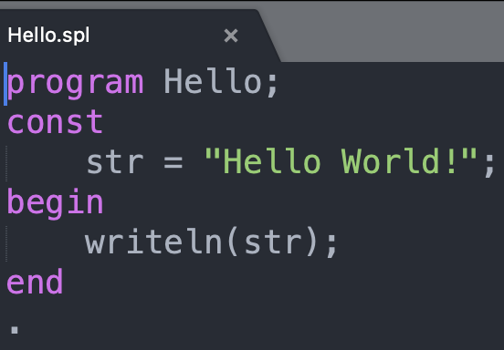

也可以带一个参数指明`spl`文件名，直接编译整个文件。注意，只需要指明文件名而不用路径，且`spl`文件必须放在目录`./Code/Test`下。

```bash
./bin/main Hello		# 输入时不需要声明文件后缀，默认都是.spl
```

这一过程会在目录`./Code/Output/AST_txt`产生对应的txt版本的语法树，如下所示

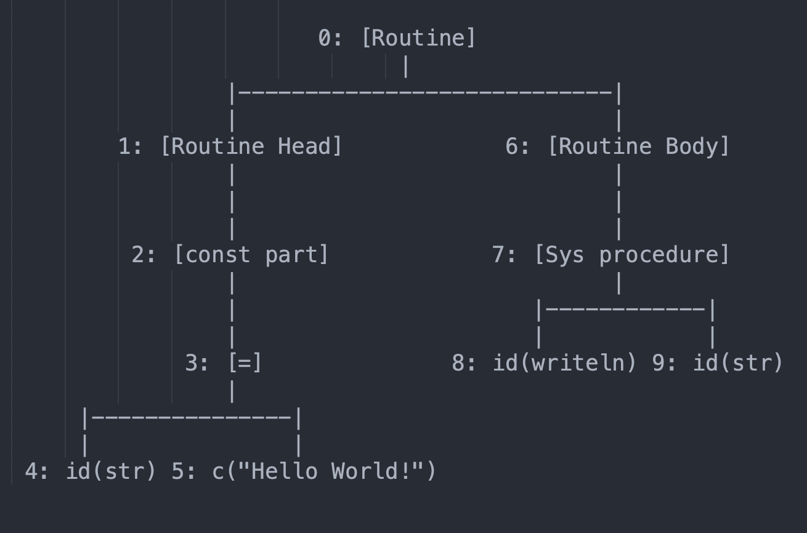

同时在`./Code/Output/AST_raw`产生描述语法树的文件，用于之后使用python进一步处理，产生图像。

配置好python以及所需的依赖包【见1.4】以后，可以运行python代码产生图片格式的语法树，路径为`./Code/Output/AST_py`

```python
python main.py Hello
```

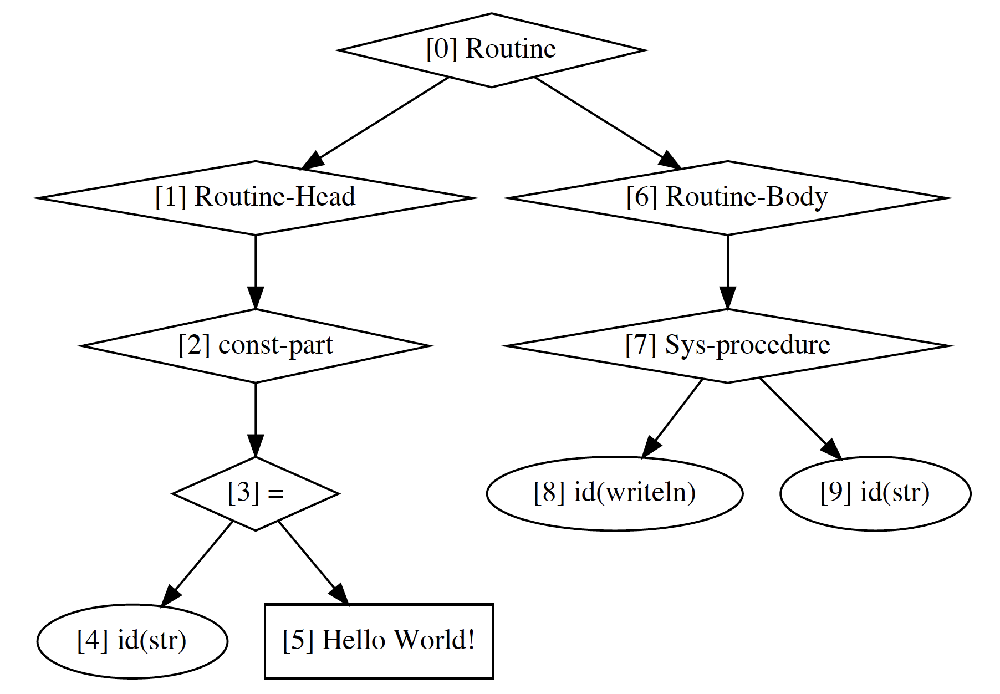

#### 1.4 配置说明

*  Flex：flex 2.5.35(flex-32)

*  Bison：bison (GNU Bison) 2.3

*  g++：Apple clang version 12.0.5 (clang-1205.0.22.9)

*  C++标准：-std = c++17

*  Python3.9：用于绘制语法树，非必要

   *  依赖包：graphviz，安装详见https://graphviz.org/download/#windows

      安装环境graphviz之后，为了在python中运行，需要

      ```bash
      pip3 install graphviz
      ```

#### 1.5 实现功能一览

以`./Code/Test/stack.spl`为例。

（1）生成语法树（文字版和图片版）

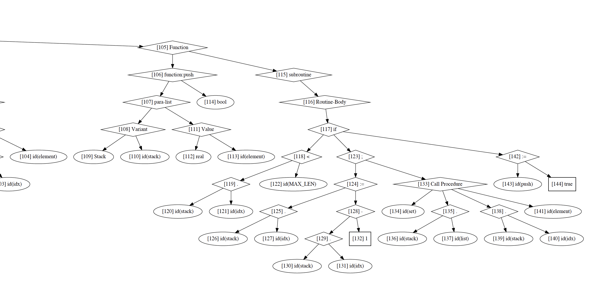

（2）生成符号表以及函数的参数表

```txt
Symbol Table: *****************
        name  line        type   attribute
         set    35   procedure
         pop    25    function    sys_type        real
         get    16    function    sys_type        real
        bool    11    sys_type     boolean
      string     0    sys_type      string
        char     0    sys_type        char
       stack    13      record         idx:     sys_type     integer
                                      list:        array       range   0 .. 1000
                                                            sys_type        real
     boolean     0    sys_type     boolean
     integer     0    sys_type     integer
        real     0    sys_type        real
        push    45    function    sys_type     boolean
        ZERO     4       const     integer           0
       Stack     7      record         idx:     sys_type     integer
                                      list:        array       range   0 .. 1000
                                                            sys_type        real
       index    14    sys_type     integer
        List     6       array       range   0 .. 1000
                                  sys_type        real
     MAX_LEN     3       const     integer        1000
----------------------------------------
function: "pop"
        name  line        type   attribute
       stack    26      record         idx:     sys_type     integer
                                      list:        array       range   0 .. 1000
                                                            sys_type        real
----------------------------------------
function: "get"
        name  line        type   attribute
        list    17       array       range   0 .. 1000
                                  sys_type        real
        name  line        type   attribute
         idx    18    sys_type     integer
----------------------------------------
function: "push"
        name  line        type   attribute
       stack    46      record         idx:     sys_type     integer
                                      list:        array       range   0 .. 1000
                                                            sys_type        real
        name  line        type   attribute
     element    47    sys_type        real
----------------------------------------
procedure: "set"
        name  line        type   attribute
        list    36       array       range   0 .. 1000
                                  sys_type        real
        name  line        type   attribute
     element    38    sys_type        real
         idx    37    sys_type     integer
```

（3）语法树节点的类型标注。其中的id与语法树图片上的id一一对应。

```txt
Type of AST Node: *****************
type of id: 48
    sys_type        real
type of id: 49
    sys_type        real
type of id: 50
    sys_type        real
type of id: 51
       array       range   0 .. 1000
                sys_type        real
type of id: 52
    sys_type     integer
type of id: 63
    sys_type     boolean
type of id: 64
    sys_type     integer
type of id: 67
    sys_type     integer
type of id: 69
    sys_type     integer
type of id: 70
    sys_type     integer
type of id: 73
    sys_type     integer
type of id: 74
    sys_type     integer
type of id: 77
    sys_type     integer
type of id: 78
    sys_type        real
type of id: 79
    sys_type        real
type of id: 80
    sys_type        real
type of id: 82
       array       range   0 .. 1000
                sys_type        real
type of id: 85
    sys_type     integer
type of id: 102
    sys_type        real
type of id: 103
    sys_type        real
type of id: 104
       array       range   0 .. 1000
                sys_type        real
type of id: 105
    sys_type     integer
type of id: 106
    sys_type        real
type of id: 120
    sys_type     boolean
type of id: 121
    sys_type     integer
type of id: 124
    sys_type     integer
type of id: 126
    sys_type     integer
type of id: 127
    sys_type     integer
type of id: 130
    sys_type     integer
type of id: 131
    sys_type     integer
type of id: 134
    sys_type     integer
type of id: 137
       array       range   0 .. 1000
                sys_type        real
type of id: 140
    sys_type     integer
type of id: 143
    sys_type        real
type of id: 144
    sys_type     boolean
type of id: 145
    sys_type     boolean
type of id: 146
    sys_type     boolean
```

（4）类型错误检查与提示。

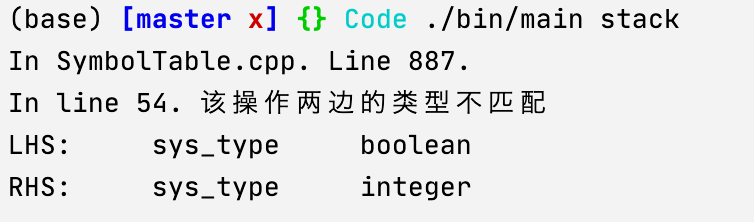

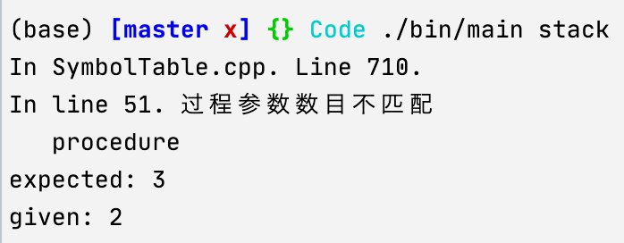


##2.词法分析

####2.1 关键token正则表达式

```
Letter  [a-zA-Z]
Digit   [0-9]
Integer (0|[1-9]{Digit}*)
Real    {Integer}.[0-9]+
Identifier  {Letter}({Letter}|{Digit}|_)*
```

其中标识符以字母开头，后面可以由数字、字母或下划线任意组合。

####2.2 行数获取

flex和yacc文件都可以分为定义区、规则区和C语言代码区

定义区

<center>
  定义区</br>%%</br>
规则区</br>%% </br>
代码区</br>
</center>
在定义区中，声明全局变量表明当前词法分析器所读取的行数。

在`yacc.y`中，定义行数变量。

```C++
unsigned int line_number = 1;
```

在`lex.l`中，声明这一外部变量。并且在规则区中，每碰到回车，就会执行修改行数的操作。

```c++
extern unsigned int line_number;
%%
...
"\n" {
    line_number ++;
}
%%
...
```

在lex内部，对每一个token会维护一个结构变量yylloc，我们可以在读取到标识符token时，对这一变量进行修改，这样在yacc处理某个token时，行数可以作为成员变量被访问

lex.l规则区：

```flex
{Identifier}    {
    yylval.sValue=new char[strlen(yytext)];
    yylloc.first_line=line_number;
    strcpy(yylval.sValue,yytext);
    return ID;
}
```

yacc.y规则区示例，通过$@(\mbox{token在规则中index}).first\_line$可以访问到在lex中赋予的行标号：

```c++
const_expr_list
	: const_expr_list ID EQUAL const_value SEMI
	{
		$$->push_back(new Node(EQUAL, 2, new Node(@2.first_line, $2, NodeType::Identifier), $4));
	}
	| ID EQUAL const_value SEMI
	{
		$$ = new std::vector<Node *>();
		$$->push_back(new Node(EQUAL, 2, new Node(@1.first_line, $1, NodeType::Identifier), $3));
	}
```

####2.3 字符串读取

我们字符串以双引号""作为开始和结束，在字符串内部出现的字符串应该作为纯粹的值来处理，而不能用常规的parser进行解析。为了实现这一功能，flex提供了“状态”设定的功能。在不同的状态下可以按照不同的正则表达式来处理。在定义区可以自定义正在读取字符串的状态。默认状态为`INITIAL`.

```c++
/* 读取字符串的状态 */
%x READING_STRING
```

并在定义区定义储存读取字符串的流

```c++
%{
#include <sstream>
std::stringstream ss;
... ...
  %}
```

正常状态下，读到第一个双引号，就进入状态READING_STRING

```c++
"\"" {
    //开始读取字符串
    BEGIN READING_STRING;
    //清空string stream
    ss.clear();
    ss.str("");
}
```

在状态`READING_STRING`，碰到另一个双引号时，就会结束字符串的读取，恢复正常状态。

```c++
<READING_STRING>"\"" {
    //结束字符串读取
    BEGIN INITIAL;
    yylval.sValue=new char[ss.str().length()];
    strcpy(yylval.sValue,ss.str().c_str());
    return STRING;
}
```

否则，处于状态`READING_STRING`时，任何字符都会作为字符串的内容被接受。（注：必须写在上一条的后面）

```c++
<READING_STRING>. {
    ss<<yytext[0];
}
```

#### 2.4 注释

采用双斜线`\\`注释一行的方案。同理2.3，我们声明一个注释状态

```c++
/* 注释状态 */
%x COMMENT
```

解析到双斜线时，改变状态

```c++
<INITIAL>"//" {
    // 注释
    BEGIN COMMENT;
}
```

在注释状态，遇到回车时就回到正常状态

```c++
<COMMENT>"\n" {
    // 注释碰到回车结束
    BEGIN INITIAL;
}
```

为了调试，读取注释内容

```c++
<COMMENT>. ;
```

####2.5 关键词

（1）运算符、界符定义

| LP: “(”        | PLUS: “+”     |
| -------------- | ------------- |
| RP: “)”        | MINUS: “－”   |
| LB: “[”        | GE: “ >=”     |
| RB: “]”        | GT: “ >”      |
| DOT: “•”       | LE: “ <=”     |
| COMMA: “,”     | LT: “ <”      |
| COLON: “:”     | EQUAL: “ =”   |
| MUL: “*”       | ASSIGN: “ :=” |
| DIV: “/”       | MOD: “MOD”    |
| UNEQUAL: “< >” | DOTDOT: “..”  |
| NOT: “NOT”     | SEMI: “;”     |

（2）系统函数、过程、常数、类型

SYS_CON: "false", "maxint", "true"

SYS_FUNCT: "abs", "chr", "odd", "ord", "pred", "sqr", "sqrt", "succ"

SYS_PROC: "write", "writeln"

SYS_TYPE: "boolean", "char", "integer", "real", "string"

READ: “read”

INTEGER：整数常数值

REAL：实数常数值

CHAR：字符常数值，用单引号括起来，如’a’，‘A’<’a’

（3）关键字

"and",    "array",    "begin",    "case",  "const", "div",   "do",   "downto",  "else",   "end",  "for", "function", "goto", "if", "mod", "not", "of",   "or",   "packed", "procedure", "program", "record",  "repeat",  "then",  "to", "type",  "until", "var",  "while".

##3. 语法分析

####3.1 Context Free Grammar

1. program ： program_head routine DOT

   program_head ： PROGRAM ID SEMI

   ```
   program {程序名};
   {routine}
   .
   ```

2. routine ： routine_head routine_body

   routine_head ： const_part type_part var_part routine_part

   ```c++
   {const_part}	// 常数
   {type_part}	// 定义区
   {var_part}	// 变量定义区
   {routine_part} // 功能函数/过程定义区
   
   
   {routine_body} // 主函数
   ```

3. 程序常量定义区：相当于C语言中的`const`类型变量

   const_part ： CONST const_expr_list | ε

   const_expr_list ： const_expr_list NAME EQUAL const_value SEMI | NAME EQUAL const_value SEMI

   ```
   const
   		ID_1 = 常量1 ;
   		ID_2 = 常量2 ;
   		... ...
   ```

4. 用户类型定义区：相当于C语言中的`typedef`和`struct`

   type_part ： TYPE type_decl_list | ε

   type_decl_list ： type_decl_list type_definition | type_definition

   type_definition ： NAME EQUAL type_decl SEMI

   ```
   type
   	type_1 = {type_decl} ;
   	type_2 = {type_decl} ;
   	... ...
   ```

   其中一条类型定义分为三种

   type_decl ： simple_type_decl | array_type_decl | record_type_decl

   （1）simple_type_decl 

   ​					： SYS_TYPE 【整型、浮点、字符、字符串、boolean】

   ​				     | NAME 【在type区域上面代码自定义的类型】

   ​				     | LP name_list RP 【枚举类型，比如(red, green, blue)】

   ​     			    | const_value DOTDOT const_value 【range类型，其中const_value只能是整数，表示范围】

   ​     			    | MINUS const_value DOTDOT const_value【同上】

   ​    			     | MINUS const_value DOTDOT MINUS const_value【同上】

   ​     			    | NAME DOTDOT NAME【同上，这里的name是在常数区定义的常数变量名】

   （2）array_type_decl ： ARRAY LB simple_type_decl RB OF type_decl

   这里的{simple_type_decl}只能是range类型或者枚举类型；type_decl可以引用类型定义区上面自定义的类型。

   ```c++
   array[0 .. 5] of {type_decl}
   array[(red, green, blue)] of {type_decl}
   ```

   （3）record_type_decl 【相当于C语言中的struct类型】

   ​					 ：RECORD field_decl_list END

   field_decl_list ： field_decl_list field_decl | field_decl

   field_decl ： name_list COLON type_decl SEMI

   其中name_list就是以逗号作为分隔的名字列表

   ```c++
   type:
   		Date = record // 日期
   							Year : integer;
   							Month: 1 .. 12;
   							Days : 1 .. 31;
   					 end;
   		Student = record // 包含学生的出生日期以及入学日期，以及三门课的成绩
   									Birth, Enroll : Date
   									Grade : array[(Chi, Math, Eng)] of real;
   							end;
   ```

5. 程序变量定义区：定义程序逻辑区（routine_part和routine_body）中要用到的变量及其类型

   var_part ： VAR var_decl_list | ε

   var_decl_list :  var_decl_list var_decl | var_decl

   var_decl :  name_list COLON type_decl SEMI

   ```c++
   var:
   		student1, student2 : Student;	// 在3.1.4 type区域中定义的类型
       i, j, k : integer;
   		name1, name2 : string;
   ```

6. 辅助过程/函数定义区：定义主函数中要调用的函数或过程。函数/进程之间也可以相互调用，但只能调用已在前面定义的。

   routine_part

   ​		：routine_part function_decl 

   ​		 | routine_part procedure_decl

   ​     	| function_decl 【函数，具有返回值，返回的变量名隐含为函数名（所以不需要return）】

   ​		 | procedure_decl  【过程，类似于函数，但不具有返回值】

   ​		 | ε

   function_decl : function_head SEMI sub_routine SEMI

   function_head : FUNCTION NAME parameters COLON simple_type_decl 

   ```
   function {函数名} 
   {参数} : {返回类型}
   {
   	sub_routine
   };
   ```

   参数定义为parameters ： LP para_decl_list RP | ε

   类似于3.1.5，同一类型的变量可以在一起声明，变量间用逗号`,`隔开。不同类型的声明用分号`;`隔开。

   para_decl_list ： para_decl_list SEMI para_type_list | para_type_list

   比较特别的是，函数/过程的输入参数分为两种类型

   `val`：即C语言中的形参，按值传入

   `var`：即C语言的引用类型

   para_type_list ： var_para_list COLON simple_type_decl | val_para_list COLON simple_type_decl

   默认都是`val`类型，`var`类型需要用关键字声明。

   val_para_list ： name_list

   var_para_list ： VAR name_list

   ```c++
   (
     	{name_1, name_2, ...} : 类型1;
     	{name_list}						: 类型2;
   var {name_list}						: 引用类型;
   )
   ```

7. 主函数区：

   routine_body ： compound_stmt

   compound_stmt ： BEGIN stmt_list END

   stmt_list ： stmt_list stmt SEMI | ε

   顺序执行stmt语句

   ```c++
   begin
   		statement_1;
   		statement_2;
   		... ...
   end
   ```

8. stmt语句：分为`label`和`nonlabel`两类。语句前面的`label`是一个整数，代表跳转语句的位置，一个label在程序中只能出现一次。

   stmt ： INTEGER COLON non_label_stmt | non_label_stmt

   如下面语句的含义就是无限循环打印`Hello World!`

   ```c++
   begin
   	1: writeln("Hello World!");
   	goto 1;
   end
   ```

   non_label_stmt ： assign_stmt【赋值语句】

   ​							 | proc_stmt【过程语句】

   ​							 | compound_stmt【复合语句】

   ​							 | if_stmt【条件语句】

   ​							 | repeat_stmt【repeat循环】

   ​							 | while_stmt 【while循环】

   ​							 | for_stmt【for循环】

   ​							 | case_stmt【case语句】

   ​							 | goto_stmt【跳转语句】

   （1）赋值语句

   assign_stmt ： ID ASSIGN expression

   ​     				  | ID LB expression RB ASSIGN expression

   ​     				  | ID DOT ID ASSIGN expression【这里ID.ID等价于C语言中结构体成员的访问】

   ```c++
   id_1 := 5
   color[red] := id_1 / 255.0
   studeng1.name := "纯路人"
   ```

   （2）过程/函数调用语句

   proc_stmt ： ID【3.1.6区域定义的过程或无参数函数名】

   ​					| ID LP args_list RP【3.1.6区域定义的函数名】

   ​    			    | SYS_PROC【系统过程，有`write`打印输入，以及`writeln`打印输入并换行】

   ​					| SYS_PROC LP expression_list RP【系统函数】			

   ​					| READ LP factor RP【类似于C中的`scanf`】

   其中系统函数有下面几种：【都是一个输入】

   *  `abs(x)`：计算绝对值$|x|$

      -    `char chr(integer x)`：$x$作为ASCII码，返回相应的字符

      -    `boolean odd(integer x)`：判断整数$x$是不是奇数

      -    `pred(x)`：对于有序类型，返回其上一个值

           `succ(x)`：对于有序类型，返回其下一个值

           比如对于整数，就是$\pm1$；对于字符，则按照ASCII码的排序

           ```pascal
           x := 10
           writeln(pred(x)) // 输出9
           writeln(succ(x)) // 输出11
           writeln(succ('B')) // 输出C
           ```

           对于枚举变量，同理

           ```pascal
           ...
           type
           		color = (red, green, blue);
           var
           		m_color : color;
           begin
           	m_color := green
           	writeln(prev(m_color))	// 输出red
           	writeln(succ(m_color))	// 输出blue
           end
           .
           ```

   *  `ord(x)`：对于有序变量，输出其排序，从0开始计数。

      对于整数，就是本身；对于字符，输出其ASCII码（十进制）；对于枚举变量同理，如上面`color`的例子中。

      ```pascal
      begin
      		m_color := green
      		writeln(ord(m_color)) // 输出1
      end
      ```

   *  `sqrt(x)`：输出平方根（square root)
   *  `sqr(x)`：输出平方（square）

   *  `read(x)`：等待用户输入，将结果输入到变量`x`，类似于C语言中的`scanf`。注：PASCAL中设置为读取文件，但是和文档给出的CFG不匹配，而且交互不太方便，所以做了修改。

   （3）条件语句

   if_stmt ： IF expression THEN stmt else_clause

   else_clause ： ELSE stmt | ε

   （4）repeat语句：相当于C语言中的do-while语句

   repeat_stmt ： REPEAT stmt_list UNTIL expression

   （5）while语句

   while_stmt ： WHILE expression DO stmt

   （6）for循环：其中`ID`对应的变量一定要是有序类型【见3.1.8（2）中对系统函数的介绍】；`direction`的方向按照`ord(x)`给出。

   for_stmt ： FOR ID ASSIGN expression direction expression DO stmt

   direction ： TO | DOWNTO

   ```pascal
   var
   	color : (red, green, blue)
   	c : char
   begin
   	for color := red to blue do // 三次循环，color分别为red, green, blue
     		{stmt}
     for c := 'z' downto 'a' do // 26次循环，c分别为'z', 'y', ..., 'a'
     		{stmt}
   end
   .
   ```

   （7）case语句：对应于C语言中的switch-case

   case_stmt ： CASE expression OF case_expr_list END

   case_expr_list ： case_expr_list case_expr | case_expr

   case_expr ： const_value COLON stmt SEMI | ID COLON stmt SEMI

   ```pascal
   const
   	one : 1
   var 
   	input : integer
   	value : integer
   begin
   	read(input); // 用户输入传入input，见3.1.8（2）的介绍
   	value := 2;
   	case input of 
     	one : {若用户输入1，执行语句};
       value : {若用户输入2，执行语句};
       3 : {若用户输入3，执行语句};
     end
   .
   ```
   
   （8）跳转语句：整数为语句的`label`

   goto_stmt ： GOTO INTEGER

   如下面语句的含义就是无限循环打印`Hello World!`

   ```c++
   begin
   	1: writeln("Hello World!");
   	goto 1;
   end
   .
   ```
   
9. 表达式：变量值、常数、函数返回值等算数组合的结果，采用常规的算数优先级（括号 > 乘除 > 加减，括号 > 交 > 并，同等级按照左结合）。

   expression_list ： expression_list COMMA expression | expression

   expression ： expression GE expr 

   ​	 | expression GT expr | expression LE expr

   ​     | expression LT expr | expression EQUAL expr 

   ​	 | expression UNEQUAL expr | expr

   expr ： expr PLUS term | expr MINUS term | expr OR term | term

   term ： term MUL factor | term DIV factor | term MOD factor | term AND  factor | factor

   *  表达式中的最小结构（最先计算）为：单个变量（包括结构体、数组访问）、函数/过程调用、常数值、取反

   factor ： NAME | NAME LP args_list RP | SYS_FUNCT | SYS_FUNCT LP args_list RP | const_value | LP expression RP | NOT factor | MINUS factor | ID LB expression RB | ID DOT ID

   *  其中参数列表可以是一列的表达式

   args_list ： args_list COMMA expression | expression

#### 3.2 语法树构造【namespace AST】

对应的文件为`AST.hpp`和`AST.cpp`

#####3.2.1 节点定义

（1）分类：其中Operation在语法树中存在子节点，其他的类型都是叶节点。

```c++
enum NodeType
{
    Constant,
    Identifier,  
    Operation,
    Typename
};
```

其中常数类型定义如下

```c++
enum ConstantType
{ 
    Integer, // integer
    Real, // real
    Char,
    String,
    Boolean
};
```

（2）在节点中语法树中储存的主要数据

```c++
// 常数数据
struct ValConstant
{
    ConstantType Type;
    union {
        // Value of the constant
        int iValue;
        double dValue;
        char cValue;
        char* sValue;
        bool bValue;
    };
};
// 名字数据
struct ValIdentifier
{
    char* Name; // Index to symbol table
};

// 提前声明Node类
class Node;
// 操作数据
struct ValOperation
{
    int Operator; // 操作符，都是yacc.y中定义的token
    int NumOperands; // 子节点数目
    Node** List_Operands; // 子节点列表
};
```

（3）节点类`class Node`

```c++
namespace Typing
{   // 提前声明Typing类型节点
    class Node;
}

namespace AST
{
  ... ...
	class Node
    {
    public:
        Typing::Node* m_Type;   // 节点真正的数据类型，在语义分析之后获得
        int m_Id; // 在语法树上的ID，在语义分析之后获得，方便检查
    public:
        Attribute m_Attribute;
        unsigned int m_Line; // 所在行数
        union 
        {
            ValConstant m_Constant;
            ValIdentifier m_Identifier;
            ValIdentifier m_Typename;
            ValOperation m_Operation;
        };
        Node(unsigned int Line, ValConstant& Cons);
        Node(unsigned int Line, const char* Name, Attribute attribute);
        Node(unsigned int Line, int Operator, std::vector<Node*>* List);
        Node(unsigned int Line, int Operator, int NumOperands, ...);
        void add(Node* node);
        void add(std::vector<Node *>* List);
        ~Node();
    };
};
```

##### 3.2.2 节点成员方法

（1）常数类型节点构造函数

```c++
Node::Node(unsigned int Line, ValConstant& Cons)
        : m_Line(Line), m_Attribute(Attribute::Constant)
    {
        m_Constant = Cons;
    }
```

（2）名称 / 自定义类名构造函数

```c++
Node::Node(unsigned int Line, char* Name, NodeType Type)
        : m_Line(Line), m_Type(Type)
    {
        if (Type == NodeType::Identifier)
        {
            m_Identifier.Name = new char[strlen(Name)];
            strcpy(m_Identifier.Name, Name);
        }
        else if (Type == NodeType::Typename)
        {
            m_Typename.Name = new char[strlen(Name)];
            strcpy(m_Typename.Name, Name);
        }
        else 
        {
            std::string msg = "Unknown Type: ";
            msg.append(std::to_string(Type));
            raiseError(msg.c_str());
        }
    }
```

（3）给定子节点列表，构造Operation节点

```c++
Node(unsigned int Line, int Operator, std::vector<Node*>* List)
        : m_Line(Line), m_Type(NodeType::Operation)
    {
        m_Operation.Operator = Operator;
        m_Operation.NumOperands = List->size();
        m_Operation.List_Operands = new Node*[List->size()];
        for (int i = 0;i < List->size(); ++i)
        {
            m_Operation.List_Operands[i] = (*List)[i];
        }
    }
```

（4）给定了子节点数目，但是子节点输入不定，构造Operation节点。这里利用了`<stdarg.h>`对不定参数的处理。

```c++
Node::Node(unsigned int Line, int Operator, int NumOperands, ...)
        : m_Line(Line), m_Attribute(Attribute::Operation)
    {
        va_list ap;
        m_Operation.Operator = Operator;
        m_Operation.NumOperands = NumOperands;
        m_Operation.List_Operands = new Node*[NumOperands];
        va_start(ap, NumOperands);
        for (int i = 0;i < NumOperands; ++i)
        {
            m_Operation.List_Operands[i] = va_arg(ap, Node*);
        }
        va_end(ap);
    }
```

（6）对现有的Operation节点添加子节点。

```c++
inline void add(Node* node)
    {
        m_Operation.NumOperands += 1;
        m_Operation.List_Operands = (Node **) realloc(m_Operation.List_Operands, 
                                                      m_Operation.NumOperands * sizeof(Node *));
        m_Operation.List_Operands[m_Operation.NumOperands - 1] = node;
    }
```

```c++
inline void add(std::vector<Node *>* List)
    {
        int Offset = m_Operation.NumOperands;
        m_Operation.NumOperands += List->size();
        m_Operation.List_Operands = (Node **) realloc(m_Operation.List_Operands,
                                                      m_Operation.NumOperands * sizeof(Node *));
        for (int i = 0;i < List->size(); ++i)
        {
            m_Operation.List_Operands[Offset + i] = (*List)[i];
        }
    }
```

（7）析构函数

```c++
~Node()
    {
        if (m_Type == NodeType::Identifier && m_Identifier.Name)
        {
            delete m_Identifier.Name;
        }
        else if (m_Type == NodeType::Operation)
        {
            for (int i = 0;i < m_Operation.NumOperands; ++i)
            {
                delete m_Operation.List_Operands[i];
            }
            delete m_Operation.List_Operands;
        }
    }
```

#### 3.3 yacc

##### 3.3.1 token定义

（1）token类型（`yacc.y`定义区）

```c++
%union {
    int iValue; // integer value
    double dValue; // double value
    char cValue; // char value
    char* sValue;
    Node* NodePtr; // Node Pointer
		std::vector<Node*>* NodePtrList; // List
};
```

（2）数据类型

```c++
// token数据类型
%token <iValue> INTEGER
%token <dValue> REAL
%token <cValue> CHAR
%token <sValue> STRING SYS_TYPE
%token <sValue> ID
```

（3）语法树节点

```c++
// 语法树节点
%type <NodePtr> expr term factor const_value expression routine
%type <NodePtr> routine_head routine_body const_part type_part var_part 
%type <NodePtrList> const_expr_list name_list var_para_list val_para_list routine_part
%type <NodePtrList> expression_list args_list field_decl_list
%type <NodePtr> compound_stmt stmt_list stmt non_label_stmt if_stmt goto_stmt
%type <NodePtr> while_stmt case_stmt case_expr case_expr_list proc_stmt
%type <NodePtr> assign_stmt var_decl var_decl_list for_stmt else_clause
%type <NodePtr> repeat_stmt type_decl_list type_definition function_decl function_head parameters
%type <NodePtr> para_decl_list para_type_list sub_routine procedure_decl procedure_head
%type <NodePtr> simple_type_decl type_decl field_decl record_type_decl array_type_decl
%type <sValue> program_head 
%type <iValue> direction
```

（4）关键字

```c++
// 运算符、定界符
%token LP RP LB RB DOT COMMA COLON MUL DIV UNEQUAL NOT
%token PLUS MINUS GE GT LE LT EQUAL ASSIGN MOD DOTDOT SEMI

// 系统函数、过程、常数、类型等单词
%token READ
%token <sValue> SYS_PROC SYS_FUNCT SYS_CON

// 关键字
%token AND ARRAY _BEGIN CASE CONST
%token DO DOWNTO ELSE END
%token FOR FUNCTION GOTO IF
%token OF OR PACKED
%token PROCEDURE PROGRAM RECORD REPEAT
%token THEN TO TYPE UNTIL VAR WHILE
```

（5）定义操作符时，额外引入的一些token。它们不出现在语法树中，但是可以指明语法树中节点的类型。

```c++
// 语法树中自定义的token
%token ROUTINE ROUTINE_BODY ROUTINE_HEAD CONST_PART VAR_PART BRACKET
%token CASE_STMT CASE_LIST TYPE_PART VAL_PARAM VAR_PARAM PARA_LIST FUNCTION_HEAD
%token SUB_ROUTINE PROCEDURE_HEAD CALL_PROC LABEL_STMT CALL_FUNCT FIELD_DECL
%token ENUM
```

其中比较特别的是，`FUNCTION`和`PROCEDURE`对应的是定义函数/过程。而`CALL_FUNCT`和`CALL_PROC`对应的则是调用。以如下的规则为例。

```c++
function_decl	// 函数定义
	: function_head SEMI sub_routine SEMI
	{
		if ($3)
			$$ = new AST::Node(@2.first_line, FUNCTION, 2, $1, $3);
		else
			$$ = new AST::Node(@2.first_line, FUNCTION, 1, $1);
	}
 ... ...
factor	// 函数调用
	: ID LP args_list RP
	{
		$$ = new AST::Node(@1.first_line, CALL_FUNCT, 1
					  , new AST::Node(@1.first_line, $1, AST::Attribute::Identifier));
		$$->add($3);
	}
	... ...
```


##### 3.3.2 yacc规则区

与3.1中的定义完全对应，而且较多重复性的工作。所以这里只详细介绍几种典型。

（1）节点传递

```c++
non_label_stmt
	: assign_stmt {$$ = $1;}
	| proc_stmt {$$ = $1;}
	| compound_stmt {$$ = $1;}
	| if_stmt {$$ = $1;}
	| repeat_stmt {$$ = $1;}
	| while_stmt {$$ = $1;}
	| for_stmt {$$ = $1;}
	| case_stmt {$$ = $1;}
	| goto_stmt {$$ = $1;}
	;
```

（2）Operation节点的构造：

assign语句有两个子节点，左节点是被赋值的变量，右节点是所赋的值。

```c++
assign_stmt
	: ID ASSIGN expression
	{
		$$ = new Node(ASSIGN, 2, new Node(@1.first_line, $1, NodeType::Identifier), $3);
	}
	| ID LB expression RB ASSIGN expression
	{
		$$ = new Node(ASSIGN, 2, 
          				new Node(BRACKET, 2, new Node(@1.first_line, $1, NodeType::Identifier), $3),
					  			$6);
	}
	| ID DOT ID ASSIGN expression
	{
		$$ = new Node(ASSIGN, 2,
					  			new Node(DOT, 2, new Node(@1.first_line, $1, NodeType::Identifier),
					  											 new Node(@3.first_line, $3, NodeType::Identifier))
					  			, $5);
	}
	;
```

*  $x \leftarrow x^{2}/(1 + 4.124x)$【注：语法树中，`[]`包裹操作，`id()`包裹变量名称，`c()`包裹常数】

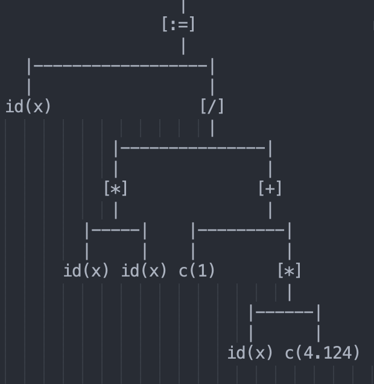

*  $temp\leftarrow \sqrt{40}$

   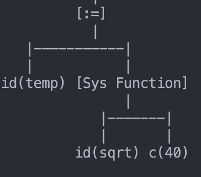

（3）常值节点

```c++
const_value
	: INTEGER
    {
        ValConstant temp;
        temp.Type = ConstantType::Integer;
        temp.iValue = $1;
        $$ = new Node(temp);
    }
	| REAL
    {
        ValConstant temp;
        temp.Type = ConstantType::Real;
        temp.dValue = $1;
        $$ = new Node(temp);
    }
	| CHAR
    {
        ValConstant temp;
        temp.Type = ConstantType::Char;
        temp.cValue = $1;
        $$ = new Node(temp);
    }
	| STRING
	{
				ValConstant temp;
        temp.Type = ConstantType::String;
        temp.sValue = $1;
        $$ = new Node(temp);
	}
	| SYS_CON
	{
				ValConstant temp;
				temp.Type = ConstantType::Boolean;
				temp.bValue = $1;
				$$ = new Node(temp);
	}
	;
```

（4）数目不定的平级列表，且上级节点未知。比如表达式列表`expression_list`中，所有表达式都是作为函数的输入，都应该作为上级函数节点的子节点，它们是平级的。所以要先把这些平级的节点放到一个列表中，当构造其上级节点时，再把它们一起输入到上级节点。

在第一个碰到的列表单元中初始化（yacc是LALR(1) parsing）一个`std::vector<>`，在后续把节点添加到这个vector。这样在碰到上级节点时，可以用这个`std::vector<>`对上级节点进行初始化。

```c++
expression_list
	: expression_list COMMA expression
	{
		$$->push_back($3);
	}
	| expression
	{
		$$ = new std::vector<Node*>();
		$$->push_back($1);
	}
	;

proc_stmt	// 在上级节点中可以利用这个std::vector<>进行平级的初始化
  : SYS_PROC LP expression_list RP
	{
		$$ = new Node(SYS_PROC, 1, new Node(@1.first_line, $1, NodeType::Identifier));
		$$->add($3);
	}
	| ...
```

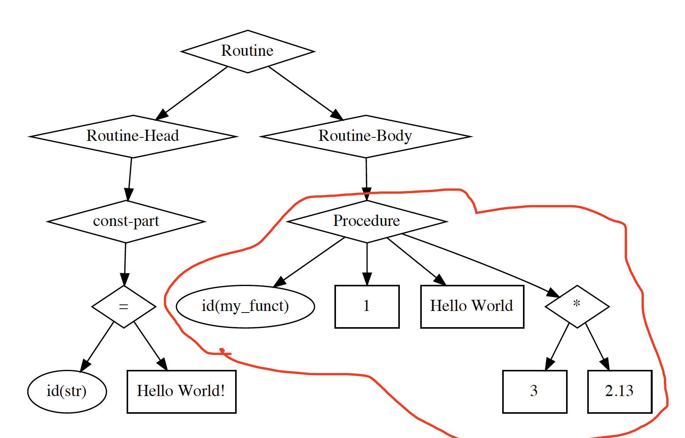

（5）数目不定的分级列表。比如case语句中。

```c++
case_stmt
	: CASE expression OF case_expr_list END
	{
		$$ = new Node(CASE_STMT, 2, $2, $4);
	}
	;
case_expr_list
	: case_expr_list case_expr 
	{
		$$->add($2);
	}
	| case_expr
	{
		$$ = new Node(CASE_LIST, 1, $1);
	}
	;
case_expr
	: const_value COLON stmt SEMI
	{
		$$ = new Node(CASE, 2, $1, $3);
	}
	| ID COLON stmt SEMI
	{
		$$ = new Node(CASE, 2
					  , new Node(@1.first_line, $1, NodeType::Identifier)
					  , $3);
	}
	;
```

比如下面的spl代码

```pascal
program Hello;
begin
        case str of
        	"Nihao" : writeln(1);
        	"Hi" : writeln(1);
        	"Hello World": writeln(1);
        end;
end
.
```

对应的语法树为

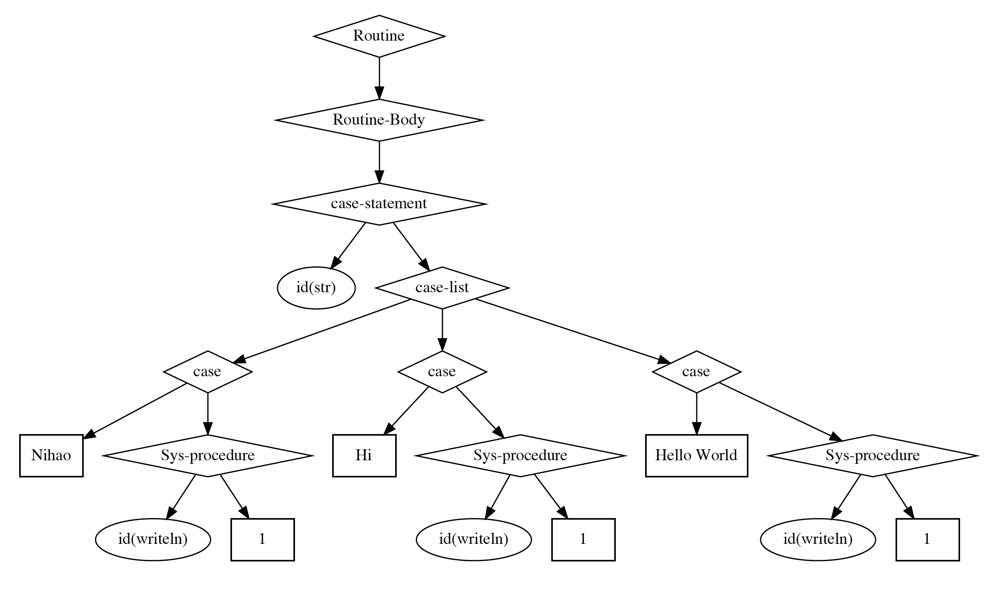

##### 3.3.3 各个语法树节点子节点的格式

下面的介绍中

*  `[a, b, c, d]`表示这个节点在语法树中有四个子节点，且从左到右依次是`a, b, c,d`
*  `[a, a, ...]`表示这个节点可以有任意个同为类`a`的子节点
*  `[a, <b>]`表示这个节点最左边的子节点为`a`，右边可能有子节点`<b>`，也可能没有
*  称一个子节点为xx名时，指该节点的类型为`AST::NodeType::Identifier`或`AST::NodeType::Typename`
*  `const_value`的类型为`AST::NodeType::Constant`

（1）Const-part + Type-part

|  Opeartion节点  |                        子节点                         |
| :-------------: | :---------------------------------------------------: |
|   CONST_PART    |             [const_expr, const_expr, ...]             |
|   const_expr    |                 [ID, =, const_value]                  |
|    TYPE_PART    | [type_type_definition_1, type_type_definition_2, ...] |
| type_definition |                  [ID, =, type_decl]                   |
|    type_decl    |        [simple_type或array_type或record_type]         |
|   array_type    |                 [元素类型, 下标类型]                  |
|   record_type   |         [field_decl_1, field_decl_2, ... ...]         |
|   field_decl    |            [type_decl, name1, name2, ...]             |

例子：

```pascal
program const_type;
const
	ZERO = 0;
	PI = 3.1415926;
type
	Grade = array[(Math, English, Math)] of real;
	Student = record 
				  m_Grade : Grade;
				  age	  : integer;
			  end;
begin
end
.
```

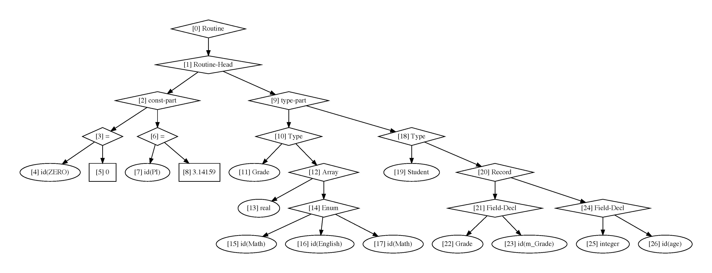

（2）Var-part + routine_part：

|     Operation节点     |                  子节点                   |
| :-------------------: | :---------------------------------------: |
|       VAR_PART        |       [var_decl_1, var_decl_2, ...]       |
|          VAR          |        [type, name_1, name2, ...]         |
|     ROUTINE_PART      | [若干个function_decl/procedure_decl ...]  |
|       FUNCTION        |          [function_head, 函数体]          |
|     FUNCTION_HEAD     |      [paralist, 返回类型]  函数名称       |
|       paralist        | [para_type_list_1, para_type_list_2, ...] |
| VAR_PARAM【引用参数】 |      [参数类型, name_1, name_2, ...]      |
|   VAL_PARAM【形参】   |      [参数类型, name_1, name_2, ...]      |
|   SEMI【语句分隔】    |  [statement_1（前）, statement_2（后）]   |

```pascal
program add;
var
	delta : integer;

function add(
	input : integer;
var
	ok	  : boolean
) : integer;
begin
	add := input + delta;
	ok := true;
end
;

begin
end.
```

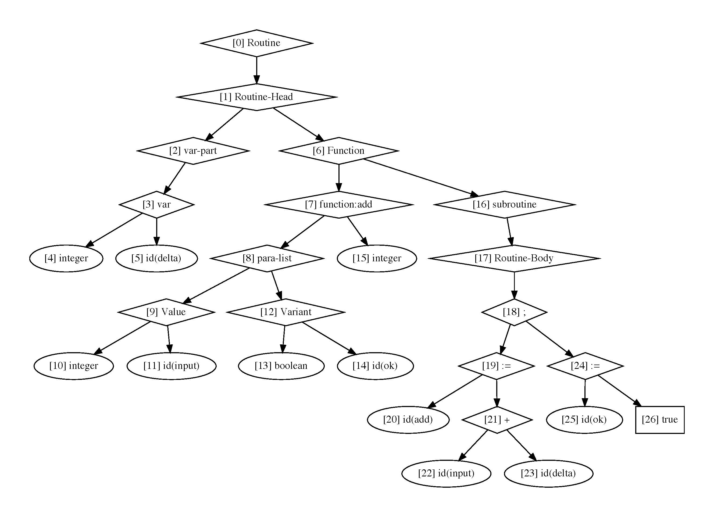

（3）函数/过程调用

|     Operation节点     |         子节点         |
| :-------------------: | :--------------------: |
| CALL_FUNCT或SYS_FUNCT | [函数名, 输入1, 输入2] |
|  CALL_PROC或SYS_PROC  | [过程名，输入1，输入2] |

```pascal
program proc_calling;
var
	name : string;

procedure greeting(
var name : string;
	id   : integer
);
begin
	writeln("hello! ", name, "\nYour id is ", id);
end
;

begin
	name := "Zephyr";
	greeting(name, 13);
end
.
```

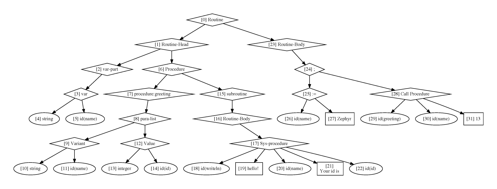

（4）数据访问

|        Operation节点        |       子节点       |
| :-------------------------: | :----------------: |
| DOT【结构体record成员访问】 | [record名，成员名] |
|     BRACKET【数组访问】     |   [数组名，索引]   |

（5）statement

|       Operation节点        |              子节点              |
| :------------------------: | :------------------------------: |
|             IF             |  [条件，if-stmt，< else-stmt >]  |
|            GOTO            | [integer（表示目标语句的label）] |
| LABEL_STMT【带标签的语句】 |       [integer, statement]       |
| WHILE / REPEAT【循环语句】 |        [条件，statement]         |
|  DOWNTO / TO 【for循环】   |   [id, 下界，上界，statement]    |
|         CASE_STMT          |       [表达式，case_list]        |
|         case_list          |        [case, case , ...]        |
|            case            |       [表达式，statement]        |

```pascal
program get_date;
type
	Date = record 
				Year, Month, Day : integer;
	 	   end;

function get_date(
	date : Date
) : string;
begin
	case date.Day of
		1: get_date := "星期一";
		2: get_date := "星期二";
		3: get_date := "星期三";
		4: get_date := "星期四";
		5: get_date := "星期五";
		6: get_date := "星期六";
		7: get_date := "星期七";
	end;
end;
begin
end
.
```

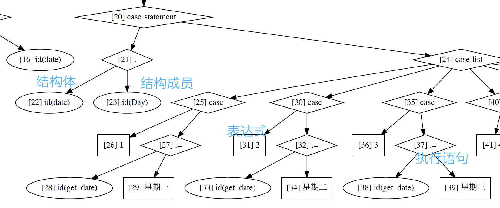

（6）运算

|       Operation运算符       |        子节点        |
| :-------------------------: | :------------------: |
|           ASSIGN            |   [被赋值对象，值]   |
|   二元运算+, -, *, /, %等   | [左操作数，右操作数] |
| 比较运算>, <, >=, <=, <>, = |       [左，右]       |

```pascal
program count_avg;

var 
	total : integer;
	count : integer;
	temp  : integer;
	avg   : real;
begin
	repeat
		read(temp);
		total := total + temp;
		count := count + 1;
	until temp = 0;

	count := count - 1;
	avg := 1 * total / count;
	writeln(avg);
end
.
```

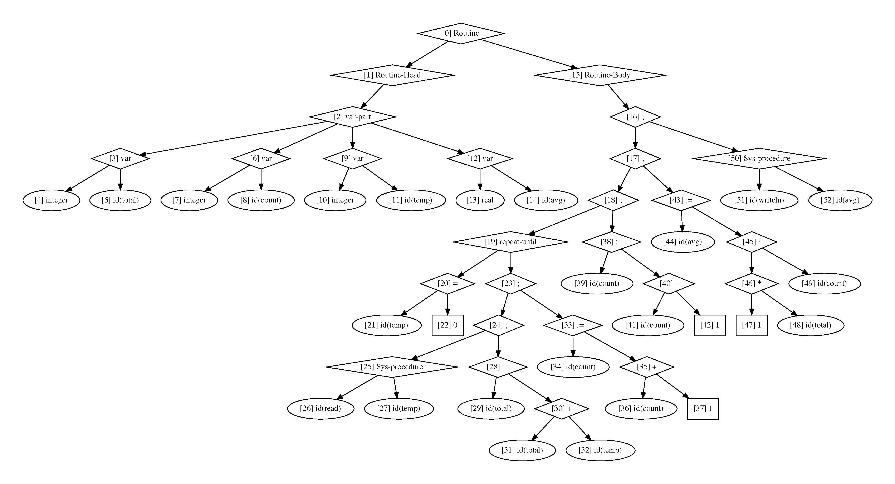

#### 3.4 语法树的绘制【namespace Plot_py / Plot_txt】

由于实现的方案一样，只是最终数据呈现方式有所区别，所以只介绍`Plot_py`

##### 3.4.1 数据格式

语法树中每一个节点在文件`*.raw.ast`中对应的数据格式为
$$
\begin{aligned}
&id \\
&\mbox{名称} \\
&\mbox{形状：有rect【常数】, oval【变量】, diamond【操作符】}
\end{aligned}
$$
每一条边的格式为
$$
\begin{aligned}
&\mbox{*edge*} \\
&\mbox{父节点id}\\
&\mbox{子节点id}\\
&\cdots
\end{aligned}
$$
经下面的python程序处理后，

```python
import io
import sys

from graphviz import Digraph

dot = Digraph(comment='AST Tree')

if len(sys.argv) <= 1:
    raise Exception("No Input file!!")

filename = './AST_raw/' + sys.argv[1] + '.raw.ast'

with io.open(filename, mode="r", encoding="utf-8") as file:
    words = iter(file.read().splitlines())
    while True:
        word = next(words, None)
        if word is None:
            break
        if word != '':  # 非空
            if word == "*edge*":
                dot.edge(next(words), next(words))
            else:
                dot.node(word, label="[" + word + "] " + next(words), shape=next(words))

dot.render('./AST_py/' + sys.argv[1] + '.py.ast', view=True)
```

呈现效果如下

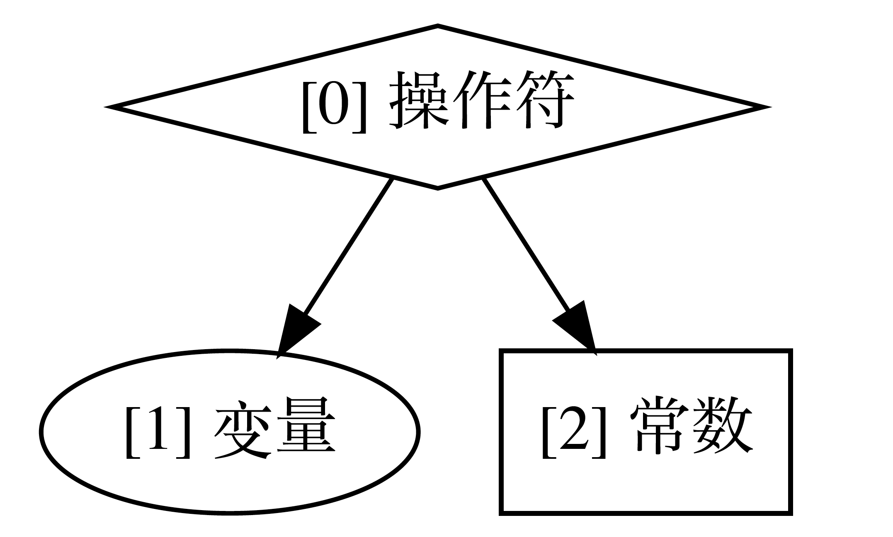

##### 3.4.2 绘制方案

绘制的方法原型为

```c++
namespace Plot_py
{
    void plotNode(AST::Node* p, int& id ,std::ofstream& Out);
}
```

含义是，绘制以`p`为根节点的语法树，并将`id`赋予节点`p`，把相应的数据流输出到文件`Out`之中。

采用简单的递归操作，当碰到叶结点时，递归结束，否则遍历每一个子节点进行递归绘制。在每处理一个子节点时，加入一条`*edge*`，因为在处理子节点前就已经知道了子节点将要被赋予的id，所以这点可以做到。实现如下

```c++
namespace Plot_py 
{
    void plotNode(AST::Node* p, int& id ,std::ofstream& Out)
    {   // id: 现在可用的标识符
        if (p == nullptr) return ;
        p->m_Id = id;
        Out << "\n" << (id ++) << "\n";
        if (p->m_Type != nullptr)
        {   // 如果推算出了节点类型，输出(id, 类型)
            int hPos = 0;
            std::cout << "type of id: " << p->m_Id << std::endl;
            std::cout << p->m_Type->toString(hPos) << std::endl;;
        }
        switch (p->m_Attribute)
        {
            case AST::Attribute::Constant:
                // 写入(id, 显示内容，node形状)
                switch (p->m_Constant.Type)
                {
                    case AST::ConstantType::Integer: Out << p->m_Constant.iValue; break;
                    case AST::ConstantType::Real: Out << p->m_Constant.dValue; break;
                    ... ...
                } // terminal的形状用方形
                Out << "\nrect";
                break;
            case AST::Attribute::Identifier:
                Out << "id(" << p->m_Identifier.Name << ")\noval"; break;
            case AST::Attribute::Typename:
                Out << p->m_Typename.Name << "\noval"; break;
            case AST::Attribute::Operation:
                {
                    switch (p->m_Operation.Operator)
                    {
                        case GE: Out << ">="; break;
                        case GT: Out << ">"; break;
                        case LE: Out << "<="; break;
                        case LT: Out << "<"; break;
                        ... ...
                    } // 操作符用diamond形状表示
                    Out << "\ndiamond";
                    // 遍历子节点，递归
                    int operation_id = id-1; // 当前操作节点的id
                    for (int i = 0;i < p->m_Operation.NumOperands; ++i)
                    {
                        Out << "\n*edge*\n" << operation_id << "\n" << id;
                        plotNode(p->m_Operation.List_Operands[i], id, Out);
                    }
                    break;
                }
        }
    }
}
```


## 4. 语义分析

### 4.1 基本流程

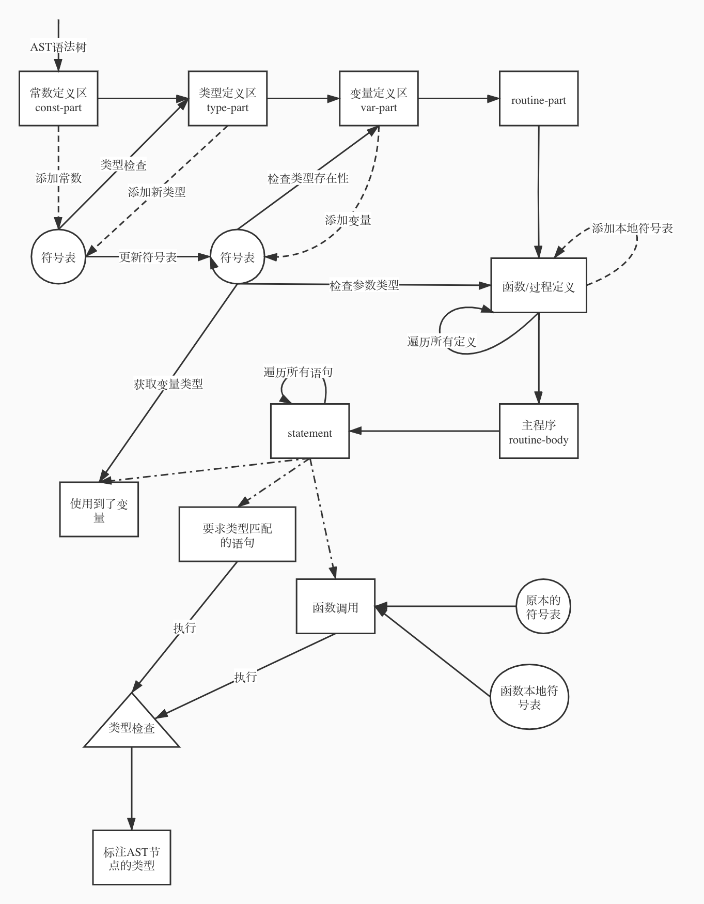

*  经过语法分析，得到了AST语法树。

*  自顶向下【post-order traversal】完成语义分析
   *  首先经过常数定义区const-part：将常数以及相应的类型和值加入符号表中。这时候只检查常数声明的类型是否为基本数据类型，即`integer, real, char, string, boolean`

   *  然后经过类型定义区type-part：格式为`typename = <类型声明>`。首先递归地解析出等式右边的完整类型，解析过程中会使用符号表进行检查，判断等式右边使用的类型是否为基本类型或者是**已经声明过的自定义类型**。

      如果等式右边类型检查正确，以等式左边`typename`为符号表的索引，右边的类型为值，向符号表插入类型声明。

   *  进入变量定义区var-part：格式为`varname : typename`。首先检查`typename`是否在符号表中定义，如果正确，则以`varname`为索引，`typename`对应的类型为值，向符号表插入变量声明。
   *  进入`routine-part`：首先处理所有的函数/过程声明。以函数为例
      *  首先和`var-part`一样，用**主程序中的符号表**检查参数类型，如果正确，把`<参数，类型>`插入**函数本地符号表**
      *  处理完参数后，检查函数返回类型，并且把返回类型作为函数节点的成员属性。
      *  最后检查函数体的类型匹配性。处理主程序的部分一样，放在后面介绍。不过这里使用的符号表是**主函数符号表+本地参数表**
      *  最后把`<函数名，函数节点>`插入符号表。

   *  进入主程序：对每一条语句进行检查。
      *  访问变量时，在符号表中检查该变量名在符号表中是否存在。如果存在，那么返回对应的类型。
      *  在涉及需要类型检查的语句【比如赋值语句】时：首先递归地**检查并解析出**每个子节点的类型，然后判断匹配性。
      *  涉及函数/过程调用时，在符号表中取出函数/过程。首先检查参数类型是否匹配；如果是函数，则设定节点类型为函数返回类型。


### 4.2 类型节点类型

定义在`namespace Typing`下，用于记录符号表中变量和用于检查的类型。

##### 4.2.1 分类

```c++
namespace Typing
{
  	// 节点类型
    enum NodeType
    {
        t_SYS_TYPE, // integer, real等
        t_ENUM, // 枚举类型，如(red, green, blue)
        t_RECORD, // 结构体
        t_ARRAY, // 数组
        t_RANGE, // 如1 .. 30, x .. y
        t_CONSTANT, // const part中定义的常量
        t_FUNCTION, // 函数
        t_PROCEDURE,    // 过程
        // ...
    };
  // 节点包含的数据类型
  enum DataType
    {
        d_INTEGER,
        d_REAL,
        d_CHAR,
        d_STRING,
        d_BOOLEAN,
    };
}
```

##### 4.2.2 节点定义

（1）基类：采用继承的设计方案，所有的类型节点基类定义如下：

```c++
namespace Typing{
  class Node
    {
    public:
        NodeType m_Type;
        Node* prev = nullptr;
        Node* next = nullptr;
    public:
        static bool isEqual(Node* node1, Node* node2); // 检查类型是否一致
        virtual std::string toString(int& hPos) const = 0; // 输出类型信息
        // hPos当前光标水平位置
    };
}
```

*  `prev, next`：因为运行同名变量的覆盖，比如函数参数的名字可以和符号表中以后的变量相同，所以符号表中每一个entry实际上是一个链表（或者说是先进先出的栈）
*  `m_Type`：节点类型
*  `isEqual`：检查两个Node节点类型是否一致
*  `toString()`：输出节点信息

（2）结构体：

```c++
namespace Typing {
  class recordNode : public Node
    {
    public:
        std::map<std::string, Node*>* m_Field = nullptr; // 成员名字到类型的映射
    public:
        Node* getAttribute(std::string str) const;
        recordNode(std::map<std::string, Node*>* Field);
        virtual std::string toString(int& hPos) const override;
    };
}
```

*  `m_Field`：元素为<成员名，成员类型>的哈希表
*  `getAttribute()`：输入结构体成员的名字，返回相应的类型。

（3）系统类型节点：最基本的Node节点之一

```c++
namespace Typing {
 	class sysNode : public Node
    {
    public: 
        std::string m_Keyword; // 为了方便输出，把类型的enum变为字符串
        DataType m_DataType;
    public:
        virtual std::string toString(int& hPos) const override;
        sysNode(DataType&& datatype);
    }; 
}
```

（4）常数节点：成员有一个系统节点指示类型，一个`AST::ValConstant`记录常数的具体值。

```c++
namespace Typing {
	class constNode : public Node
    {
    public:
        sysNode* m_Sys = nullptr;
        AST::ValConstant m_Constant;
        constNode(Node* Sys, AST::ValConstant Constant);
        virtual std::string toString(int& hPos) const override;
    };
}
```

（5）枚举类型：储存枚举类型中每一个字符串，并且这些字符串是有序的（按照声明的顺序），所以用`std::vector`作为集合体。

```c++
namespace Typing {
  class enumNode : public Node
    {
    public:
        std::vector<std::string>* m_List = nullptr;
    public:
        enumNode(std::vector<std::string>* List);
        virtual std::string toString(int& hPos) const override;
    };
}
```

（6）range类型：记录上下标的整数值

```c++
namespace Typing {
  class rangeNode : public Node
    {
    public:
        int m_LowerBound; 
        int m_UpperBound;
        rangeNode(Node* LowerBound, Node* UpperBound);
        virtual std::string toString(int& hPos) const override;
    };
}
```

（7）数组类型：储存索引类型和其中的元素类型。索引只支持枚举类型和range类型。

```c++
namespace Typing {
  class arrayNode : public Node
    {
    public:
        Node* m_EleType = nullptr; // 元素类型
        Node* m_IdxType = nullptr; // 索引类型
        arrayNode(Node* IdxType, Node* EleType);
        virtual std::string toString(int& hPos) const override;
    };
}
```

（8）函数类型

```c++
namespace Typing {
  class functNode : public Node
    {
    public:
        std::string m_name; // 函数名字
        std::vector<std::pair<std::string, bool>> m_Params;    // 参数字符串表，主要是反应参数顺序
        Node* m_resType = nullptr; // 返回类型
        ST* m_val_table = nullptr;    // 形参表
        ST* m_var_table = nullptr;    // 引用参数表
        AST::Node* m_body; // 函数体的指针，指向<Routine-Body>
    public:
        functNode(std::string name, Node* resType, AST::Node* body);
        void addParam(bool isVar, const std::string& paramName, Node* node, unsigned int line);
        virtual std::string toString(int& hPos) const override;
    };
}
```

*  `m_name`：函数名
*  `m_Params`：本地的参数辅助表，元素为`<参数名，该参数是否是引用类型>`，同时它也可以反应参数添加的顺序，这样在调用函数类型检查时可以知道对应位置输入的参数应该有的类型是什么。
*  `m_resType`：返回类型
*  `m_val_table`：形参符号表
*  `m_var_table`：引用参数符号表
*  `m_body`：函数体在AST语法树中的节点
*  `addParam()`：添加参数，输入`line`调用这个方法的AST节点所在的行数，用于报错信息的输出

（9）过程类型：和函数相同，只是没有返回类型，不再赘述。

###4.3 符号表

用类`ST`对普通的哈希表进行进一步的封装，实现符号表内容的插入、删除，以及符号表的初始化和类型检查等工作。

##### 4.3.1 类的定义

```c++
class ST
{
    std::unordered_map<std::string, Typing::Node*> Table;
    std::unordered_map<std::string, unsigned int> LineTable;
private:
    enum Scope
    {
        s_GLOBAL,
        s_CONST_PART,
        s_VAR_PART,
        s_RANGE,
    };
    Typing::Node* getType(AST::Node* p, Scope scope = Scope::s_GLOBAL);
public:
    [[nodiscard]] inline bool isEmpty() const
    {
        return Table.empty();
    }
    explicit ST(bool addSys = true)
    { // 初始化Table，塞入系统类型
        if (addSys)
        {   // 是否要默认添加系统类型
            /* 系统数据 */
            insert("integer", new Typing::sysNode(Typing::DataType::d_INTEGER), 0);
            insert("real", new Typing::sysNode(Typing::DataType::d_REAL), 0);
            insert("boolean", new Typing::sysNode(Typing::DataType::d_BOOLEAN), 0);
            insert("char", new Typing::sysNode(Typing::DataType::d_CHAR), 0);
            insert("string", new Typing::sysNode(Typing::DataType::d_STRING), 0);
        }
    }
    // 给定语法树的根节点，构造符号表
    void setup(AST::Node* p);

    // 输出符号表
    void show();

    // 向符号表中加入符号以及对应的属性
    // 返回是否为首次插入
    bool insert(const std::string& str, Typing::Node* node, unsigned int Line);

    // 根据符号名获取对应类型
    // 如果不存在，则返回nullptr
    Typing::Node* get(const std::string& str, unsigned int line);

    // 按照当前符号表检查节点
    Typing::Node* check(AST::Node* p);

    // 弹出该名字对应的最近一次加入到符号表的符号
    // 返回弹出的类型节点
    Typing::Node* pop(const std::string& str);
};
```

*  `explicit ST(bool addSys = true)`：`addSys`表明是否要把基础的系统类型插入符号表中。具体来说，在初始化最外层（用于主程序）的符号表时，需要插入系统类型，便于统一检查的方式。初始化函数所用参数表【见4.2.2.8】时，则不需要插入系统类型【否则输出的符号表会比较累赘，功能性其实不受影响】
*  `isEmpty()`：符号表是否为空
*  `Table`：传统意义上的符号哈希表，元素为`<变量名，类型节点>`

*  `LineTable`：记录变量的定义行数，用于输出错误信息，元素为`<变量名，行数>`

*  `setup(p)`：以`p`为AST语法树根节点，构建符号表

*  `show()`：输出符号表

*  `insert()`：符号表中插入元素

*  `get()`：获取str在符号表中类型

*  `check(p)`：检查以`p`为根节点的AST语法树

*  `pop()`：弹出输入名称最近一次插入符号表的记录

*  `Typing::Node* getType(AST::Node* p, Scope scope = Scope::s_GLOBAL)`：获取AST节点`p`的类型，Scope表明考虑的作用域。有如下几种

   ```c++
   enum Scope
       {
           s_GLOBAL, // 全局
           s_CONST_PART, // const-part常数定义区
           s_VAR_PART, // var-part变量定义区
           s_RANGE, // 定义range
       };
   ```

##### 4.3.2 函数实现

（1）用`std::unorder_map`标准容器屏蔽哈希表的具体实现后，每一个元素的值是一个类型的链表，具体来说是一个先进先出的栈结构。如下图所示：

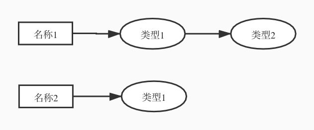

比如，当函数参数名与外层符号表某元素相同时，函数内部该变量名的类型取对应的参数类型，当退出函数后，弹出参数类型结点，还原外层的类型。

```c++
bool ST::insert(const std::string& str, Typing::Node* node, unsigned int Line)
{
    if (Table.find(str) == Table.end())
    {
        node->prev = node->next = nullptr;
        Table[str] = node;
        LineTable[str] = Line;
        return true;
    }
    else
    { // 原本就存在str这一个key
        // 用指针连接
        Table[str]->next = node;
        node->prev = Table[str];
        Table[str] = node;
        return false;
    }
}

Typing::Node* ST::get(const std::string& str, unsigned int line)
{
    if (Table.find(str) != Table.end())
    {
        return Table[str];
    }
    // 报错
    std::stringstream msg;
    msg << std::endl << "In line: " << line << ". The type \"" << str << "\" is not available in the symbol table!";
    raiseError(msg.str());
}

Typing::Node* ST::pop(const std::string& str)
{
    if (Table.find(str) == Table.end())
    { // 如果不存在，没办法删除
        std::stringstream msg;
        msg << "当前符号表中不存在名称: \"" << str << "\"" << std::endl;
        raiseError(msg.str())
    }
    else 
    {   // 取出链表尾部
        Typing::Node* res = Table[str];
        Typing::Node* prev = Table[str]->prev;  // 上一个在这一位置的符号
        if (prev)
        {
            Table[str] = prev;
            Table[str]->next = nullptr;
        }
        else 
        {
            Table.erase(str);
        }
        res->prev = nullptr;
        return res;
    }
}
```

（2）获取AST结点的类型。

这部分和绘图非常相似，依旧采用了递归的思想。其叶节点情形为

*  常数节点时，类型为对应的系统类型。

   Remark：常数只能是简单的系统类型。

   ```c++
   Typing::Node* ST::getType(AST::Node* p, Scope scope)
   { 
       switch (p->m_Attribute)
       {
           case AST::Attribute::Constant:
               switch (p->m_Constant.Type)
               {
                   case AST::ConstantType::Integer:
                       return new Typing::constNode(get("integer", 0) , p->m_Constant);
                   case AST::ConstantType::Real:
                       return new Typing::constNode(get("real", 0) , p->m_Constant);
                   case AST::ConstantType::Boolean:
                       return new Typing::constNode(get("boolean", 0) , p->m_Constant);
                   case AST::ConstantType::Char:
                       return new Typing::constNode(get("char", 0) , p->m_Constant);
                   case AST::ConstantType::String:
                       return new Typing::constNode(get("string", 0) , p->m_Constant);
                   default:
                       raiseError("Unknown constant Type!");
               }
           ...
        ...
       }
   ...
   }
   ```

*  变量名时，返回符号表中记录的类型

   ```c++
   case AST::Attribute::Identifier:
               if (scope == Scope::s_RANGE)
               {
                   return get(p->m_Identifier.Name, p->m_Line);
               }
   ```

*  类型名时，也返回符号表中的记录类型。

   Remark：见4.1，type-part和var-part的信息都放在符号表内。

   ```c++
   case AST::Attribute::Typename:
               {
                   return get(p->m_Typename.Name, p->m_Line);
               }
   ```

对于非叶节点，有如下几种情形

*  本身不具备类型，此时只需要让子节点获取类型即可。如

   ```c++
   case TYPE_PART:           
       for (int i = 0;i < p->m_Operation.NumOperands; ++i)
       {
         getType(p->m_Operation.List_Operands[i]);
       }
       break;
   ```

*  常数定义。比如符号EQUAL作用域出现在const-part时，表明常数定义。节点本身没有类型，但是这时候要插入符号表。

   ```c++
   case EQUAL:
       if (scope == Scope::s_CONST_PART)
       { // const part的常数定义
         insert(p->m_Operation.List_Operands[0]->m_Identifier.Name,
                getType(p->m_Operation.List_Operands[1]), p->m_Operation.List_Operands[0]->m_Line);
       }
       break;
   ```

*  类型定义，变量定义。插入符号表

   ```c++
   case TYPE: // 左边是类型名字，右边是这个名字对应的类型statement
         // 见test3.spl以及对应的AST
         insert(p->m_Operation.List_Operands[0]->m_Identifier.Name,
                getType(p->m_Operation.List_Operands[1]), p->m_Operation.List_Operands[0]->m_Line);
   
         break;
   case VAR: 
         if (scope == Scope::s_VAR_PART)
         { // var part部分的var，声明全局变量的类型
           for (int i = 1; i < p->m_Operation.NumOperands; ++i)
           {  
             insert(p->m_Operation.List_Operands[i]->m_Identifier.Name,
                    getType(p->m_Operation.List_Operands[0]), p->m_Operation.List_Operands[i]->m_Line);
   
           }
         }
         else
         { // 函数参数部分的var，声明参数的引用类型
   
         }
         break;
   ```

*  函数/过程。以函数为例，其子节点的格式为

   *  首先获取函数的参数子节点类型，并插入函数本地符号表。
   *  处理完参数后，检查函数体的类型。
      *  将函数本地符号表并入当前类实例的符号表中
      *  使用函数`check()`检查函数体
      *  检查成功后，恢复原始的符号表

   ```c++
   case FUNCTION:
       {
         auto function = dynamic_cast<Typing::functNode*>(getType(p->m_Operation.List_Operands[0]));
         if (p->m_Operation.NumOperands == 2)
         {   // 具有subroutine 
           AST::Node* subroutine = p->m_Operation.List_Operands[1];
           function->m_body = subroutine->m_Operation.List_Operands[0];
   
           // 检查函数体的类型
   
           for (auto& it : function->m_val_table->Table)
           {   // 先把函数的参数表暂时加入符号表中
             insert(it.first, it.second, function->m_val_table->LineTable[it.first]);
           }   
           for (auto& it : function->m_var_table->Table)
           {   // 类型检查时不区分引用类型
             insert(it.first, it.second, function->m_val_table->LineTable[it.first]);
           }
   
           // 检查函数体
           check(function->m_body);
   
           // 把刚才加入的符号弹出
           for (auto& it : function->m_val_table->Table)
           {
             pop(it.first);
           }
           for (auto& it : function->m_var_table->Table)
           {
             pop(it.first);
           }
         }
   
         return function;
       }
   case FUNCTION_HEAD:
       {
         std::string name = p->m_Operation.List_Operands[p->m_Operation.NumOperands]->m_Identifier.Name;
         auto* function = new Typing::functNode(name, getType(p->m_Operation.List_Operands[p->m_Operation.NumOperands-1]), nullptr);
         this->insert(name, function, // 函数的行数取函数名的函数
                      p->m_Operation.List_Operands[p->m_Operation.NumOperands]->m_Line); 
         if (p->m_Operation.NumOperands > 1)
         { // 具有参数
           AST::Node* paraList = p->m_Operation.List_Operands[0];
           for (int i = 0;i < paraList->m_Operation.NumOperands; ++i)
           {
             AST::Node* para_group = paraList->m_Operation.List_Operands[i];
             Typing::Node* type = getType(para_group->m_Operation.List_Operands[0]);
             for (int j = 1;j < para_group->m_Operation.NumOperands; ++j)
             {
               auto param = para_group->m_Operation.List_Operands[j];
   
               if (para_group->m_Operation.Operator == VAL_PARAM)
               { // 添加形参表
                 function->addParam(true, param->m_Identifier.Name, type, param->m_Line);
               }
               else if (para_group->m_Operation.Operator == VAR_PARAM)
               { // 添加引用参数表
                 function->addParam(false, param->m_Identifier.Name, type, param->m_Line);
               }
               else 
               {
                 raiseError("Unknown param type!");
               }
             }
           }
         }
         return function;
       }
   ```

（3）检查类型的一致性。

```c++
Typing::Node* ST::check(AST::Node* p);
```

*  goto语句：要求子节点为常数整数类型

   ```c++
   switch (p->m_Operation.Operator)
       {
           /* goto语句，跳转到对应label */
         case GOTO:
           { // 格式为[integer"]
             assert(p->m_Operation.List_Operands[0]->m_Attribute == AST::Attribute::Constant);
             auto jump_label = check(p->m_Operation.List_Operands[0]);
             if (Typing::Node::isEqual(get("integer", 0), jump_label))
             {
               return nullptr;
             }
             std::stringstream msg;
             msg << std::endl << "In line " << p->m_Line << ". goto statement的label必须为整数" << std::endl;
             raiseError(msg.str());
           }
   ```

*  循环语句：要求循环条件为boolean类型，然后检查执行语句的类型。类似的还有其他结构语句，比如If语句，case语句。

   ```c++
   case WHILE:
   case REPEAT:
   { // 子节点格式为，[条件，statement]
     // while和repeat是一致的
     // 例子请见guess.spl
     auto condition = check(p->m_Operation.List_Operands[0]);
     if (Typing::Node::isEqual(get("boolean", 0), condition))
     {   // 条件需要为布尔值
       // 检查语句
       check(p->m_Operation.List_Operands[1]);
       // 本身没有返回值
       return nullptr;
     }
     std::stringstream msg;
     msg << std::endl << "In line " << p->m_Line << ". while语句的条件必须为布尔值" << std::endl;
     raiseError(msg.str());
   }
   ```

*  函数调用：要求

   *  参数数目匹配
   *  参数数目由左到右的类型匹配
   *  函数存在返回类型

   ```c++
   case CALL_FUNCT:
       {   // 注意，这里是调用函数，而非定义函数
         // 子节点格式为[函数名, 输入1, 输入2, ...]
         auto function = dynamic_cast<Typing::functNode *>(get(
           p->m_Operation.List_Operands[0]->m_Identifier.Name, p->m_Line));
   
         int size = function->m_Params.size();
   
         if (size != p->m_Operation.NumOperands - 1)
         {
           std::stringstream msg;
           msg << std::endl << "In line " << p->m_Line << ". 函数参数数目不匹配" << std::endl;
           int hPos = 0;
           msg << function->toString(hPos) << std::endl;
           msg << "expected: " << size << std::endl;
           msg << "given: " << p->m_Operation.NumOperands - 1 << std::endl;
           raiseError(msg.str());
         }
         int i = 1;
         for (auto it = function->m_Params.begin(); it != function->m_Params.end(); ++it)
         {
           auto input = check(p->m_Operation.List_Operands[i++]); // 第i个输入的参数
           Typing::Node *param;
   
           if (it->second)
           {   // is var = true
             param = function->m_var_table->get(it->first, p->m_Line);
           }
           else
           {
             param = function->m_val_table->get(it->first, p->m_Line);
           }
           if (!Typing::Node::isEqual(param, input))
           {
             std::stringstream msg;
             msg << std::endl << "In line " << p->m_Line << ". 函数参数类型不匹配" << std::endl;
             int hPos = 0;
             msg << "expected: " << std::endl << param->toString(hPos) << std::endl;
             msg << "input: " << std::endl << input->toString(hPos) << std::endl;
             raiseError(msg.str());
           }
         }
         // 函数返回类型
         p->m_Type = function->m_resType;
         return p->m_Type;
       }
   ```

*  结构体成员访问：要求

   *  被访问的变量类型为`record`

   *  结构体访问的成员名有效

   *  特别的，要考虑到被访问的变量名为函数的情形。因为在函数内部，函数的返回变量就是本身，所以这时候就检查函数的

      返回类型是否为`reocrd`

   ```c++
   case DOT:
       {   // 结构体成员访问
         // 子节点为[record名，成员名]
         auto node = get(p->m_Operation.List_Operands[0]->m_Identifier.Name, p->m_Line);
         Typing::recordNode *record;
         if (node->m_Type == Typing::NodeType::t_RECORD)
         {
           record = dynamic_cast<Typing::recordNode *>(node);
         }
         else if (node->m_Type == Typing::NodeType::t_FUNCTION)
         {   // 在函数内部，函数名就是返回值
           auto function = dynamic_cast<Typing::functNode *>(node);
   
           if (function->m_resType->m_Type == Typing::NodeType::t_RECORD)
           {
             record = dynamic_cast<Typing::recordNode *>(function->m_resType);
           }
           else
           {
             std::stringstream msg;
             msg << std::endl << "In line " << p->m_Line << ". 函数类型不是record！" << std::endl;
             int hPos = 0;
             msg << "函数: " << function->toString(hPos) << std::endl;
             raiseError(msg.str());
           }
         }
         else
         {
           std::stringstream msg;
           msg << std::endl << "In line " << p->m_Line << ". 不是结构类型，无法访问成员！" << std::endl;
           int hPos = 0;
           msg << "变量: " << node->toString(hPos) << std::endl;
           raiseError(msg.str());
         }
         std::string member = p->m_Operation.List_Operands[1]->m_Identifier.Name;
         if (record->m_Field->find(member) == record->m_Field->end())
         {
           std::stringstream msg;
           msg << std::endl << "In line " << p->m_Line << ". 结构体访问的成员不存在!" << std::endl;
           int hPos = 0;
           msg << "结构体: " << record->toString(hPos) << std::endl;
           msg << "访问名: " << member << std::endl;
           raiseError(msg.str());
         }
   
         // 返回成员的类型
         p->m_Type = (*(record->m_Field))[member];
         return p->m_Type;
       }
   ```

*  赋值语句。

   *  两边的类型必须一致。
   *  不一致的情形只允许：`real := integer`，但是不允许`integer := real`

   ```c++
   case ASSIGN:
       {   // 返回两边类型
         // 子节点为[被赋值id，值]
         Typing::Node *left = check(p->m_Operation.List_Operands[0]);
         Typing::Node *right = check(p->m_Operation.List_Operands[1]);
   
         if (!Typing::Node::isEqual(left, right))
         {
           if (Typing::Node::isEqual(right, get("integer", 0)) &&
               Typing::Node::isEqual(left, get("real", 0)))
           { // 有且仅有左边是real也是没有问题的
             // 但是不能把real赋值给integer
             // 这时候返回值就是real
             p->m_Type = get("real", 0);
             return p->m_Type;
           }
           else
           {
             std::stringstream msg;
             msg << std::endl << "In line " << p->m_Line << ". 该操作两边的类型不匹配" << std::endl;
             int hPos = 0;
             msg << "LHS: " << left->toString(hPos) << std::endl;
             msg << "RHS: " << right->toString(hPos) << std::endl;
             raiseError(msg.str());
           }
         }
         p->m_Type = right;
         return p->m_Type;
       }
   ```

### 4.4 解释器的封装

把语法分析和语义分析的操作封装为解释器

`interpreter.hpp`

```c++
class Interpreter
{
public:
    ST* symbol_table = nullptr;
    AST::Node* main_entry = nullptr;  // 主函数的入口，指向跟节点下面的routine-body
public:
    Interpreter()
    {
        symbol_table = new ST();
    }
    static int plot_txt(AST::Node* p, std::ofstream& Out);
    static int plot_py(AST::Node* p, std::ofstream& Out);
    int execute(AST::Node* p, std::string& Filename, std::string& Program) const;
};
```

`interpreter.cpp`

*  根据程序名构造输出文件
*  构造符号表，并在期间设置`main_entry`，即主程序对应的AST语法树根节点
*  绘制符号表
*  绘制语法树

只需要调用`interpeter.execute(...)`即可。

```c++
#include "Interpreter.hpp"
#include <unordered_map>
#include "Plot_txt.hpp"
#include "Plot_py.hpp"
#include "yacc.tab.hpp"

int Interpreter::plot_txt(AST::Node* p, std::ofstream& Out)
{
    int rte, rtm;
    Plot_txt::init();
    Plot_txt::plotNode(p, 0, 0, rte, rtm);
    Plot_txt::finish(Out);
    return 0;
}
int Interpreter::plot_py(AST::Node* p, std::ofstream& Out)
{
    int id = 0;
    Plot_py::plotNode(p, id, Out);
    return 0;
}

int Interpreter::execute(AST::Node* p, std::string& Filename, std::string& Program) const
{
    /* 把刚std::cout重定向，写入到文件 */
    std::ofstream st_out("./Output/Logs/" + Filename + ".st");
    std::streambuf* cout_buffer = std::cout.rdbuf();
    std::streambuf* st_out_buffer = st_out.rdbuf();
    // 替换cout缓存区指针
    std::cout.rdbuf(st_out_buffer);

    std::cout << "Symbol Table: *****************" << std::endl;
    symbol_table->setup(p);
    symbol_table->show();
    std::cout << "Type of AST Node: *****************" << std::endl;

    // 两个绘制顺序不能换，在plot_py过程获得节点id
    std::ofstream ast_raw("./Output/AST_raw/" + Filename + ".raw.ast");
    plot_py(p, ast_raw);
    ast_raw.close();

    std::ofstream ast_txt("./Output/AST_txt/" + Filename + ".txt.ast");
    plot_txt(p, ast_txt);
    ast_txt.close();


    st_out.flush();
    st_out.close();
    // 恢复std::cout为原来的流缓冲区指针
    std::cout.rdbuf(cout_buffer);


    return 0;
}
```

