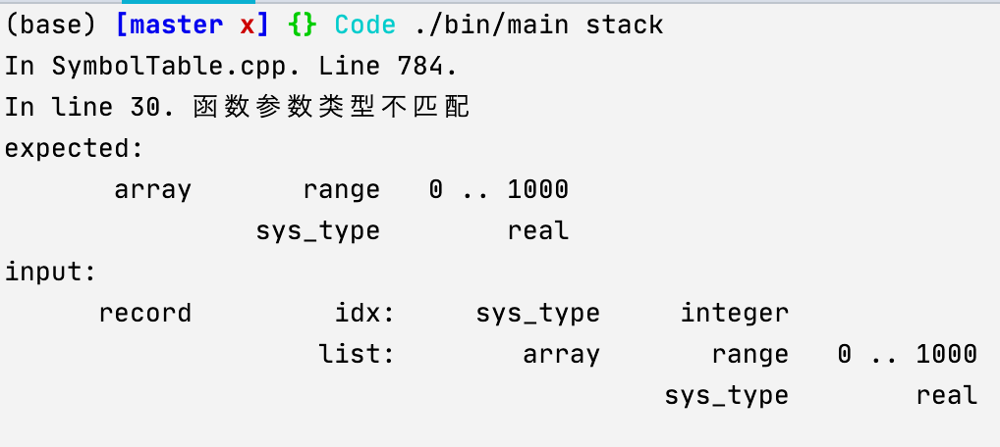

##1. 引言

###1.1 文件结构


*  根目录
   *  Code：工程代码区域，**为了跨系统路径统一的方便，只能在这一目录运行可执行文件**`bin/main`。
      *  bin：可执行文件生成路径
      *  build：CMake编译产生的目标文件
      *  include：头文件路径`.hpp`，包括bison编译产生的头文件
      *  source：源文件路径`.cpp`，包括flex和bison编译产生的源文件
      *  lex_yacc：flex`.lex`和bison`.y`源文件路径
      *  Test：用于测试的`.spl`代码路径
      *  Output：程序**运行过程**中产生的输出文件
         *  AST_txt：文本格式的语法树
         *  AST_raw：描述语法树的文本流，用于python代码进行进一步的处理
         *  AST_py：python代码解析`AST_raw`中文件后，输出的语法树图片
         *  Logs：输出的类型信息，后缀为`.st`的文件包含符号表，以及语法树中各个节点的类型（与语法树上的id一一对应）
         *  IR_code：编译`.spl`代码所产生的中间代码，由`llvm`生成
         *  MIPS_code：用`llvm`编译中间代码，所产生的针对MIPS架构的汇编代码
   *  Resource：存放文档所用图片

###1.2 工程编译

采用全自动的`CMake`文件编译。在路径`./Code`下执行指令

```bash
mkdir -p build
cd build
cmake ..
make
cd .. # 返回./Code
```

即可（需要在本地上安装好LLVM，见博客https://blog.csdn.net/l2563898960/article/details/82871826）。下面的CMakeList.txt对任何工程都适配，只需要简单修改自定义的路径名，以及`lex`和`yacc`文件的名字即可

```makefile
cmake_minimum_required(VERSION 3.19)
project(SPL_PROJECT)
set(CMAKE_CXX_STANDARD 17)

# 设置文件夹名称
set(SOURCE_DIR source)
set(BUILD_DIR build)
set(INCLUDE_DIR include)
set(TARGET_DIR bin)
set(LEX_YACC lex_yacc)

# 设置所用的lex / yacc
set(LEX flex)
set(YACC bison)

# bison and flex
find_package(BISON)
find_package(FLEX)

include_directories(${LEX_YACC})

# 设置lex和yacc的输出文件名
set(LEX_FILE lex)
set(YACC_FILE yacc)
# lex编译.l文件
execute_process(COMMAND ${LEX} -o ${CMAKE_CURRENT_SOURCE_DIR}/${SOURCE_DIR}/${LEX_FILE}.yy.cpp
        ${CMAKE_CURRENT_SOURCE_DIR}/${LEX_YACC}/${LEX_FILE}.l)
# yacc编译.y文件
execute_process(COMMAND ${YACC} -o ${CMAKE_CURRENT_SOURCE_DIR}/${SOURCE_DIR}/${YACC_FILE}.tab.cpp
        ${CMAKE_CURRENT_SOURCE_DIR}/${LEX_YACC}/${YACC_FILE}.y -d)
# 把生成的yacc.tab.hpp转移到include路径
execute_process(COMMAND mv ${CMAKE_CURRENT_SOURCE_DIR}/${SOURCE_DIR}/${YACC_FILE}.tab.hpp
        ${CMAKE_CURRENT_SOURCE_DIR}/${INCLUDE_DIR}/)

# llvm
find_package(LLVM REQUIRED CONFIG)

message(STATUS "Found LLVM ${LLVM_PACKAGE_VERSION}")
message(STATUS "Using LLVMConfig.cmake in: ${LLVM_DIR}")


# Set your project compile flags.
# E.g. if using the C++ header files
# you will need to enable C++11 support
# for your compiler.

include_directories(${LLVM_INCLUDE_DIRS})
include_directories(include)
add_definitions(${LLVM_DEFINITIONS})

# Now build our tools
aux_source_directory(source SRC_LIST)


# 可执行文件输出到bin
set(EXECUTABLE_OUTPUT_PATH "${CMAKE_CURRENT_SOURCE_DIR}/${TARGET_DIR}")
add_executable(main ${SRC_LIST})

# Find the libraries that correspond to the LLVM components
# that we wish to use
llvm_map_components_to_libnames(llvm_libs support core irreader)

# Link against LLVM libraries
# 连接llvm
target_link_libraries(main ${llvm_libs})
```

###1.3 运行说明

**注：请在路径`./Code/`下运行**

```c++
./bin/main
```

如果执行文件时不带参数，则在控制台直接输入spl代码。


也可以带一个参数指明`spl`文件名，直接编译整个文件。注意，只需要指明文件名而不用路径，且`spl`文件必须放在目录`./Code/Test`下。

```bash
./bin/main Hello		# 输入时不需要声明文件后缀，默认都是.spl
```

####1.3.1 语法分析结果

这一过程会在目录`./Code/Output/AST_txt`产生对应的txt版本的语法树，如下所示


同时在`./Code/Output/AST_raw`产生描述语法树的文件，用于之后使用python进一步处理，产生图像。

配置好python以及所需的依赖包【见1.4】以后，可以运行python代码产生图片格式的语法树，路径为`./Code/Output/AST_py`

```python
python main.py Hello
```


####1.3.2 语义分析结果

运行过程会在目录`./Code/Output/Logs`产生语义分析过程产生的符号表，以及对语法树中各个节点类型的标注，文件后缀为`.st`。


#### 1.3.3 代码生成结果

运行过程会在目录`./Code/Output/IR_code`产生spl代码对应的中间代码（也会在控制台直接输出），文件后缀为`.ll`。


在本地配置好`llvm`以后，可以直接用`lli`命令来运行中间代码。


也可以用`llc -march=<指令集架构，如MIPS>`命令来产生汇编代码。

```bash
llc -march=mips ./Output/IR_code/Hello.ll -o ./Output/MIPS_code/Hello.s
```

```assembly
	.text
	.abicalls
	.option	pic0
	.section	.mdebug.abi32,"",@progbits
	.nan	legacy
	.text
	.file	"main"
	.globl	main                            # -- Begin function main
	.p2align	2
	.type	main,@function
	.set	nomicromips
	.set	nomips16
	.ent	main
main:                                   # @main
	.cfi_startproc
	.frame	$sp,24,$ra
	.mask 	0x80000000,-4
	.fmask	0x00000000,0
	.set	noreorder
	.set	nomacro
	.set	noat
# %bb.0:                                # %main_entry
	addiu	$sp, $sp, -24
	.cfi_def_cfa_offset 24
	sw	$ra, 20($sp)                    # 4-byte Folded Spill
	.cfi_offset 31, -4
	lui	$1, %hi($format)
	addiu	$4, $1, %lo($format)
	lui	$1, %hi($string_tmp_)
	jal	printf
	addiu	$5, $1, %lo($string_tmp_)
	lw	$ra, 20($sp)                    # 4-byte Folded Reload
	jr	$ra
	addiu	$sp, $sp, 24
	.set	at
	.set	macro
	.set	reorder
	.end	main
$func_end0:
	.size	main, ($func_end0)-main
	.cfi_endproc
                                        # -- End function
	.type	$string_tmp_,@object            # @string_tmp_
	.section	.rodata.str1.1,"aMS",@progbits,1
$string_tmp_:
	.asciz	"Hello Wolrd"
	.size	$string_tmp_, 12

	.type	$format,@object                 # @format
$format:
	.asciz	"%s\n"
	.size	$format, 4

	.section	".note.GNU-stack","",@progbits
	.text
```


###1.4 配置说明

*  Flex：flex 2.5.35(flex-32)

*  Bison：bison (GNU Bison) 2.3

*  g++：Apple clang version 12.0.5 (clang-1205.0.22.9)

*  C++标准：-std = c++17

*  CMake $\ge$3.19

*  llvm 12.0.0

*  Python3.9：用于绘制语法树，非必要

   *  依赖包：graphviz，安装详见https://graphviz.org/download/#windows

      安装环境graphviz之后，为了在python中运行，需要

      ```bash
      pip3 install graphviz
      ```

###1.5 实现功能一览

以`./Code/Test/stack.spl`为例。

####1.5.1 生成语法树（文字版和图片版）


####1.5.2 生成符号表以及函数的参数表

```txt
Symbol Table: *****************
        name  line        type   attribute
         set    35   procedure
         pop    25    function    sys_type        real
         get    16    function    sys_type        real
        bool    11    sys_type     boolean
      string     0    sys_type      string
        char     0    sys_type        char
       stack    13      record         idx:     sys_type     integer
                                      list:        array       range   0 .. 1000
                                                            sys_type        real
     boolean     0    sys_type     boolean
     integer     0    sys_type     integer
        real     0    sys_type        real
        push    45    function    sys_type     boolean
        ZERO     4       const     integer           0
       Stack     7      record         idx:     sys_type     integer
                                      list:        array       range   0 .. 1000
                                                            sys_type        real
       index    14    sys_type     integer
        List     6       array       range   0 .. 1000
                                  sys_type        real
     MAX_LEN     3       const     integer        1000
----------------------------------------
function: "pop"
        name  line        type   attribute
       stack    26      record         idx:     sys_type     integer
                                      list:        array       range   0 .. 1000
                                                            sys_type        real
----------------------------------------
function: "get"
        name  line        type   attribute
        list    17       array       range   0 .. 1000
                                  sys_type        real
        name  line        type   attribute
         idx    18    sys_type     integer
----------------------------------------
function: "push"
        name  line        type   attribute
       stack    46      record         idx:     sys_type     integer
                                      list:        array       range   0 .. 1000
                                                            sys_type        real
        name  line        type   attribute
     element    47    sys_type        real
----------------------------------------
procedure: "set"
        name  line        type   attribute
        list    36       array       range   0 .. 1000
                                  sys_type        real
        name  line        type   attribute
     element    38    sys_type        real
         idx    37    sys_type     integer
```

#### 1.5.3 语法树节点的类型标注。其中的id与语法树图片上的id一一对应。

```txt
Type of AST Node: *****************
type of id: 48
    sys_type        real
type of id: 49
    sys_type        real
type of id: 50
    sys_type        real
type of id: 51
       array       range   0 .. 1000
                sys_type        real
type of id: 52
    sys_type     integer
type of id: 63
    sys_type     boolean
type of id: 64
    sys_type     integer
type of id: 67
    sys_type     integer
type of id: 69
    sys_type     integer
type of id: 70
    sys_type     integer
type of id: 73
    sys_type     integer
type of id: 74
    sys_type     integer
type of id: 77
    sys_type     integer
type of id: 78
    sys_type        real
type of id: 79
    sys_type        real
type of id: 80
    sys_type        real
type of id: 82
       array       range   0 .. 1000
                sys_type        real
type of id: 85
    sys_type     integer
type of id: 102
    sys_type        real
type of id: 103
    sys_type        real
type of id: 104
       array       range   0 .. 1000
                sys_type        real
type of id: 105
    sys_type     integer
type of id: 106
    sys_type        real
type of id: 120
    sys_type     boolean
type of id: 121
    sys_type     integer
type of id: 124
    sys_type     integer
type of id: 126
    sys_type     integer
type of id: 127
    sys_type     integer
type of id: 130
    sys_type     integer
type of id: 131
    sys_type     integer
type of id: 134
    sys_type     integer
type of id: 137
       array       range   0 .. 1000
                sys_type        real
type of id: 140
    sys_type     integer
type of id: 143
    sys_type        real
type of id: 144
    sys_type     boolean
type of id: 145
    sys_type     boolean
type of id: 146
    sys_type     boolean
```

####1.5.4 类型错误检查与提示。




#### 1.5.5 中间代码生成

```java
; ModuleID = 'main'
source_filename = "main"

@string_tmp_ = private unnamed_addr constant [41 x i8] c"option: [0]: pop\09[1]: push\09[other]: exit\00", align 1
@format = private unnamed_addr constant [4 x i8] c"%s\0A\00", align 1
@string_tmp_.1 = private unnamed_addr constant [27 x i8] c"Please enter your option: \00", align 1
@format.2 = private unnamed_addr constant [3 x i8] c"%s\00", align 1
@format.3 = private unnamed_addr constant [3 x i8] c"%d\00", align 1
@format.4 = private unnamed_addr constant [5 x i8] c"%lf\0A\00", align 1
@string_tmp_.5 = private unnamed_addr constant [44 x i8] c"Please enter the element you want to push: \00", align 1
@format.6 = private unnamed_addr constant [3 x i8] c"%s\00", align 1
@format.7 = private unnamed_addr constant [4 x i8] c"%lf\00", align 1
@string_tmp_.8 = private unnamed_addr constant [39 x i8] c"[Error]: No more element to be popped!\00", align 1
@format.9 = private unnamed_addr constant [4 x i8] c"%s\0A\00", align 1
@string_tmp_.10 = private unnamed_addr constant [28 x i8] c"[Error]: The stack is full!\00", align 1
@format.11 = private unnamed_addr constant [4 x i8] c"%s\0A\00", align 1

declare i32 @printf(i8*, ...)

declare i32 @scanf(i8*, ...)

define void @main() {
main_entry:
  %element = alloca double, align 8
  %option = alloca i32, align 4
  %index = alloca i32, align 4
  %stack = alloca { i32, [1000 x double] }, align 8
  %record_access_tmp_ = getelementptr inbounds { i32, [1000 x double] }, { i32, [1000 x double] }* %stack, i32 0, i32 0
  store i32 0, i32* %record_access_tmp_, align 4
  %0 = call i32 (i8*, ...) @printf(i8* getelementptr inbounds ([4 x i8], [4 x i8]* @format, i32 0, i32 0), i8* getelementptr inbounds ([41 x i8], [41 x i8]* @string_tmp_, i32 0, i32 0))
  br label %loop

loop:                                             ; preds = %after2, %main_entry
  %1 = call i32 (i8*, ...) @printf(i8* getelementptr inbounds ([3 x i8], [3 x i8]* @format.2, i32 0, i32 0), i8* getelementptr inbounds ([27 x i8], [27 x i8]* @string_tmp_.1, i32 0, i32 0))
  %2 = call i32 (i8*, ...) @scanf(i8* getelementptr inbounds ([3 x i8], [3 x i8]* @format.3, i32 0, i32 0), i32* %option)
  %option1 = load i32, i32* %option, align 4
  %ieq_tmp_ = icmp eq i32 %option1, 0
  br i1 %ieq_tmp_, label %if, label %else

after:                                            ; preds = %after2
  ret void

if:                                               ; preds = %loop
  %3 = call double ({ i32, [1000 x double] }*, ...) @pop({ i32, [1000 x double] }* %stack)
  %4 = call i32 (i8*, ...) @printf(i8* getelementptr inbounds ([5 x i8], [5 x i8]* @format.4, i32 0, i32 0), double %3)
  br label %after2

else:                                             ; preds = %loop
  %option3 = load i32, i32* %option, align 4
  %ieq_tmp_4 = icmp eq i32 %option3, 1
  br i1 %ieq_tmp_4, label %if5, label %else6

after2:                                           ; preds = %after7, %if
  %option9 = load i32, i32* %option, align 4
  %ieq_tmp_10 = icmp eq i32 %option9, 2
  br i1 %ieq_tmp_10, label %after, label %loop

if5:                                              ; preds = %else
  %5 = call i32 (i8*, ...) @printf(i8* getelementptr inbounds ([3 x i8], [3 x i8]* @format.6, i32 0, i32 0), i8* getelementptr inbounds ([44 x i8], [44 x i8]* @string_tmp_.5, i32 0, i32 0))
  %6 = call i32 (i8*, ...) @scanf(i8* getelementptr inbounds ([4 x i8], [4 x i8]* @format.7, i32 0, i32 0), double* %element)
  %element8 = load double, double* %element, align 8
  call void (double, { i32, [1000 x double] }*, ...) @push(double %element8, { i32, [1000 x double] }* %stack)
  br label %after7

else6:                                            ; preds = %else
  store i32 2, i32* %option, align 4
  br label %after7

after7:                                           ; preds = %else6, %if5
  br label %after2
}

define internal void @set(double %0, [1000 x double]* %1, i32 %2, ...) {
set:
  %element = alloca double, align 8
  store double %0, double* %element, align 8
  %index = alloca i32, align 4
  store i32 %2, i32* %index, align 4
  %index1 = load i32, i32* %index, align 4
  %3 = getelementptr [1000 x double], [1000 x double]* %1, i32 0, i32 %index1
  %element2 = load double, double* %element, align 8
  store double %element2, double* %3, align 8
  ret void
}

define internal double @pop({ i32, [1000 x double] }* %0, ...) {
pop:
  %pop1 = alloca double, align 8
  %record_access_tmp_ = getelementptr inbounds { i32, [1000 x double] }, { i32, [1000 x double] }* %0, i32 0, i32 0
  %1 = load i32, i32* %record_access_tmp_, align 4
  %igt_tmp_ = icmp sgt i32 %1, 0
  br i1 %igt_tmp_, label %if, label %else

if:                                               ; preds = %pop
  %record_access_tmp_2 = getelementptr inbounds { i32, [1000 x double] }, { i32, [1000 x double] }* %0, i32 0, i32 1
  %2 = load [1000 x double], [1000 x double]* %record_access_tmp_2, align 8
  %record_access_tmp_3 = getelementptr inbounds { i32, [1000 x double] }, { i32, [1000 x double] }* %0, i32 0, i32 0
  %3 = load i32, i32* %record_access_tmp_3, align 4
  %4 = call double ([1000 x double], i32, ...) @get([1000 x double] %2, i32 %3)
  store double %4, double* %pop1, align 8
  %record_access_tmp_4 = getelementptr inbounds { i32, [1000 x double] }, { i32, [1000 x double] }* %0, i32 0, i32 0
  %record_access_tmp_5 = getelementptr inbounds { i32, [1000 x double] }, { i32, [1000 x double] }* %0, i32 0, i32 0
  %5 = load i32, i32* %record_access_tmp_5, align 4
  %isub_tmp_ = sub i32 %5, 1
  store i32 %isub_tmp_, i32* %record_access_tmp_4, align 4
  br label %after

else:                                             ; preds = %pop
  %6 = call i32 (i8*, ...) @printf(i8* getelementptr inbounds ([4 x i8], [4 x i8]* @format.9, i32 0, i32 0), i8* getelementptr inbounds ([39 x i8], [39 x i8]* @string_tmp_.8, i32 0, i32 0))
  br label %after

after:                                            ; preds = %else, %if
  %7 = load double, double* %pop1, align 8
  ret double %7
}

define internal double @get([1000 x double] %0, i32 %1, ...) {
get:
  %list = alloca [1000 x double], align 8
  store [1000 x double] %0, [1000 x double]* %list, align 8
  %index = alloca i32, align 4
  store i32 %1, i32* %index, align 4
  %get1 = alloca double, align 8
  %index2 = load i32, i32* %index, align 4
  %2 = getelementptr [1000 x double], [1000 x double]* %list, i32 0, i32 %index2
  %3 = load double, double* %2, align 8
  store double %3, double* %get1, align 8
  %4 = load double, double* %get1, align 8
  ret double %4
}

define internal void @push(double %0, { i32, [1000 x double] }* %1, ...) {
push:
  %element = alloca double, align 8
  store double %0, double* %element, align 8
  %record_access_tmp_ = getelementptr inbounds { i32, [1000 x double] }, { i32, [1000 x double] }* %1, i32 0, i32 0
  %2 = load i32, i32* %record_access_tmp_, align 4
  %ilt_tmp_ = icmp slt i32 %2, 1000
  br i1 %ilt_tmp_, label %if, label %else

if:                                               ; preds = %push
  %record_access_tmp_1 = getelementptr inbounds { i32, [1000 x double] }, { i32, [1000 x double] }* %1, i32 0, i32 0
  %record_access_tmp_2 = getelementptr inbounds { i32, [1000 x double] }, { i32, [1000 x double] }* %1, i32 0, i32 0
  %3 = load i32, i32* %record_access_tmp_2, align 4
  %iadd_tmp_ = add i32 %3, 1
  store i32 %iadd_tmp_, i32* %record_access_tmp_1, align 4
  %element3 = load double, double* %element, align 8
  %record_access_tmp_4 = getelementptr inbounds { i32, [1000 x double] }, { i32, [1000 x double] }* %1, i32 0, i32 1
  %record_access_tmp_5 = getelementptr inbounds { i32, [1000 x double] }, { i32, [1000 x double] }* %1, i32 0, i32 0
  %4 = load i32, i32* %record_access_tmp_5, align 4
  call void (double, [1000 x double]*, i32, ...) @set(double %element3, [1000 x double]* %record_access_tmp_4, i32 %4)
  br label %after

else:                                             ; preds = %push
  %5 = call i32 (i8*, ...) @printf(i8* getelementptr inbounds ([4 x i8], [4 x i8]* @format.11, i32 0, i32 0), i8* getelementptr inbounds ([28 x i8], [28 x i8]* @string_tmp_.10, i32 0, i32 0))
  br label %after

after:                                            ; preds = %else, %if
  ret void
}
```

#### 1.5.6 中间代码运行


#### 1.5.7 MIPS汇编代码生成

```assembly
	.text
	.abicalls
	.option	pic0
	.section	.mdebug.abi32,"",@progbits
	.nan	legacy
	.text
	.file	"main"
	.globl	main                            # -- Begin function main
	.p2align	2
	.type	main,@function
	.set	nomicromips
	.set	nomips16
	.ent	main
main:                                   # @main
	.cfi_startproc
	.frame	$sp,8088,$ra
	.mask 	0xc0ff0000,-4
	.fmask	0x00000000,0
	.set	noreorder
	.set	nomacro
	.set	noat
# %bb.0:                                # %main_entry
	addiu	$sp, $sp, -8088
	.cfi_def_cfa_offset 8088
	sw	$ra, 8084($sp)                  # 4-byte Folded Spill
	sw	$fp, 8080($sp)                  # 4-byte Folded Spill
	sw	$23, 8076($sp)                  # 4-byte Folded Spill
	sw	$22, 8072($sp)                  # 4-byte Folded Spill
	sw	$21, 8068($sp)                  # 4-byte Folded Spill
	sw	$20, 8064($sp)                  # 4-byte Folded Spill
	sw	$19, 8060($sp)                  # 4-byte Folded Spill
	sw	$18, 8056($sp)                  # 4-byte Folded Spill
	sw	$17, 8052($sp)                  # 4-byte Folded Spill
	sw	$16, 8048($sp)                  # 4-byte Folded Spill
	.cfi_offset 31, -4
	.cfi_offset 30, -8
	.cfi_offset 23, -12
	.cfi_offset 22, -16
	.cfi_offset 21, -20
	.cfi_offset 20, -24
	.cfi_offset 19, -28
	.cfi_offset 18, -32
	.cfi_offset 17, -36
	.cfi_offset 16, -40
	lui	$1, %hi($format)
	addiu	$4, $1, %lo($format)
	lui	$1, %hi($string_tmp_)
	addiu	$5, $1, %lo($string_tmp_)
	jal	printf
	sw	$zero, 24($sp)
	lui	$1, %hi($format.2)
	addiu	$16, $1, %lo($format.2)
	lui	$1, %hi($string_tmp_.1)
	addiu	$17, $1, %lo($string_tmp_.1)
	lui	$1, %hi($format.3)
	addiu	$18, $1, %lo($format.3)
	addiu	$19, $sp, 8036
	addiu	$20, $sp, 24
	lui	$1, %hi($format.4)
	addiu	$21, $1, %lo($format.4)
	addiu	$23, $zero, 2
	lui	$1, %hi($format.6)
	addiu	$1, $1, %lo($format.6)
	sw	$1, 20($sp)                     # 4-byte Folded Spill
	lui	$1, %hi($string_tmp_.5)
	addiu	$1, $1, %lo($string_tmp_.5)
	sw	$1, 16($sp)                     # 4-byte Folded Spill
	lui	$1, %hi($format.7)
	addiu	$fp, $1, %lo($format.7)
	j	$BB0_3
	addiu	$22, $sp, 8040
$BB0_1:                                 # %if
                                        #   in Loop: Header=BB0_3 Depth=1
	jal	pop
	move	$4, $20
	mfc1	$6, $f1
	mfc1	$7, $f0
	jal	printf
	move	$4, $21
$BB0_2:                                 # %after2
                                        #   in Loop: Header=BB0_3 Depth=1
	lw	$1, 8036($sp)
	beq	$1, $23, $BB0_7
	nop
$BB0_3:                                 # %loop
                                        # =>This Inner Loop Header: Depth=1
	move	$4, $16
	jal	printf
	move	$5, $17
	move	$4, $18
	jal	scanf
	move	$5, $19
	lw	$1, 8036($sp)
	beqz	$1, $BB0_1
	nop
# %bb.4:                                # %else
                                        #   in Loop: Header=BB0_3 Depth=1
	lw	$1, 8036($sp)
	addiu	$2, $zero, 1
	bne	$1, $2, $BB0_6
	nop
# %bb.5:                                # %if5
                                        #   in Loop: Header=BB0_3 Depth=1
	lw	$4, 20($sp)                     # 4-byte Folded Reload
	lw	$5, 16($sp)                     # 4-byte Folded Reload
	jal	printf
	nop
	move	$4, $fp
	jal	scanf
	move	$5, $22
	ldc1	$f0, 8040($sp)
	mfc1	$4, $f1
	mfc1	$5, $f0
	jal	push
	move	$6, $20
	j	$BB0_2
	nop
$BB0_6:                                 # %else6
                                        #   in Loop: Header=BB0_3 Depth=1
	j	$BB0_2
	sw	$23, 8036($sp)
$BB0_7:                                 # %after
	lw	$16, 8048($sp)                  # 4-byte Folded Reload
	lw	$17, 8052($sp)                  # 4-byte Folded Reload
	lw	$18, 8056($sp)                  # 4-byte Folded Reload
	lw	$19, 8060($sp)                  # 4-byte Folded Reload
	lw	$20, 8064($sp)                  # 4-byte Folded Reload
	lw	$21, 8068($sp)                  # 4-byte Folded Reload
	lw	$22, 8072($sp)                  # 4-byte Folded Reload
	lw	$23, 8076($sp)                  # 4-byte Folded Reload
	lw	$fp, 8080($sp)                  # 4-byte Folded Reload
	lw	$ra, 8084($sp)                  # 4-byte Folded Reload
	jr	$ra
	addiu	$sp, $sp, 8088
	.set	at
	.set	macro
	.set	reorder
	.end	main
$func_end0:
	.size	main, ($func_end0)-main
	.cfi_endproc
                                        # -- End function
	.p2align	2                               # -- Begin function set
	.type	set,@function
	.set	nomicromips
	.set	nomips16
	.ent	set
set:                                    # @set
	.cfi_startproc
	.frame	$sp,16,$ra
	.mask 	0x00000000,0
	.fmask	0x00000000,0
	.set	noreorder
	.set	nomacro
	.set	noat
# %bb.0:                                # %set
	addiu	$sp, $sp, -16
	.cfi_def_cfa_offset 16
	sw	$7, 4($sp)
	mtc1	$5, $f0
	mtc1	$4, $f1
	sdc1	$f0, 8($sp)
	sll	$1, $7, 3
	addu	$1, $6, $1
	sdc1	$f0, 0($1)
	jr	$ra
	addiu	$sp, $sp, 16
	.set	at
	.set	macro
	.set	reorder
	.end	set
$func_end1:
	.size	set, ($func_end1)-set
	.cfi_endproc
                                        # -- End function
	.p2align	2                               # -- Begin function pop
	.type	pop,@function
	.set	nomicromips
	.set	nomips16
	.ent	pop
pop:                                    # @pop
	.cfi_startproc
	.frame	$sp,15928,$ra
	.mask 	0x80010000,-52
	.fmask	0xfff00000,-8
	.set	noreorder
	.set	nomacro
	.set	noat
# %bb.0:                                # %pop
	addiu	$sp, $sp, -15928
	.cfi_def_cfa_offset 15928
	sdc1	$f30, 15920($sp)                # 8-byte Folded Spill
	sdc1	$f28, 15912($sp)                # 8-byte Folded Spill
	sdc1	$f26, 15904($sp)                # 8-byte Folded Spill
	sdc1	$f24, 15896($sp)                # 8-byte Folded Spill
	sdc1	$f22, 15888($sp)                # 8-byte Folded Spill
	sdc1	$f20, 15880($sp)                # 8-byte Folded Spill
	sw	$ra, 15876($sp)                 # 4-byte Folded Spill
	sw	$16, 15872($sp)                 # 4-byte Folded Spill
	.cfi_offset 63, -8
	.cfi_offset 62, -4
	.cfi_offset 61, -16
	.cfi_offset 60, -12
	.cfi_offset 59, -24
	.cfi_offset 58, -20
	.cfi_offset 57, -32
	.cfi_offset 56, -28
	.cfi_offset 55, -40
	.cfi_offset 54, -36
	.cfi_offset 53, -48
	.cfi_offset 52, -44
	.cfi_offset 31, -52
	.cfi_offset 16, -56
	sw	$7, 15940($sp)
	sw	$6, 15936($sp)
	sw	$5, 15932($sp)
	lw	$1, 0($4)
	blez	$1, $BB2_2
	nop
# %bb.1:                                # %if
	move	$16, $4
	ldc1	$f0, 16($4)
	ldc1	$f2, 8($4)
	ldc1	$f4, 24($4)
	sdc1	$f4, 15856($sp)                 # 8-byte Folded Spill
	ldc1	$f4, 32($4)
	# 
	# 超长的数组load/store，这里省略
	#
	
```


##2.词法分析

###2.1 关键token正则表达式

```
Letter  [a-zA-Z]
Digit   [0-9]
Integer (0|[1-9]{Digit}*)
Real    {Integer}.[0-9]+
Identifier  {Letter}({Letter}|{Digit}|_)*
```

其中标识符以字母开头，后面可以由数字、字母或下划线任意组合。

###2.2 行数获取

flex和yacc文件都可以分为定义区、规则区和C语言代码区

定义区

<center>
  定义区</br>%%</br>
规则区</br>%% </br>
代码区</br>
</center>
在定义区中，声明全局变量表明当前词法分析器所读取的行数。

在`yacc.y`中，定义行数变量。

```C++
unsigned int line_number = 1;
```

在`lex.l`中，声明这一外部变量。并且在规则区中，每碰到回车，就会执行修改行数的操作。

```c++
extern unsigned int line_number;
%%
...
"\n" {
    line_number ++;
}
%%
...
```

在lex内部，对每一个token会维护一个结构变量yylloc，我们可以在读取到标识符token时，对这一变量进行修改，这样在yacc处理某个token时，行数可以作为成员变量被访问

lex.l规则区：

```flex
{Identifier}    {
    yylval.sValue=new char[strlen(yytext)];
    yylloc.first_line=line_number;
    strcpy(yylval.sValue,yytext);
    return ID;
}
```

yacc.y规则区示例，通过$@(\mbox{token在规则中index}).first\_line$可以访问到在lex中赋予的行标号：

```c++
const_expr_list
	: const_expr_list ID EQUAL const_value SEMI
	{
		$$->push_back(new Node(EQUAL, 2, new Node(@2.first_line, $2, NodeType::Identifier), $4));
	}
	| ID EQUAL const_value SEMI
	{
		$$ = new std::vector<Node *>();
		$$->push_back(new Node(EQUAL, 2, new Node(@1.first_line, $1, NodeType::Identifier), $3));
	}
```

###2.3 字符串读取

我们字符串以双引号""作为开始和结束，在字符串内部出现的字符串应该作为纯粹的值来处理，而不能用常规的parser进行解析。为了实现这一功能，flex提供了“状态”设定的功能。在不同的状态下可以按照不同的正则表达式来处理。在定义区可以自定义正在读取字符串的状态。默认状态为`INITIAL`.

```c++
/* 读取字符串的状态 */
%x READING_STRING
```

并在定义区定义储存读取字符串的流

```c++
%{
#include <sstream>
std::stringstream ss;
... ...
  %}
```

正常状态下，读到第一个双引号，就进入状态READING_STRING

```c++
"\"" {
    //开始读取字符串
    BEGIN READING_STRING;
    //清空string stream
    ss.clear();
    ss.str("");
}
```

在状态`READING_STRING`，碰到另一个双引号时，就会结束字符串的读取，恢复正常状态。

```c++
<READING_STRING>"\"" {
    //结束字符串读取
    BEGIN INITIAL;
    yylval.sValue=new char[ss.str().length()];
    strcpy(yylval.sValue,ss.str().c_str());
    return STRING;
}
```

否则，处于状态`READING_STRING`时，任何字符都会作为字符串的内容被接受。（注：必须写在上一条的后面）

```c++
<READING_STRING>. {
    ss<<yytext[0];
}
```

###2.4 注释

采用双斜线`//`注释一行的方案。同理2.3，我们声明一个注释状态

```c++
/* 注释状态 */
%x COMMENT
```

解析到双斜线时，改变状态

```c++
<INITIAL>"//" {
    // 注释
    BEGIN COMMENT;
}
```

在注释状态，遇到回车时就回到正常状态

```c++
<COMMENT>"\n" {
    // 注释碰到回车结束
    BEGIN INITIAL;
}
```

为了调试，读取注释内容

```c++
<COMMENT>. ;
```

###2.5 关键词

####2.5.1 运算符、界符定义

| LP: “(”        | PLUS: “+”     |
| -------------- | ------------- |
| RP: “)”        | MINUS: “－”   |
| LB: “[”        | GE: “ >=”     |
| RB: “]”        | GT: “ >”      |
| DOT: “•”       | LE: “ <=”     |
| COMMA: “,”     | LT: “ <”      |
| COLON: “:”     | EQUAL: “ =”   |
| MUL: “*”       | ASSIGN: “ :=” |
| DIV: “/”       | MOD: “MOD”    |
| UNEQUAL: “< >” | DOTDOT: “..”  |
| NOT: “NOT”     | SEMI: “;”     |

#### 2.5.2 系统函数、过程、常数、类型

SYS_CON: "false", "maxint", "true"

SYS_FUNCT: "abs", "chr", "odd", "ord", "pred", "sqr", "sqrt", "succ"

SYS_PROC: "write", "writeln"

SYS_TYPE: "boolean", "char", "integer", "real", "string"

READ: “read”

INTEGER：整数常数值

REAL：实数常数值

CHAR：字符常数值，用单引号括起来，如’a’，‘A’<’a’

#### 2.5.2 关键字

"and",    "array",    "begin",    "case",  "const", "div",   "do",   "downto",  "else",   "end",  "for", "function", "goto", "if", "mod", "not", "of",   "or",   "packed", "procedure", "program", "record",  "repeat",  "then",  "to", "type",  "until", "var",  "while".

##3. 语法分析

###3.1 Context Free Grammar

1. program ： program_head routine DOT

   program_head ： PROGRAM ID SEMI

   ```
   program {程序名};
   {routine}
   .
   ```

2. routine ： routine_head routine_body

   routine_head ： const_part type_part var_part routine_part

   ```c++
   {const_part}	// 常数
   {type_part}	// 定义区
   {var_part}	// 变量定义区
   {routine_part} // 功能函数/过程定义区
   
   
   {routine_body} // 主函数
   ```

3. 程序常量定义区：相当于C语言中的`const`类型变量

   const_part ： CONST const_expr_list | ε

   const_expr_list ： const_expr_list NAME EQUAL const_value SEMI | NAME EQUAL const_value SEMI

   ```
   const
   		ID_1 = 常量1 ;
   		ID_2 = 常量2 ;
   		... ...
   ```

4. 用户类型定义区：相当于C语言中的`typedef`和`struct`

   type_part ： TYPE type_decl_list | ε

   type_decl_list ： type_decl_list type_definition | type_definition

   type_definition ： NAME EQUAL type_decl SEMI

   ```
   type
   	type_1 = {type_decl} ;
   	type_2 = {type_decl} ;
   	... ...
   ```

   其中一条类型定义分为三种

   type_decl ： simple_type_decl | array_type_decl | record_type_decl

   （1）simple_type_decl 

   ​					： SYS_TYPE 【整型、浮点、字符、字符串、boolean】

   ​				     | NAME 【在type区域上面代码自定义的类型】

   ​				     | LP name_list RP 【枚举类型，比如(red, green, blue)】

   ​     			    | const_value DOTDOT const_value 【range类型，其中const_value只能是整数，表示范围】

   ​     			    | MINUS const_value DOTDOT const_value【同上】

   ​    			     | MINUS const_value DOTDOT MINUS const_value【同上】

   ​     			    | NAME DOTDOT NAME【同上，这里的name是在常数区定义的常数变量名】

   （2）array_type_decl ： ARRAY LB simple_type_decl RB OF type_decl

   这里的{simple_type_decl}只能是range类型或者枚举类型；type_decl可以引用类型定义区上面自定义的类型。

   ```c++
   array[0 .. 5] of {type_decl}
   array[(red, green, blue)] of {type_decl}
   ```

   （3）record_type_decl 【相当于C语言中的struct类型】

   ​					 ：RECORD field_decl_list END

   field_decl_list ： field_decl_list field_decl | field_decl

   field_decl ： name_list COLON type_decl SEMI

   其中name_list就是以逗号作为分隔的名字列表

   ```c++
   type:
   		Date = record // 日期
   							Year : integer;
   							Month: 1 .. 12;
   							Days : 1 .. 31;
   					 end;
   		Student = record // 包含学生的出生日期以及入学日期，以及三门课的成绩
   									Birth, Enroll : Date
   									Grade : array[(Chi, Math, Eng)] of real;
   							end;
   ```

5. 程序变量定义区：定义程序逻辑区（routine_part和routine_body）中要用到的变量及其类型

   var_part ： VAR var_decl_list | ε

   var_decl_list :  var_decl_list var_decl | var_decl

   var_decl :  name_list COLON type_decl SEMI

   ```c++
   var:
   		student1, student2 : Student;	// 在3.1.4 type区域中定义的类型
       i, j, k : integer;
   		name1, name2 : string;
   ```

6. 辅助过程/函数定义区：定义主函数中要调用的函数或过程。函数/进程之间也可以相互调用，但只能调用已在前面定义的。

   routine_part

   ​		：routine_part function_decl 

   ​		 | routine_part procedure_decl

   ​     	| function_decl 【函数，具有返回值，返回的变量名隐含为函数名（所以不需要return）】

   ​		 | procedure_decl  【过程，类似于函数，但不具有返回值】

   ​		 | ε

   function_decl : function_head SEMI sub_routine SEMI

   function_head : FUNCTION NAME parameters COLON simple_type_decl 

   ```
   function {函数名} 
   {参数} : {返回类型}
   {
   	sub_routine
   };
   ```

   参数定义为parameters ： LP para_decl_list RP | ε

   类似于3.1.5，同一类型的变量可以在一起声明，变量间用逗号`,`隔开。不同类型的声明用分号`;`隔开。

   para_decl_list ： para_decl_list SEMI para_type_list | para_type_list

   比较特别的是，函数/过程的输入参数分为两种类型

   `val`：即C语言中的形参，按值传入

   `var`：即C语言的引用类型

   para_type_list ： var_para_list COLON simple_type_decl | val_para_list COLON simple_type_decl

   默认都是`val`类型，`var`类型需要用关键字声明。

   val_para_list ： name_list

   var_para_list ： VAR name_list

   ```c++
   (
     	{name_1, name_2, ...} : 类型1;
     	{name_list}						: 类型2;
   var {name_list}						: 引用类型;
   )
   ```

7. 主函数区：

   routine_body ： compound_stmt

   compound_stmt ： BEGIN stmt_list END

   stmt_list ： stmt_list stmt SEMI | ε

   顺序执行stmt语句

   ```c++
   begin
   		statement_1;
   		statement_2;
   		... ...
   end
   ```

8. stmt语句：分为`label`和`nonlabel`两类。语句前面的`label`是一个整数，代表跳转语句的位置，一个label在程序中只能出现一次。

   stmt ： INTEGER COLON non_label_stmt | non_label_stmt

   如下面语句的含义就是无限循环打印`Hello World!`

   ```c++
   begin
   	1: writeln("Hello World!");
   	goto 1;
   end
   ```

   non_label_stmt ： assign_stmt【赋值语句】

   ​							 | proc_stmt【过程语句】

   ​							 | compound_stmt【复合语句】

   ​							 | if_stmt【条件语句】

   ​							 | repeat_stmt【repeat循环】

   ​							 | while_stmt 【while循环】

   ​							 | for_stmt【for循环】

   ​							 | case_stmt【case语句】

   ​							 | goto_stmt【跳转语句】

   （1）赋值语句

   assign_stmt ： ID ASSIGN expression

   ​     				  | ID LB expression RB ASSIGN expression

   ​     				  | ID DOT ID ASSIGN expression【这里ID.ID等价于C语言中结构体成员的访问】

   ```c++
   id_1 := 5
   color[red] := id_1 / 255.0
   studeng1.name := "纯路人"
   ```

   （2）过程/函数调用语句

   proc_stmt ： ID【3.1.6区域定义的过程或无参数函数名】

   ​					| ID LP args_list RP【3.1.6区域定义的函数名】

   ​    			    | SYS_PROC【系统过程，有`write`打印输入，以及`writeln`打印输入并换行】

   ​					| SYS_PROC LP expression_list RP【系统函数】			

   ​					| READ LP factor RP【类似于C中的`scanf`】

   其中系统函数有下面几种：【都是一个输入】

   *  `abs(x)`：计算绝对值$|x|$

      -    `char chr(integer x)`：$x$作为ASCII码，返回相应的字符

      -    `boolean odd(integer x)`：判断整数$x$是不是奇数

      -    `pred(x)`：对于有序类型，返回其上一个值

           `succ(x)`：对于有序类型，返回其下一个值

           比如对于整数，就是$\pm1$；对于字符，则按照ASCII码的排序

           ```pascal
           x := 10
           writeln(pred(x)) // 输出9
           writeln(succ(x)) // 输出11
           writeln(succ('B')) // 输出C
           ```

           对于枚举变量，同理

           ```pascal
           ...
           type
           		color = (red, green, blue);
           var
           		m_color : color;
           begin
           	m_color := green
           	writeln(prev(m_color))	// 输出red
           	writeln(succ(m_color))	// 输出blue
           end
           .
           ```

   *  `ord(x)`：对于有序变量，输出其排序，从0开始计数。

      对于整数，就是本身；对于字符，输出其ASCII码（十进制）；对于枚举变量同理，如上面`color`的例子中。

      ```pascal
      begin
      		m_color := green
      		writeln(ord(m_color)) // 输出1
      end
      ```

   *  `sqrt(x)`：输出平方根（square root)
   *  `sqr(x)`：输出平方（square）

   *  `read(x)`：等待用户输入，将结果输入到变量`x`，类似于C语言中的`scanf`。注：PASCAL中设置为读取文件，但是和文档给出的CFG不匹配，而且交互不太方便，所以做了修改。

   （3）条件语句

   if_stmt ： IF expression THEN stmt else_clause

   else_clause ： ELSE stmt | ε

   （4）repeat语句：相当于C语言中的do-while语句

   repeat_stmt ： REPEAT stmt_list UNTIL expression

   （5）while语句

   while_stmt ： WHILE expression DO stmt

   （6）for循环：其中`ID`对应的变量一定要是有序类型【见3.1.8（2）中对系统函数的介绍】；`direction`的方向按照`ord(x)`给出。

   for_stmt ： FOR ID ASSIGN expression direction expression DO stmt

   direction ： TO | DOWNTO

   ```pascal
   var
   	color : (red, green, blue)
   	c : char
   begin
   	for color := red to blue do // 三次循环，color分别为red, green, blue
     		{stmt}
     for c := 'z' downto 'a' do // 26次循环，c分别为'z', 'y', ..., 'a'
     		{stmt}
   end
   .
   ```

   （7）case语句：对应于C语言中的switch-case

   case_stmt ： CASE expression OF case_expr_list END

   case_expr_list ： case_expr_list case_expr | case_expr

   case_expr ： const_value COLON stmt SEMI | ID COLON stmt SEMI

   ```pascal
   const
   	one : 1
   var 
   	input : integer
   	value : integer
   begin
   	read(input); // 用户输入传入input，见3.1.8（2）的介绍
   	value := 2;
   	case input of 
     	one : {若用户输入1，执行语句};
       value : {若用户输入2，执行语句};
       3 : {若用户输入3，执行语句};
     end
   .
   ```
   
   （8）跳转语句：整数为语句的`label`

   goto_stmt ： GOTO INTEGER

   如下面语句的含义就是无限循环打印`Hello World!`

   ```c++
   begin
   	1: writeln("Hello World!");
   	goto 1;
   end
   .
   ```
   
9. 表达式：变量值、常数、函数返回值等算数组合的结果，采用常规的算数优先级（括号 > 乘除 > 加减，括号 > 交 > 并，同等级按照左结合）。

   expression_list ： expression_list COMMA expression | expression

   expression ： expression GE expr 

   ​	 | expression GT expr | expression LE expr

   ​     | expression LT expr | expression EQUAL expr 

   ​	 | expression UNEQUAL expr | expr

   expr ： expr PLUS term | expr MINUS term | expr OR term | term

   term ： term MUL factor | term DIV factor | term MOD factor | term AND  factor | factor

   *  表达式中的最小结构（最先计算）为：单个变量（包括结构体、数组访问）、函数/过程调用、常数值、取反

   factor ： NAME | NAME LP args_list RP | SYS_FUNCT | SYS_FUNCT LP args_list RP | const_value | LP expression RP | NOT factor | MINUS factor | ID LB expression RB | ID DOT ID

   *  其中参数列表可以是一列的表达式

   args_list ： args_list COMMA expression | expression

###3.2 语法树构造【namespace AST】

对应的文件为`AST.hpp`和`AST.cpp`

####3.2.1 节点定义

（1）分类：其中Operation在语法树中存在子节点，其他的类型都是叶节点。

```c++
enum NodeType
{
    Constant,
    Identifier,  
    Operation,
    Typename
};
```

其中常数类型定义如下

```c++
enum ConstantType
{ 
    Integer, // integer
    Real, // real
    Char,
    String,
    Boolean
};
```

（2）在节点中语法树中储存的主要数据

```c++
// 常数数据
struct ValConstant
{
    ConstantType Type;
    union {
        // Value of the constant
        int iValue;
        double dValue;
        char cValue;
        char* sValue;
        bool bValue;
    };
};
// 名字数据
struct ValIdentifier
{
    char* Name; // Index to symbol table
};

// 提前声明Node类
class Node;
// 操作数据
struct ValOperation
{
    int Operator; // 操作符，都是yacc.y中定义的token
    int NumOperands; // 子节点数目
    Node** List_Operands; // 子节点列表
};
```

（3）节点类`class Node`

```c++
namespace Typing
{   // 提前声明Typing类型节点
    class Node;
}

namespace AST
{
  ... ...
	class Node
    {
    public:
        Typing::Node* m_Type;   // 节点真正的数据类型，在语义分析之后获得
        int m_Id; // 在语法树上的ID，在语义分析之后获得，方便检查
    public:
        Attribute m_Attribute;
        unsigned int m_Line; // 所在行数
        union 
        {
            ValConstant m_Constant;
            ValIdentifier m_Identifier;
            ValIdentifier m_Typename;
            ValOperation m_Operation;
        };
        Node(unsigned int Line, ValConstant& Cons);
        Node(unsigned int Line, const char* Name, Attribute attribute);
        Node(unsigned int Line, int Operator, std::vector<Node*>* List);
        Node(unsigned int Line, int Operator, int NumOperands, ...);
        void add(Node* node);
        void add(std::vector<Node *>* List);
        ~Node();
    };
};
```

####3.2.2 节点成员方法

（1）常数类型节点构造函数

```c++
Node::Node(unsigned int Line, ValConstant& Cons)
        : m_Line(Line), m_Attribute(Attribute::Constant)
    {
        m_Constant = Cons;
    }
```

（2）名称 / 自定义类名构造函数

```c++
Node::Node(unsigned int Line, char* Name, NodeType Type)
        : m_Line(Line), m_Type(Type)
    {
        if (Type == NodeType::Identifier)
        {
            m_Identifier.Name = new char[strlen(Name)];
            strcpy(m_Identifier.Name, Name);
        }
        else if (Type == NodeType::Typename)
        {
            m_Typename.Name = new char[strlen(Name)];
            strcpy(m_Typename.Name, Name);
        }
        else 
        {
            std::string msg = "Unknown Type: ";
            msg.append(std::to_string(Type));
            raiseError(msg.c_str());
        }
    }
```

（3）给定子节点列表，构造Operation节点

```c++
Node(unsigned int Line, int Operator, std::vector<Node*>* List)
        : m_Line(Line), m_Type(NodeType::Operation)
    {
        m_Operation.Operator = Operator;
        m_Operation.NumOperands = List->size();
        m_Operation.List_Operands = new Node*[List->size()];
        for (int i = 0;i < List->size(); ++i)
        {
            m_Operation.List_Operands[i] = (*List)[i];
        }
    }
```

（4）给定了子节点数目，但是子节点输入不定，构造Operation节点。这里利用了`<stdarg.h>`对不定参数的处理。

```c++
Node::Node(unsigned int Line, int Operator, int NumOperands, ...)
        : m_Line(Line), m_Attribute(Attribute::Operation)
    {
        va_list ap;
        m_Operation.Operator = Operator;
        m_Operation.NumOperands = NumOperands;
        m_Operation.List_Operands = new Node*[NumOperands];
        va_start(ap, NumOperands);
        for (int i = 0;i < NumOperands; ++i)
        {
            m_Operation.List_Operands[i] = va_arg(ap, Node*);
        }
        va_end(ap);
    }
```

（6）对现有的Operation节点添加子节点。

```c++
inline void add(Node* node)
    {
        m_Operation.NumOperands += 1;
        m_Operation.List_Operands = (Node **) realloc(m_Operation.List_Operands, 
                                                      m_Operation.NumOperands * sizeof(Node *));
        m_Operation.List_Operands[m_Operation.NumOperands - 1] = node;
    }
```

```c++
inline void add(std::vector<Node *>* List)
    {
        int Offset = m_Operation.NumOperands;
        m_Operation.NumOperands += List->size();
        m_Operation.List_Operands = (Node **) realloc(m_Operation.List_Operands,
                                                      m_Operation.NumOperands * sizeof(Node *));
        for (int i = 0;i < List->size(); ++i)
        {
            m_Operation.List_Operands[Offset + i] = (*List)[i];
        }
    }
```

（7）析构函数

```c++
~Node()
    {
        if (m_Type == NodeType::Identifier && m_Identifier.Name)
        {
            delete m_Identifier.Name;
        }
        else if (m_Type == NodeType::Operation)
        {
            for (int i = 0;i < m_Operation.NumOperands; ++i)
            {
                delete m_Operation.List_Operands[i];
            }
            delete m_Operation.List_Operands;
        }
    }
```

###3.3 yacc

####3.3.1 token定义

（1）token类型（`yacc.y`定义区）

```c++
%union {
    int iValue; // integer value
    double dValue; // double value
    char cValue; // char value
    char* sValue;
    Node* NodePtr; // Node Pointer
		std::vector<Node*>* NodePtrList; // List
};
```

（2）数据类型

```c++
// token数据类型
%token <iValue> INTEGER
%token <dValue> REAL
%token <cValue> CHAR
%token <sValue> STRING SYS_TYPE
%token <sValue> ID
```

（3）语法树节点

```c++
// 语法树节点
%type <NodePtr> expr term factor const_value expression routine
%type <NodePtr> routine_head routine_body const_part type_part var_part 
%type <NodePtrList> const_expr_list name_list var_para_list val_para_list routine_part
%type <NodePtrList> expression_list args_list field_decl_list
%type <NodePtr> compound_stmt stmt_list stmt non_label_stmt if_stmt goto_stmt
%type <NodePtr> while_stmt case_stmt case_expr case_expr_list proc_stmt
%type <NodePtr> assign_stmt var_decl var_decl_list for_stmt else_clause
%type <NodePtr> repeat_stmt type_decl_list type_definition function_decl function_head parameters
%type <NodePtr> para_decl_list para_type_list sub_routine procedure_decl procedure_head
%type <NodePtr> simple_type_decl type_decl field_decl record_type_decl array_type_decl
%type <sValue> program_head 
%type <iValue> direction
```

（4）关键字

```c++
// 运算符、定界符
%token LP RP LB RB DOT COMMA COLON MUL DIV UNEQUAL NOT
%token PLUS MINUS GE GT LE LT EQUAL ASSIGN MOD DOTDOT SEMI

// 系统函数、过程、常数、类型等单词
%token READ
%token <sValue> SYS_PROC SYS_FUNCT SYS_CON

// 关键字
%token AND ARRAY _BEGIN CASE CONST
%token DO DOWNTO ELSE END
%token FOR FUNCTION GOTO IF
%token OF OR PACKED
%token PROCEDURE PROGRAM RECORD REPEAT
%token THEN TO TYPE UNTIL VAR WHILE
```

（5）定义操作符时，额外引入的一些token。它们不出现在语法树中，但是可以指明语法树中节点的类型。

```c++
// 语法树中自定义的token
%token ROUTINE ROUTINE_BODY ROUTINE_HEAD CONST_PART VAR_PART BRACKET
%token CASE_STMT CASE_LIST TYPE_PART VAL_PARAM VAR_PARAM PARA_LIST FUNCTION_HEAD
%token SUB_ROUTINE PROCEDURE_HEAD CALL_PROC LABEL_STMT CALL_FUNCT FIELD_DECL
%token ENUM
```

其中比较特别的是，`FUNCTION`和`PROCEDURE`对应的是定义函数/过程。而`CALL_FUNCT`和`CALL_PROC`对应的则是调用。以如下的规则为例。

```c++
function_decl	// 函数定义
	: function_head SEMI sub_routine SEMI
	{
		if ($3)
			$$ = new AST::Node(@2.first_line, FUNCTION, 2, $1, $3);
		else
			$$ = new AST::Node(@2.first_line, FUNCTION, 1, $1);
	}
 ... ...
factor	// 函数调用
	: ID LP args_list RP
	{
		$$ = new AST::Node(@1.first_line, CALL_FUNCT, 1
					  , new AST::Node(@1.first_line, $1, AST::Attribute::Identifier));
		$$->add($3);
	}
	... ...
```

####3.3.2 yacc规则区

与3.1中的定义完全对应，而且较多重复性的工作。所以这里只详细介绍几种典型。

（1）节点传递

```c++
non_label_stmt
	: assign_stmt {$$ = $1;}
	| proc_stmt {$$ = $1;}
	| compound_stmt {$$ = $1;}
	| if_stmt {$$ = $1;}
	| repeat_stmt {$$ = $1;}
	| while_stmt {$$ = $1;}
	| for_stmt {$$ = $1;}
	| case_stmt {$$ = $1;}
	| goto_stmt {$$ = $1;}
	;
```

（2）Operation节点的构造：

assign语句有两个子节点，左节点是被赋值的变量，右节点是所赋的值。

```c++
assign_stmt
	: ID ASSIGN expression
	{
		$$ = new Node(ASSIGN, 2, new Node(@1.first_line, $1, NodeType::Identifier), $3);
	}
	| ID LB expression RB ASSIGN expression
	{
		$$ = new Node(ASSIGN, 2, 
          				new Node(BRACKET, 2, new Node(@1.first_line, $1, NodeType::Identifier), $3),
					  			$6);
	}
	| ID DOT ID ASSIGN expression
	{
		$$ = new Node(ASSIGN, 2,
					  			new Node(DOT, 2, new Node(@1.first_line, $1, NodeType::Identifier),
					  											 new Node(@3.first_line, $3, NodeType::Identifier))
					  			, $5);
	}
	;
```

*  $x \leftarrow x^{2}/(1 + 4.124x)$【注：语法树中，`[]`包裹操作，`id()`包裹变量名称，`c()`包裹常数】


*  $temp\leftarrow \sqrt{40}$

   

（3）常值节点

```c++
const_value
	: INTEGER
    {
        ValConstant temp;
        temp.Type = ConstantType::Integer;
        temp.iValue = $1;
        $$ = new Node(temp);
    }
	| REAL
    {
        ValConstant temp;
        temp.Type = ConstantType::Real;
        temp.dValue = $1;
        $$ = new Node(temp);
    }
	| CHAR
    {
        ValConstant temp;
        temp.Type = ConstantType::Char;
        temp.cValue = $1;
        $$ = new Node(temp);
    }
	| STRING
	{
				ValConstant temp;
        temp.Type = ConstantType::String;
        temp.sValue = $1;
        $$ = new Node(temp);
	}
	| SYS_CON
	{
				ValConstant temp;
				temp.Type = ConstantType::Boolean;
				temp.bValue = $1;
				$$ = new Node(temp);
	}
	;
```

（4）数目不定的平级列表，且上级节点未知。比如表达式列表`expression_list`中，所有表达式都是作为函数的输入，都应该作为上级函数节点的子节点，它们是平级的。所以要先把这些平级的节点放到一个列表中，当构造其上级节点时，再把它们一起输入到上级节点。

在第一个碰到的列表单元中初始化（yacc是LALR(1) parsing）一个`std::vector<>`，在后续把节点添加到这个vector。这样在碰到上级节点时，可以用这个`std::vector<>`对上级节点进行初始化。

```c++
expression_list
	: expression_list COMMA expression
	{
		$$->push_back($3);
	}
	| expression
	{
		$$ = new std::vector<Node*>();
		$$->push_back($1);
	}
	;

proc_stmt	// 在上级节点中可以利用这个std::vector<>进行平级的初始化
  : SYS_PROC LP expression_list RP
	{
		$$ = new Node(SYS_PROC, 1, new Node(@1.first_line, $1, NodeType::Identifier));
		$$->add($3);
	}
	| ...
```


（5）数目不定的分级列表。比如case语句中。

```c++
case_stmt
	: CASE expression OF case_expr_list END
	{
		$$ = new Node(CASE_STMT, 2, $2, $4);
	}
	;
case_expr_list
	: case_expr_list case_expr 
	{
		$$->add($2);
	}
	| case_expr
	{
		$$ = new Node(CASE_LIST, 1, $1);
	}
	;
case_expr
	: const_value COLON stmt SEMI
	{
		$$ = new Node(CASE, 2, $1, $3);
	}
	| ID COLON stmt SEMI
	{
		$$ = new Node(CASE, 2
					  , new Node(@1.first_line, $1, NodeType::Identifier)
					  , $3);
	}
	;
```

比如下面的spl代码

```pascal
program Hello;
begin
        case str of
        	"Nihao" : writeln(1);
        	"Hi" : writeln(1);
        	"Hello World": writeln(1);
        end;
end
.
```

对应的语法树为


####3.3.3 各个语法树节点子节点的格式

下面的介绍中

*  `[a, b, c, d]`表示这个节点在语法树中有四个子节点，且从左到右依次是`a, b, c,d`
*  `[a, a, ...]`表示这个节点可以有任意个同为类`a`的子节点
*  `[a, <b>]`表示这个节点最左边的子节点为`a`，右边可能有子节点`<b>`，也可能没有
*  称一个子节点为xx名时，指该节点的类型为`AST::NodeType::Identifier`或`AST::NodeType::Typename`
*  `const_value`的类型为`AST::NodeType::Constant`

（1）Const-part + Type-part

|  Opeartion节点  |                        子节点                         |
| :-------------: | :---------------------------------------------------: |
|   CONST_PART    |             [const_expr, const_expr, ...]             |
|   const_expr    |                 [ID, =, const_value]                  |
|    TYPE_PART    | [type_type_definition_1, type_type_definition_2, ...] |
| type_definition |                  [ID, =, type_decl]                   |
|    type_decl    |        [simple_type或array_type或record_type]         |
|   array_type    |                 [元素类型, 下标类型]                  |
|   record_type   |         [field_decl_1, field_decl_2, ... ...]         |
|   field_decl    |            [type_decl, name1, name2, ...]             |

例子：

```pascal
program const_type;
const
	ZERO = 0;
	PI = 3.1415926;
type
	Grade = array[(Math, English, Math)] of real;
	Student = record 
				  m_Grade : Grade;
				  age	  : integer;
			  end;
begin
end
.
```


（2）Var-part + routine_part：

|     Operation节点     |                  子节点                   |
| :-------------------: | :---------------------------------------: |
|       VAR_PART        |       [var_decl_1, var_decl_2, ...]       |
|          VAR          |        [type, name_1, name2, ...]         |
|     ROUTINE_PART      | [若干个function_decl/procedure_decl ...]  |
|       FUNCTION        |          [function_head, 函数体]          |
|     FUNCTION_HEAD     |      [paralist, 返回类型]  函数名称       |
|       paralist        | [para_type_list_1, para_type_list_2, ...] |
| VAR_PARAM【引用参数】 |      [参数类型, name_1, name_2, ...]      |
|   VAL_PARAM【形参】   |      [参数类型, name_1, name_2, ...]      |
|   SEMI【语句分隔】    |  [statement_1（前）, statement_2（后）]   |

```pascal
program add;
var
	delta : integer;

function add(
	input : integer;
var
	ok	  : boolean
) : integer;
begin
	add := input + delta;
	ok := true;
end
;

begin
end.
```


（3）函数/过程调用

|     Operation节点     |         子节点         |
| :-------------------: | :--------------------: |
| CALL_FUNCT或SYS_FUNCT | [函数名, 输入1, 输入2] |
|  CALL_PROC或SYS_PROC  | [过程名，输入1，输入2] |

```pascal
program proc_calling;
var
	name : string;

procedure greeting(
var name : string;
	id   : integer
);
begin
	writeln("hello! ", name, "\nYour id is ", id);
end
;

begin
	name := "Zephyr";
	greeting(name, 13);
end
.
```


（4）数据访问

|        Operation节点        |       子节点       |
| :-------------------------: | :----------------: |
| DOT【结构体record成员访问】 | [record名，成员名] |
|     BRACKET【数组访问】     |   [数组名，索引]   |

（5）statement

|       Operation节点        |              子节点              |
| :------------------------: | :------------------------------: |
|             IF             |  [条件，if-stmt，< else-stmt >]  |
|            GOTO            | [integer（表示目标语句的label）] |
| LABEL_STMT【带标签的语句】 |       [integer, statement]       |
| WHILE / REPEAT【循环语句】 |        [条件，statement]         |
|  DOWNTO / TO 【for循环】   |   [id, 下界，上界，statement]    |
|         CASE_STMT          |       [表达式，case_list]        |
|         case_list          |        [case, case , ...]        |
|            case            |       [表达式，statement]        |

```pascal
program get_date;
type
	Date = record 
				Year, Month, Day : integer;
	 	   end;

function get_date(
	date : Date
) : string;
begin
	case date.Day of
		1: get_date := "星期一";
		2: get_date := "星期二";
		3: get_date := "星期三";
		4: get_date := "星期四";
		5: get_date := "星期五";
		6: get_date := "星期六";
		7: get_date := "星期七";
	end;
end;
begin
end
.
```


（6）运算

|       Operation运算符       |        子节点        |
| :-------------------------: | :------------------: |
|           ASSIGN            |   [被赋值对象，值]   |
|   二元运算+, -, *, /, %等   | [左操作数，右操作数] |
| 比较运算>, <, >=, <=, <>, = |       [左，右]       |

```pascal
program count_avg;

var 
	total : integer;
	count : integer;
	temp  : integer;
	avg   : real;
begin
	repeat
		read(temp);
		total := total + temp;
		count := count + 1;
	until temp = 0;

	count := count - 1;
	avg := 1 * total / count;
	writeln(avg);
end
.
```


###3.4 语法树的绘制【namespace Plot_py / Plot_txt】

由于实现的方案一样，只是最终数据呈现方式有所区别，所以只介绍`Plot_py`

####3.4.1 数据格式

语法树中每一个节点在文件`*.raw.ast`中对应的数据格式为
$$
\begin{aligned}
&id \\
&\mbox{名称} \\
&\mbox{形状：有rect【常数】, oval【变量】, diamond【操作符】}
\end{aligned}
$$
每一条边的格式为
$$
\begin{aligned}
&\mbox{*edge*} \\
&\mbox{父节点id}\\
&\mbox{子节点id}\\
&\cdots
\end{aligned}
$$
经下面的python程序处理后，

```python
import io
import sys

from graphviz import Digraph

dot = Digraph(comment='AST Tree')

if len(sys.argv) <= 1:
    raise Exception("No Input file!!")

filename = './AST_raw/' + sys.argv[1] + '.raw.ast'

with io.open(filename, mode="r", encoding="utf-8") as file:
    words = iter(file.read().splitlines())
    while True:
        word = next(words, None)
        if word is None:
            break
        if word != '':  # 非空
            if word == "*edge*":
                dot.edge(next(words), next(words))
            else:
                dot.node(word, label="[" + word + "] " + next(words), shape=next(words))

dot.render('./AST_py/' + sys.argv[1] + '.py.ast', view=True)
```

呈现效果如下


####3.4.2 绘制方案

绘制的方法原型为

```c++
namespace Plot_py
{
    void plotNode(AST::Node* p, int& id ,std::ofstream& Out);
}
```

含义是，绘制以`p`为根节点的语法树，并将`id`赋予节点`p`，把相应的数据流输出到文件`Out`之中。

采用简单的递归操作，当碰到叶结点时，递归结束，否则遍历每一个子节点进行递归绘制。在每处理一个子节点时，加入一条`*edge*`，因为在处理子节点前就已经知道了子节点将要被赋予的id，所以这点可以做到。实现如下

```c++
namespace Plot_py 
{
    void plotNode(AST::Node* p, int& id ,std::ofstream& Out)
    {   // id: 现在可用的标识符
        if (p == nullptr) return ;
        p->m_Id = id;
        Out << "\n" << (id ++) << "\n";
        if (p->m_Type != nullptr)
        {   // 如果推算出了节点类型，输出(id, 类型)
            int hPos = 0;
            std::cout << "type of id: " << p->m_Id << std::endl;
            std::cout << p->m_Type->toString(hPos) << std::endl;;
        }
        switch (p->m_Attribute)
        {
            case AST::Attribute::Constant:
                // 写入(id, 显示内容，node形状)
                switch (p->m_Constant.Type)
                {
                    case AST::ConstantType::Integer: Out << p->m_Constant.iValue; break;
                    case AST::ConstantType::Real: Out << p->m_Constant.dValue; break;
                    ... ...
                } // terminal的形状用方形
                Out << "\nrect";
                break;
            case AST::Attribute::Identifier:
                Out << "id(" << p->m_Identifier.Name << ")\noval"; break;
            case AST::Attribute::Typename:
                Out << p->m_Typename.Name << "\noval"; break;
            case AST::Attribute::Operation:
                {
                    switch (p->m_Operation.Operator)
                    {
                        case GE: Out << ">="; break;
                        case GT: Out << ">"; break;
                        case LE: Out << "<="; break;
                        case LT: Out << "<"; break;
                        ... ...
                    } // 操作符用diamond形状表示
                    Out << "\ndiamond";
                    // 遍历子节点，递归
                    int operation_id = id-1; // 当前操作节点的id
                    for (int i = 0;i < p->m_Operation.NumOperands; ++i)
                    {
                        Out << "\n*edge*\n" << operation_id << "\n" << id;
                        plotNode(p->m_Operation.List_Operands[i], id, Out);
                    }
                    break;
                }
        }
    }
}
```

##4. 语义分析

###4.1 基本流程


*  经过语法分析，得到了AST语法树。

*  自顶向下【post-order traversal】完成语义分析
   *  首先经过常数定义区const-part：将常数以及相应的类型和值加入符号表中。这时候只检查常数声明的类型是否为基本数据类型，即`integer, real, char, string, boolean`

   *  然后经过类型定义区type-part：格式为`typename = <类型声明>`。首先递归地解析出等式右边的完整类型，解析过程中会使用符号表进行检查，判断等式右边使用的类型是否为基本类型或者是**已经声明过的自定义类型**。

      如果等式右边类型检查正确，以等式左边`typename`为符号表的索引，右边的类型为值，向符号表插入类型声明。

   *  进入变量定义区var-part：格式为`varname : typename`。首先检查`typename`是否在符号表中定义，如果正确，则以`varname`为索引，`typename`对应的类型为值，向符号表插入变量声明。
   *  进入`routine-part`：首先处理所有的函数/过程声明。以函数为例
      *  首先和`var-part`一样，用**主程序中的符号表**检查参数类型，如果正确，把`<参数，类型>`插入**函数本地符号表**
      *  处理完参数后，检查函数返回类型，并且把返回类型作为函数节点的成员属性。
      *  最后检查函数体的类型匹配性。处理主程序的部分一样，放在后面介绍。不过这里使用的符号表是**主函数符号表+本地参数表**
      *  最后把`<函数名，函数节点>`插入符号表。

   *  进入主程序：对每一条语句进行检查。
      *  访问变量时，在符号表中检查该变量名在符号表中是否存在。如果存在，那么返回对应的类型。
      *  在涉及需要类型检查的语句【比如赋值语句】时：首先递归地**检查并解析出**每个子节点的类型，然后判断匹配性。
      *  涉及函数/过程调用时，在符号表中取出函数/过程。首先检查参数类型是否匹配；如果是函数，则设定节点类型为函数返回类型。

###4.2 类型节点类型

定义在`namespace Typing`下，用于记录符号表中变量和用于检查的类型。

####4.2.1 分类

```c++
namespace Typing
{
  	// 节点类型
    enum NodeType
    {
        t_SYS_TYPE, // integer, real等
        t_ENUM, // 枚举类型，如(red, green, blue)
        t_RECORD, // 结构体
        t_ARRAY, // 数组
        t_RANGE, // 如1 .. 30, x .. y
        t_CONSTANT, // const part中定义的常量
        t_FUNCTION, // 函数
        t_PROCEDURE,    // 过程
        // ...
    };
  // 节点包含的数据类型
  enum DataType
    {
        d_INTEGER,
        d_REAL,
        d_CHAR,
        d_STRING,
        d_BOOLEAN,
    };
}
```

####4.2.2 节点定义

（1）基类：采用继承的设计方案，所有的类型节点基类定义如下：

```c++
namespace Typing{
  class Node
    {
    public:
        NodeType m_Type;
        Node* prev = nullptr;
        Node* next = nullptr;
    public:
        static bool isEqual(Node* node1, Node* node2); // 检查类型是否一致
        virtual std::string toString(int& hPos) const = 0; // 输出类型信息
        // hPos当前光标水平位置
    };
}
```

*  `prev, next`：因为运行同名变量的覆盖，比如函数参数的名字可以和符号表中以后的变量相同，所以符号表中每一个entry实际上是一个链表（或者说是先进先出的栈）
*  `m_Type`：节点类型
*  `isEqual`：检查两个Node节点类型是否一致
*  `toString()`：输出节点信息

（2）结构体：

```c++
namespace Typing {
  class recordNode : public Node
    {
    public:
        std::map<std::string, Node*>* m_Field = nullptr; // 成员名字到类型的映射
    public:
        Node* getAttribute(std::string str) const;
        recordNode(std::map<std::string, Node*>* Field);
        virtual std::string toString(int& hPos) const override;
    };
}
```

*  `m_Field`：元素为<成员名，成员类型>的哈希表
*  `getAttribute()`：输入结构体成员的名字，返回相应的类型。

（3）系统类型节点：最基本的Node节点之一

```c++
namespace Typing {
 	class sysNode : public Node
    {
    public: 
        std::string m_Keyword; // 为了方便输出，把类型的enum变为字符串
        DataType m_DataType;
    public:
        virtual std::string toString(int& hPos) const override;
        sysNode(DataType&& datatype);
    }; 
}
```

（4）常数节点：成员有一个系统节点指示类型，一个`AST::ValConstant`记录常数的具体值。

```c++
namespace Typing {
	class constNode : public Node
    {
    public:
        sysNode* m_Sys = nullptr;
        AST::ValConstant m_Constant;
        constNode(Node* Sys, AST::ValConstant Constant);
        virtual std::string toString(int& hPos) const override;
    };
}
```

（5）枚举类型：储存枚举类型中每一个字符串，并且这些字符串是有序的（按照声明的顺序），所以用`std::vector`作为集合体。

```c++
namespace Typing {
  class enumNode : public Node
    {
    public:
        std::vector<std::string>* m_List = nullptr;
    public:
        enumNode(std::vector<std::string>* List);
        virtual std::string toString(int& hPos) const override;
    };
}
```

（6）range类型：记录上下标的整数值

```c++
namespace Typing {
  class rangeNode : public Node
    {
    public:
        int m_LowerBound; 
        int m_UpperBound;
        rangeNode(Node* LowerBound, Node* UpperBound);
        virtual std::string toString(int& hPos) const override;
    };
}
```

（7）数组类型：储存索引类型和其中的元素类型。索引只支持枚举类型和range类型。

```c++
namespace Typing {
  class arrayNode : public Node
    {
    public:
        Node* m_EleType = nullptr; // 元素类型
        Node* m_IdxType = nullptr; // 索引类型
        arrayNode(Node* IdxType, Node* EleType);
    		inline unsigned int getSize() const;
        virtual std::string toString(int& hPos) const override;
    };
}
```

（8）函数类型

```c++
namespace Typing {
  class functNode : public Node
    {
    public:
        std::string m_name; // 函数名字
        std::vector<std::pair<std::string, bool>> m_Params;    // 参数字符串表，主要是反应参数顺序
        Node* m_resType = nullptr; // 返回类型
        ST* m_val_table = nullptr;    // 形参表
        ST* m_var_table = nullptr;    // 引用参数表
        AST::Node* m_body; // 函数体的指针，指向<Routine-Body>
    public:
        functNode(std::string name, Node* resType, AST::Node* body);
        void addParam(bool isVar, const std::string& paramName, Node* node, unsigned int line);
        virtual std::string toString(int& hPos) const override;
    };
}
```

*  `m_name`：函数名
*  `m_Params`：本地的参数辅助表，元素为`<参数名，该参数是否是引用类型>`，同时它也可以反应参数添加的顺序，这样在调用函数类型检查时可以知道对应位置输入的参数应该有的类型是什么。
*  `m_resType`：返回类型
*  `m_val_table`：形参符号表
*  `m_var_table`：引用参数符号表
*  `m_body`：函数体在AST语法树中的节点
*  `addParam()`：添加参数，输入`line`调用这个方法的AST节点所在的行数，用于报错信息的输出

（9）过程类型：和函数相同，只是没有返回类型，不再赘述。

###4.3 符号表

用类`ST`对普通的哈希表进行进一步的封装，实现符号表内容的插入、删除，以及符号表的初始化和类型检查等工作。

####4.3.1 类的定义

```c++
class ST
{
    std::unordered_map<std::string, std::stack<Typing::Node*>> Table;
    std::unordered_map<std::string, unsigned int> LineTable;
  	std::set<std::string> TypeTable; // type part中自定义的类型名
private:
    enum Scope
    {
        s_GLOBAL,
        s_CONST_PART,
        s_VAR_PART,
        s_RANGE,
    };
    Typing::Node* getType(AST::Node* p, Scope scope = Scope::s_GLOBAL);
public:
    [[nodiscard]] inline bool isEmpty() const
    {
        return Table.empty();
    }
    explicit ST(bool addSys = true)
    { // 初始化Table，塞入系统类型
      // 这只是为了方便类型检查，检查完会弹出
        if (addSys)
        {   // 是否要默认添加系统类型
            /* 系统数据 */
            insert("integer", new Typing::sysNode(Typing::DataType::d_INTEGER), 0);
            insert("real", new Typing::sysNode(Typing::DataType::d_REAL), 0);
            insert("boolean", new Typing::sysNode(Typing::DataType::d_BOOLEAN), 0);
            insert("char", new Typing::sysNode(Typing::DataType::d_CHAR), 0);
            insert("string", new Typing::sysNode(Typing::DataType::d_STRING), 0);
        }
    }
    // 给定语法树的根节点，构造符号表
    void setup(AST::Node* p);

    // 输出符号表
    void show();

    // 向符号表中加入符号以及对应的属性
    // 返回是否为首次插入
    bool insert(const std::string& str, Typing::Node* node, unsigned int Line);

    // 根据符号名获取对应类型
    // 如果不存在，则返回nullptr
    Typing::Node* get(const std::string& str, unsigned int line);

    // 按照当前符号表检查节点
    Typing::Node* check(AST::Node* p);

    // 弹出该名字对应的最近一次加入到符号表的符号
    // 返回弹出的类型节点
    Typing::Node* pop(const std::string& str);
};
```

*  `explicit ST(bool addSys = true)`：`addSys`表明是否要把基础的系统类型插入符号表中。具体来说，在初始化最外层（用于主程序）的符号表时，需要插入系统类型，便于统一检查的方式。初始化函数所用参数表【见4.2.2.8】时，则不需要插入系统类型【否则输出的符号表会比较累赘，功能性其实不受影响】
*  `isEmpty()`：符号表是否为空
*  `Table`：传统意义上的符号哈希表，元素为`<变量名，类型节点>`

*  `LineTable`：记录变量的定义行数，用于输出错误信息，元素为`<变量名，行数>`

*  `setup(p)`：以`p`为AST语法树根节点，构建符号表

*  `show()`：输出符号表

*  `insert()`：符号表中插入元素

*  `get()`：获取str在符号表中类型

*  `check(p)`：检查以`p`为根节点的AST语法树

*  `pop()`：弹出输入名称最近一次插入符号表的记录

*  `Typing::Node* getType(AST::Node* p, Scope scope = Scope::s_GLOBAL)`：获取AST节点`p`的类型，Scope表明考虑的作用域。有如下几种

   ```c++
   enum Scope
       {
           s_GLOBAL, // 全局
           s_CONST_PART, // const-part常数定义区
           s_VAR_PART, // var-part变量定义区
           s_RANGE, // 定义range
       };
   ```

####4.3.2 函数实现

（1）用`std::unorder_map`标准容器屏蔽哈希表的具体实现后，每一个元素的值是一个类型的链表，具体来说是一个先进先出的栈结构。如下图所示：


比如，当函数参数名与外层符号表某元素相同时，函数内部该变量名的类型取对应的参数类型，当退出函数后，弹出参数类型结点，还原外层的类型。

```c++
bool ST::insert(const std::string& str, Typing::Node* node, unsigned int Line)
{
    auto res = Table.find(str);
    if (res == Table.end())
    {
        Table[str] = std::stack<Typing::Node*>();
        Table[str].push(node);
        return true;
    }
    else
    {
        Table[str].push(node);
        return false;
    }
}

Typing::Node* ST::get(const std::string& str, unsigned int line)
{
    auto res = Table.find(str);
    if (res != Table.end())
    {
        return res->second.top();
    }
    // 报错
    std::stringstream msg;
    msg << std::endl << "In line: " << line << ". The type \"" << str << "\" is not available in the symbol table!";
    raiseError(msg.str());
}

Typing::Node* ST::pop(const std::string& str)
{
    auto res = Table.find(str);

    if (res == Table.end())
    { // 如果不存在，没办法删除
        std::stringstream msg;
        msg << "当前符号表中不存在名称: \"" << str << "\"" << std::endl;
        raiseError(msg.str())
    }
    else 
    {
        auto* ret = Table[str].top();
        Table[str].pop();
        if (Table[str].empty())
        {
            Table.erase(str);
        }
        return ret;
    }
}
```

（2）获取AST结点的类型。

这部分和绘图非常相似，依旧采用了递归的思想。其叶节点情形为

*  常数节点时，类型为对应的系统类型。

   Remark：常数只能是简单的系统类型。

   ```c++
   Typing::Node* ST::getType(AST::Node* p, Scope scope)
   { 
       switch (p->m_Attribute)
       {
           case AST::Attribute::Constant:
               switch (p->m_Constant.Type)
               {
                   case AST::ConstantType::Integer:
                       return new Typing::constNode(get("integer", 0) , p->m_Constant);
                   case AST::ConstantType::Real:
                       return new Typing::constNode(get("real", 0) , p->m_Constant);
                   case AST::ConstantType::Boolean:
                       return new Typing::constNode(get("boolean", 0) , p->m_Constant);
                   case AST::ConstantType::Char:
                       return new Typing::constNode(get("char", 0) , p->m_Constant);
                   case AST::ConstantType::String:
                       return new Typing::constNode(get("string", 0) , p->m_Constant);
                   default:
                       raiseError("Unknown constant Type!");
               }
           ...
        ...
       }
   ...
   }
   ```

*  变量名时，返回符号表中记录的类型

   ```c++
   case AST::Attribute::Identifier:
               if (scope == Scope::s_RANGE)
               {
                   return get(p->m_Identifier.Name, p->m_Line);
               }
   ```

*  类型名时，也返回符号表中的记录类型。

   Remark：见4.1，type-part和var-part的信息都放在符号表内。

   ```c++
   case AST::Attribute::Typename:
               {
                   return get(p->m_Typename.Name, p->m_Line);
               }
   ```

对于非叶节点，有如下几种情形

*  本身不具备类型，此时只需要让子节点获取类型即可。如

   ```c++
   case TYPE_PART:           
       for (int i = 0;i < p->m_Operation.NumOperands; ++i)
       {
         getType(p->m_Operation.List_Operands[i]);
       }
       break;
   ```

*  常数定义。比如符号EQUAL作用域出现在const-part时，表明常数定义。节点本身没有类型，但是这时候要插入符号表。

   ```c++
   case EQUAL:
       if (scope == Scope::s_CONST_PART)
       { // const part的常数定义
         insert(p->m_Operation.List_Operands[0]->m_Identifier.Name,
                getType(p->m_Operation.List_Operands[1]), p->m_Operation.List_Operands[0]->m_Line);
       }
       break;
   ```

*  类型定义，变量定义。插入符号表

   ```c++
   case TYPE: // 左边是类型名字，右边是这个名字对应的类型statement
         // 见test3.spl以及对应的AST
         insert(p->m_Operation.List_Operands[0]->m_Identifier.Name,
                getType(p->m_Operation.List_Operands[1]), p->m_Operation.List_Operands[0]->m_Line);
   
         break;
   case VAR: 
         if (scope == Scope::s_VAR_PART)
         { // var part部分的var，声明全局变量的类型
           for (int i = 1; i < p->m_Operation.NumOperands; ++i)
           {  
             insert(p->m_Operation.List_Operands[i]->m_Identifier.Name,
                    getType(p->m_Operation.List_Operands[0]), p->m_Operation.List_Operands[i]->m_Line);
   
           }
         }
         else
         { // 函数参数部分的var，声明参数的引用类型
   
         }
         break;
   ```

*  函数/过程。以函数为例，其子节点的格式为

   *  首先获取函数的参数子节点类型，并插入函数本地符号表。
   *  处理完参数后，检查函数体的类型。
      *  将函数本地符号表并入当前类实例的符号表中
      *  使用函数`check()`检查函数体
      *  检查成功后，恢复原始的符号表

   ```c++
   case FUNCTION:
       {
         auto function = dynamic_cast<Typing::functNode*>(getType(p->m_Operation.List_Operands[0]));
         if (p->m_Operation.NumOperands == 2)
         {   // 具有subroutine 
           AST::Node* subroutine = p->m_Operation.List_Operands[1];
           function->m_body = subroutine->m_Operation.List_Operands[0];
   
           // 检查函数体的类型
   
           for (auto& it : function->m_val_table->Table)
           {   // 先把函数的参数表暂时加入符号表中
             insert(it.first, it.second.top(), function->m_val_table->LineTable[it.first]);
           }   
           for (auto& it : function->m_var_table->Table)
           {   // 类型检查时不区分引用类型
             insert(it.first, it.second.top(), function->m_val_table->LineTable[it.first]);
           }
   
           // 检查函数体
           check(function->m_body);
   
           // 把刚才加入的符号弹出
           for (auto& it : function->m_val_table->Table)
           {
             pop(it.first);
           }
           for (auto& it : function->m_var_table->Table)
           {
             pop(it.first);
           }
         }
   
         return function;
       }
   case FUNCTION_HEAD:
       {
         std::string name = p->m_Operation.List_Operands[p->m_Operation.NumOperands]->m_Identifier.Name;
         auto* function = new Typing::functNode(name, getType(p->m_Operation.List_Operands[p->m_Operation.NumOperands-1]), nullptr);
         this->insert(name, function, // 函数的行数取函数名的函数
                      p->m_Operation.List_Operands[p->m_Operation.NumOperands]->m_Line); 
         if (p->m_Operation.NumOperands > 1)
         { // 具有参数
           AST::Node* paraList = p->m_Operation.List_Operands[0];
           for (int i = 0;i < paraList->m_Operation.NumOperands; ++i)
           {
             AST::Node* para_group = paraList->m_Operation.List_Operands[i];
             Typing::Node* type = getType(para_group->m_Operation.List_Operands[0]);
             for (int j = 1;j < para_group->m_Operation.NumOperands; ++j)
             {
               auto param = para_group->m_Operation.List_Operands[j];
   
               if (para_group->m_Operation.Operator == VAL_PARAM)
               { // 添加形参表
                 function->addParam(true, param->m_Identifier.Name, type, param->m_Line);
               }
               else if (para_group->m_Operation.Operator == VAR_PARAM)
               { // 添加引用参数表
                 function->addParam(false, param->m_Identifier.Name, type, param->m_Line);
               }
               else 
               {
                 raiseError("Unknown param type!");
               }
             }
           }
         }
         return function;
       }
   ```

（3）检查类型的一致性。

```c++
Typing::Node* ST::check(AST::Node* p);
```

*  goto语句：要求子节点为常数整数类型

   ```c++
   switch (p->m_Operation.Operator)
   {
       /* goto语句，跳转到对应label */
     case GOTO:
       { // 格式为[integer"]
         assert(p->m_Operation.List_Operands[0]->m_Attribute == AST::Attribute::Constant);
         auto jump_label = check(p->m_Operation.List_Operands[0]);
         if (Typing::Node::isEqual(get("integer", 0), jump_label))
         {
           return nullptr;
         }
         std::stringstream msg;
         msg << std::endl << "In line " << p->m_Line << ". goto statement的label必须为整数" << std::endl;
         raiseError(msg.str());
       }
   ```

*  循环语句：要求循环条件为boolean类型，然后检查执行语句的类型。类似的还有其他结构语句，比如If语句，case语句。

   ```c++
   case WHILE:
   case REPEAT:
   { // 子节点格式为，[条件，statement]
     // while和repeat是一致的
     // 例子请见guess.spl
     auto condition = check(p->m_Operation.List_Operands[0]);
     if (Typing::Node::isEqual(get("boolean", 0), condition))
     {   // 条件需要为布尔值
       // 检查语句
       check(p->m_Operation.List_Operands[1]);
       // 本身没有返回值
       return nullptr;
     }
     std::stringstream msg;
     msg << std::endl << "In line " << p->m_Line << ". while语句的条件必须为布尔值" << std::endl;
     raiseError(msg.str());
   }
   ```

*  函数调用：要求

   *  参数数目匹配
   *  参数数目由左到右的类型匹配
   *  函数存在返回类型

   ```c++
   case CALL_FUNCT:
       {   // 注意，这里是调用函数，而非定义函数
         // 子节点格式为[函数名, 输入1, 输入2, ...]
         auto function = dynamic_cast<Typing::functNode *>(get(
           p->m_Operation.List_Operands[0]->m_Identifier.Name, p->m_Line));
   
         int size = function->m_Params.size();
   
         if (size != p->m_Operation.NumOperands - 1)
         {
           std::stringstream msg;
           msg << std::endl << "In line " << p->m_Line << ". 函数参数数目不匹配" << std::endl;
           int hPos = 0;
           msg << function->toString(hPos) << std::endl;
           msg << "expected: " << size << std::endl;
           msg << "given: " << p->m_Operation.NumOperands - 1 << std::endl;
           raiseError(msg.str());
         }
         int i = 1;
         for (auto it = function->m_Params.begin(); it != function->m_Params.end(); ++it)
         {
           auto input = check(p->m_Operation.List_Operands[i++]); // 第i个输入的参数
           Typing::Node *param;
   
           if (it->second)
           {   // is var = true
             param = function->m_var_table->get(it->first, p->m_Line);
           }
           else
           {
             param = function->m_val_table->get(it->first, p->m_Line);
           }
           if (!Typing::Node::isEqual(param, input))
           {
             std::stringstream msg;
             msg << std::endl << "In line " << p->m_Line << ". 函数参数类型不匹配" << std::endl;
             int hPos = 0;
             msg << "expected: " << std::endl << param->toString(hPos) << std::endl;
             msg << "input: " << std::endl << input->toString(hPos) << std::endl;
             raiseError(msg.str());
           }
         }
         // 函数返回类型
         p->m_Type = function->m_resType;
         return p->m_Type;
       }
   ```

*  结构体成员访问：要求

   *  被访问的变量类型为`record`

   *  结构体访问的成员名有效

   *  特别的，要考虑到被访问的变量名为函数的情形。因为在函数内部，函数的返回变量就是本身，所以这时候就检查函数的

      返回类型是否为`reocrd`

   ```c++
   case DOT:
       {   // 结构体成员访问
         // 子节点为[record名，成员名]
         auto node = get(p->m_Operation.List_Operands[0]->m_Identifier.Name, p->m_Line);
         Typing::recordNode *record;
         if (node->m_Type == Typing::NodeType::t_RECORD)
         {
           record = dynamic_cast<Typing::recordNode *>(node);
         }
         else if (node->m_Type == Typing::NodeType::t_FUNCTION)
         {   // 在函数内部，函数名就是返回值
           auto function = dynamic_cast<Typing::functNode *>(node);
   
           if (function->m_resType->m_Type == Typing::NodeType::t_RECORD)
           {
             record = dynamic_cast<Typing::recordNode *>(function->m_resType);
           }
           else
           {
             std::stringstream msg;
             msg << std::endl << "In line " << p->m_Line << ". 函数类型不是record！" << std::endl;
             int hPos = 0;
             msg << "函数: " << function->toString(hPos) << std::endl;
             raiseError(msg.str());
           }
         }
         else
         {
           std::stringstream msg;
           msg << std::endl << "In line " << p->m_Line << ". 不是结构类型，无法访问成员！" << std::endl;
           int hPos = 0;
           msg << "变量: " << node->toString(hPos) << std::endl;
           raiseError(msg.str());
         }
         std::string member = p->m_Operation.List_Operands[1]->m_Identifier.Name;
         if (record->m_Field->find(member) == record->m_Field->end())
         {
           std::stringstream msg;
           msg << std::endl << "In line " << p->m_Line << ". 结构体访问的成员不存在!" << std::endl;
           int hPos = 0;
           msg << "结构体: " << record->toString(hPos) << std::endl;
           msg << "访问名: " << member << std::endl;
           raiseError(msg.str());
         }
   
         // 返回成员的类型
         p->m_Type = (*(record->m_Field))[member];
         return p->m_Type;
       }
   ```

*  赋值语句。

   *  两边的类型必须一致。
   *  不一致的情形只允许：`real := integer`，但是不允许`integer := real`

   ```c++
   case ASSIGN:
       {   // 返回两边类型
         // 子节点为[被赋值id，值]
         Typing::Node *left = check(p->m_Operation.List_Operands[0]);
         Typing::Node *right = check(p->m_Operation.List_Operands[1]);
   
         if (!Typing::Node::isEqual(left, right))
         {
           if (Typing::Node::isEqual(right, get("integer", 0)) &&
               Typing::Node::isEqual(left, get("real", 0)))
           { // 有且仅有左边是real也是没有问题的
             // 但是不能把real赋值给integer
             // 这时候返回值就是real
             p->m_Type = get("real", 0);
             return p->m_Type;
           }
           else
           {
             std::stringstream msg;
             msg << std::endl << "In line " << p->m_Line << ". 该操作两边的类型不匹配" << std::endl;
             int hPos = 0;
             msg << "LHS: " << left->toString(hPos) << std::endl;
             msg << "RHS: " << right->toString(hPos) << std::endl;
             raiseError(msg.str());
           }
         }
         p->m_Type = right;
         return p->m_Type;
       }
   ```

### 4.4 解释器的封装

把语法分析和语义分析的操作封装为解释器

`interpreter.hpp`

```c++
class Interpreter
{
public:
    ST* symbol_table = nullptr;
    AST::Node* main_entry = nullptr;  // 主函数的入口，指向跟节点下面的routine-body
public:
    Interpreter()
    {
        symbol_table = new ST();
    }
    static int plot_txt(AST::Node* p, std::ofstream& Out);
    static int plot_py(AST::Node* p, std::ofstream& Out);
    int execute(AST::Node* p, std::string& Filename, std::string& Program) const;
};
```

`interpreter.cpp`

*  根据程序名构造输出文件
*  构造符号表，并在期间设置`main_entry`，即主程序对应的AST语法树根节点
*  绘制符号表
*  绘制语法树

只需要调用`interpeter.execute(...)`即可。

```c++
#include "Interpreter.hpp"
#include <unordered_map>
#include "Plot_txt.hpp"
#include "Plot_py.hpp"
#include "yacc.tab.hpp"

int Interpreter::plot_txt(AST::Node* p, std::ofstream& Out)
{
    int rte, rtm;
    Plot_txt::init();
    Plot_txt::plotNode(p, 0, 0, rte, rtm);
    Plot_txt::finish(Out);
    return 0;
}
int Interpreter::plot_py(AST::Node* p, std::ofstream& Out)
{
    int id = 0;
    Plot_py::plotNode(p, id, Out);
    return 0;
}

int Interpreter::execute(AST::Node* p, std::string& Filename, std::string& Program) const
{
    /* 把刚std::cout重定向，写入到文件 */
    std::ofstream st_out("./Output/Logs/" + Filename + ".st");
    std::streambuf* cout_buffer = std::cout.rdbuf();
    std::streambuf* st_out_buffer = st_out.rdbuf();
    // 替换cout缓存区指针
    std::cout.rdbuf(st_out_buffer);

    std::cout << "Symbol Table: *****************" << std::endl;
    symbol_table->setup(p);
    symbol_table->show();
    std::cout << "Type of AST Node: *****************" << std::endl;

    // 两个绘制顺序不能换，在plot_py过程获得节点id
    std::ofstream ast_raw("./Output/AST_raw/" + Filename + ".raw.ast");
    plot_py(p, ast_raw);
    ast_raw.close();

    std::ofstream ast_txt("./Output/AST_txt/" + Filename + ".txt.ast");
    plot_txt(p, ast_txt);
    ast_txt.close();


    st_out.flush();
    st_out.close();
    // 恢复std::cout为原来的流缓冲区指针
    std::cout.rdbuf(cout_buffer);

		// 生成代码
    std::ofstream IROut("./Output/IR_Code/" + Filename + ".ll");
    CodeGenerator codeGenerator;
    codeGenerator.execute(this, IROut);
    return 0;
}
```

##5. 优化考虑

代码优化是指对程序代码进行等价变换，且不改变程序的运行结果。程序代码可以是中间代码，也可以是目标代码。优化的含义是最终生成的目标代码更短，这里既有时间上的意义，也有空间上的意义，能够让代码更加精简、整洁。但是目前现有的编译器进行的代码优化也是一个步骤众多的过程，优化时也会耗费资源和时间，所以达到代码优化和本身资源消耗间的平衡也是做好优化所需要考虑的地方。常见的代码优化方法有：删除多余运算、合并已知量和复写传播，删除无用赋值等。
###5.1 常量折叠

这里的常量优化包括常量折叠以及常量扩散。常量折叠也可以认为是删除多余运算，这是一种比较常见的优化方法，同时也很有效。常数折叠是，如果在程序运行中出现常数表达式，那么在编译时就需要把常数表达式计算出来，并在代码生成时运用该值，舍弃常量表达式，以此来减少程序的运算量，进而缩短运行时间。比如，LLVM生成IR的时候，会进行常量折叠优化。LLVM有优化器选项，通过opt命令，我们可以直接在命令行中调用LLVM工具链提供的IR代码优化器对LLVM-IR 代码优化，该优化器同时支持对可读文本以及二进制格式下的LLVM-IR代码进行优化，并且可以通过参数执行相应的优化策略。

### 5.2 常量传播优化

优化策略中包含“-constprop” ：该策略主要是用于 “常量传播优化”，这一方法也可以称为常量扩散或者复用，即目前赋值为常数的变量，在后续表达式中继续出现，且被当作常数进行使用，所以在后面复用该变量时，可以直接用常数进行替代，以此减少参数传递的时间，进而缩短程序运行时间。


## 6. 代码生成

### 6.1 LLVM概述

LLVM(Low Level Virtual Machine)是以C++编写的编译器基础设施，包含一系列模块化的编译器组件和工具教练用俩开发编译器前端和后端。LLVM起源于2000年伊利诺伊大学Vikram Adve和Chris Lattner的研究，它是为了任意一种编程语言而写成的程序，利用虚拟技术创造出编译阶段、链接阶段、运行阶段以及闲置阶段的优化，目前支持Ada、D语言、Fortran、GLSL、Java字节码、Swift、Python、Ruby等十多种语言。

- 前端：LLVM最初被用来取代现有于GCC堆栈的代码产生器，许多GCC的前端已经可以与其运行，其中Clang是一个新的编译器，同时支持C、Objective-C以及C++。
- 中间端：LLVM IR是一种类似汇编的底层语言，一种强类型的精简指令集，并对目标指令集进行了抽象。LLVM支持C++中对象形式、序列化bitcode形式和汇编形式。
- 后端：LLVM支持ARM、Qualcomm Hexagon、MPIS、Nvidia并行指令集等多种后端指令集。

### 6.2 LLVM IR

LLVM IR是LLVM的核心所在，通过将不同高级语言的前端变换成LLVM IR进行优化、链接后再传给不同目标的后端转换成为二进制代码，前端、优化、后端三个阶段互相解耦，这种模块化的设计使得LLVM优化不依赖于任何源码和目标机器。


#### 6.2.1 IR布局

每个IR文件称为一个Module，它是其他所有IR对象的顶级容器，包含了目标信息、全局符号和所依赖的其他模块和符号表等对象的列表，其中全局符号又包括了全局变量、函数声明和函数定义。

函数由参数和多个基本块组成，其中第一个基本块称为entry基本块，这是函数开始执行的起点，另外LLVM的函数拥有独立的符号表，可以对标识符进行查询和搜索。

每一个基本块包含了标签和各种指令的集合，标签作为指令的索引用于实现指令间的跳转，指令包含Phi指令、一般指令以及终止指令等。


#### 6.2.2 IR上下文环境

- LLVM::Context：提供用户创建变量等对象的上下文环境，尤其在多线程环境下至关重要
- LLVM::IRBuilder：提供创建LLVM指令并将其插入基础块的API，插入的指令都是写到当前基础块的尾部。

## 6.3 模块设计

#### 6.3.1 大致流程

*  初始化llvm
*  根据符号表构造变量和常数，并分配相应空间
*  函数/过程的声明（暂不定义）
*  IO函数的声明
*  生成主函数代码，期间把**所用到的**系统函数记录下来，并且在使用前进行声明（暂不定义）
*  定义函数/过程
*  定义系统函数/过程
*  生成中间码

```c++
void CodeGenerator::execute(const Interpreter* ipt, std::ofstream &Out)
{
    /* 1. 初始化llvm */
    // 主函数
    auto* mainFunction = llvm::Function::Create(
            llvm::FunctionType::get(Builder.getVoidTy(), false),
            llvm::GlobalValue::ExternalLinkage,
            "main",
            Module
    );
    auto* mainBlock = llvm::BasicBlock::Create( // 主函数函数体
            Context,
            "main_entry",
            mainFunction
    );

    // 跳转到main block
    Builder.SetInsertPoint(mainBlock);

    RecordsStack.push(std::map<std::string, Typing::recordNode*>());


    /* 2. 根据符号表内容构造全局变量和常量，以及函数/过程的声明 */
    SymbolTable = ipt->symbol_table;
    setupGlobal();

    /* 3. 生成主函数代码 */
    genCode(ipt->main_entry, false);
    // 主函数返回void
    Builder.CreateRet(nullptr);

    /* 4. 函数/过程的定义 */
    // 生成函数的定义
    defineFunctions();
    // 生成过程的定义
    defineProcedures();

    /* 5. 生成所用到的系统函数的定义 */
    for (const auto& SystemFunction : CalledSystemFunctions)
    {
        SystemFunctions::define(SystemFunction, Context, Builder, Module);
    }

    /* 6. 生成中间码 */
    std::string IRCode;
    llvm::raw_string_ostream IR(IRCode);
    IR << *Module;
    IR.flush();
    std::cout << IRCode << std::endl;

    Out << IRCode;
    Out.close();
}
```


####6.3.2 类型转化

为了能够将数据类型直接对应到机器码，需要把前面`Typing::`模块的类型转化为llvm的类型。通过下面的函数实现。

*  对于基础的系统类型：整数、浮点数、字符、布尔类型、字符串，都可以直接翻译到llvm中的基础类型。其中浮点数使用`double`，字符使用八位的整数表示（ASCII码），布尔值使用一位的整数，字符串使用八位的整数指针（字符指针）。
*  对于结构体类型：首先解析其所有成员的llvm类型，构建出成员类型数组`std::vector<llvm::Type*> Members`，然后利用`llvm::StructType::get(Context, Members)`来为初始化数组类型。这里必须使用`get()`，因为它能避免相同类型的结构被重复定义。如果每个成员的类型和对应顺序相同，则结构体在llvm中被看作相同的。
*  对于数组类型：解析出元素类型，再声明数组大小，利用`llvm::ArrayType::get(toLLVM(ArrayNode->m_EleType), ArrayNode->getSize());`构造。

```c++
llvm::Type* CodeGenerator::toLLVM(Typing::Node* tNode)
{
    switch (tNode->nType)
    {
        case Typing::NodeType::t_CONSTANT:
        {
            raiseError("这部分应该被处理过");
        }
        case Typing::NodeType::t_SYS_TYPE:
        {
            auto* sysNode = dynamic_cast<Typing::sysNode*>(tNode);
            if (sysNode->dType == Typing::DataType::d_INTEGER)
            {
                return Builder.getInt32Ty();
            }
            else if (sysNode->dType == Typing::DataType::d_REAL)
            {
                return Builder.getDoubleTy();
            }
            else if (sysNode->dType == Typing::DataType::d_BOOLEAN)
            {
                return Builder.getInt1Ty();
            }
            else if (sysNode->dType == Typing::DataType::d_CHAR)
            {
                return Builder.getInt8Ty();
            }
            else if (sysNode->dType == Typing::DataType::d_STRING)
            { // 字符串就是一个字符指针
                return Builder.getInt8PtrTy();
            }
        }
        case Typing::NodeType::t_RECORD:
        {
            auto* RecordNode = dynamic_cast<Typing::recordNode*>(tNode);
            std::vector<llvm::Type*> Members;
            for (auto Member_it = RecordNode->MemberIndex.begin(); Member_it != RecordNode->MemberIndex.end(); ++Member_it)
            { // 按顺序遍历每个成员，添加到Members中
                Members.emplace_back(toLLVM((*(RecordNode->m_Field))[*Member_it]));
            }
            auto* Record = llvm::StructType::get(Context, Members);

            return Record;
        }
        case Typing::NodeType::t_ARRAY:
        {
            auto* ArrayNode = dynamic_cast<Typing::arrayNode*>(tNode);
            // 数组中每个元素是一个pointer【->getPointerTo()】
            return llvm::ArrayType::get(toLLVM(ArrayNode->m_EleType), ArrayNode->getSize());
        }
    }
    return nullptr;
}
```

#### 6.3.3 成员数据结构

```c++
		// 全局变量
    // <名字，对应地址>
    std::map<std::string, llvm::Value*> GlobalVariables;
    // 常量
    // <名字，对应值>
    std::map<std::string, llvm::Value*> GlobalConst;
    // 函数参数列表
    // 一个函数内部能够访问的变量只有GlobalVariable以及栈顶的Arguments
    std::stack<std::map<std::string, llvm::Value*>> ArgumentsStack;

    // 结构体列表
    std::stack<std::map<std::string, Typing::recordNode*>> RecordsStack;

    // 函数集合，用于保存函数声明，最后再实现
    std::set<std::pair<llvm::Function*, Typing::functNode*>> FunctionSet;
    std::set<std::pair<llvm::Function*, Typing::procNode*>> ProcedureSet;

    // 调用函数的输入参数
    std::vector<llvm::Value*> CallerArguments;

    // 被调用过的系统函数（之后需要定义）
    std::set<std::string> CalledSystemFunctions;
```

#### 6.3.4 符号表的解析(void CodeGenerator::setupGlobal())

因为在前面处理时，已经把type区域定义的类型全部展开，并且把处理type区域过程中加入的数据全部删掉（比如type int = integer本来会把<int, sysNode*>插入到符号表），所以只需要处理`const`、`var`、`function/procedure`这几个地方即可。

（1）常数：在const区域定义

解析到常数时，把它加入到llvm常量表中。

```c++
else if (tNode->nType == Typing::NodeType::t_CONSTANT)
{ // 处理constant
  auto* constNode = dynamic_cast<Typing::constNode*>(tNode);
  switch (constNode->m_Sys->dType)
  {
    case Typing::DataType::d_INTEGER:
      GlobalConst[Name] = llvm::ConstantInt::get(Builder.getInt32Ty(),
                                                 constNode->m_Constant.iValue, true);
      break;
    case Typing::DataType::d_BOOLEAN:
      GlobalConst[Name] = llvm::ConstantInt::get(Builder.getInt1Ty(),
                                                 constNode->m_Constant.bValue);
      break;

    case Typing::DataType::d_REAL:
      GlobalConst[Name] = llvm::ConstantFP::get(Builder.getDoubleTy(),
                                                constNode->m_Constant.dValue);
    case Typing::DataType::d_CHAR:
      GlobalConst[Name] = llvm::ConstantInt::get(Builder.getInt8Ty(),
                                                 constNode->m_Constant.cValue);
      break;
    case Typing::DataType::d_STRING:
      GlobalConst[Name] = Builder.CreateGlobalStringPtr(constNode->m_Constant.sValue, "string_tmp_");
      break;
  }
}
```

（2）变量：var区域定义

在符号表中的表示为`<变量名, Typing::Node*>`，只需要把变量对应类型转为llvm类型，然后添加到llvm变量表中即可。

```c++
else
{ // 添加全局变量
  llvm::Type* Type = toLLVM(tNode);
  if (tNode->nType == Typing::NodeType::t_RECORD)
  {
    RecordsStack.top()[Name] = dynamic_cast<Typing::recordNode*>(tNode);
  }
  if (Type)
  {
    GlobalVariables[Name] = Builder.CreateAlloca(Type, nullptr, Name);
  }
}
```

（3）函数

在`namespace Typing`中，一个函数节点的结构如下，具有函数名、形参表、引用参数表、返回类型、函数体指针，并且记录了参数顺序。

```c++
class functNode : public Node
{
  public:
  std::string m_name; // 函数名字
  std::vector<std::pair<std::string, bool>> m_Params;    // 参数字符串表，主要是反应参数顺序
  Node* m_resType = nullptr; // 返回类型
  ST* m_val_table = nullptr;    // 形参表
  ST* m_var_table = nullptr;    // 引用参数表
  AST::Node* m_body; // 函数体的指针，指向<Routine-Body>
  public:
  functNode(std::string name, Node* resType, AST::Node* body);
  void addParam(bool isVar, const std::string& paramName, Node* node, unsigned int line);
  virtual std::string toString(int& hPos) const override;
};
```

在llvm定义函数时，需要声明函数名、返回类型、以及按顺序的参数类型。所以同样使用`toLLVM()`把各个类型转为llvm格式即可。需要注意的是，由于spl中只存在全局函数，所以函数的存在域声明为整个Module即可。添加完函数的声明后，在`FunctionSet`中保留函数原型以及Typing函数指针（比如还需要用到它包含的函数体指针），用于最后的定义。

*  选择先声明、最后定义的理由在于：定义函数需要重新进入一个基本块，而llvm无法返回到原本的基本块继续填入代码，因此这样会打断主函数基本块的代码写入。

```C++
else if (tNode->nType == Typing::NodeType::t_FUNCTION)
{ // 直接定义函数
  auto* FunctNode = dynamic_cast<Typing::functNode*>(tNode);
  auto ArgumentsType = std::vector<llvm::Type*>(); // 参数类型
  for (auto Param_it = FunctNode->m_Params.begin(); Param_it != FunctNode->m_Params.end(); Param_it++)
  {
    std::string ParamName = Param_it->first;
    bool isVar = Param_it->second;
    if (isVar)
    { // 否则，参数类型为相应的指针
      ArgumentsType.push_back(toLLVM(FunctNode->m_var_table->get(ParamName, 0))->getPointerTo());
    }
    else
    { // 不是引用类型，则参数类型就是本身类型
      ArgumentsType.push_back(toLLVM(FunctNode->m_val_table->get(ParamName, 0)));
    }
  }
  auto* FunctionProto = llvm::Function::Create(
    llvm::FunctionType::get(toLLVM(FunctNode->m_resType), ArgumentsType, true),
    llvm::GlobalValue::InternalLinkage,
    FunctNode->m_name,
    Module
  );

  // 将函数声明保存起来，之后再插入代码【否则会打断main block】
  FunctionSet.insert(std::make_pair(FunctionProto, FunctNode));
}
```

（4）过程：与函数一样，只不过把返回类型声明为`Builder.getVoidTy()`，不再赘述。

#### 6.3.5 语法树 --> 中间代码

```C++
llvm::Value* genCode(AST::Node* ASTNode, bool getVarByAddr);
```

这个函数用于在**当前基本块**生成以`ASTNode`为根的语法树的中间代码，其中`getVarByAddr`这个属性声明，访问到一个变量时，希望把它处理为数据，还是处理为指针。

举例说明，下面的表达式中
$$
x:= x+1
$$
右边的$x$应该被看作值，对应的p代码为`lod %x`。而左边的值应该被看作指针，因为在保存语句中需要把右边的运算结果写到$x$的地址，对应的p代码为`sto %x, <运算结果>`。

根据AST节点的属性，有不同的处理方法

```c++
switch (ASTNode->m_Attribute)
```

#### 6.3.5.1 常数

和符号表中出现的常数处理一样，不过这里的出现的常数都是匿名的，直接返回值即可。比较特别的是，llvm创建字符串时，需要用到中间代码指令（其他常数只是简单替换），把字符串构建为一个全局变量指针。

```c++
case AST::Attribute::Constant:
{
  switch (ASTNode->m_Constant.Type)
  {
    case AST::ConstantType::Integer:
      return llvm::ConstantInt::get(Builder.getInt32Ty(), ASTNode->m_Constant.iValue, true);
    case AST::ConstantType::Real:
      return llvm::ConstantFP::get(Builder.getDoubleTy(), ASTNode->m_Constant.dValue);
    case AST::ConstantType::Boolean:
      return llvm::ConstantInt::get(Builder.getInt1Ty(), ASTNode->m_Constant.bValue, false);
    case AST::ConstantType::Char: // 字符用ASCII表示，所以相当于8bit整数
      return llvm::ConstantInt::get(Builder.getInt8Ty(), ASTNode->m_Constant.cValue, false);
    case AST::ConstantType::String:
      return Builder.CreateGlobalStringPtr(ASTNode->m_Constant.sValue, "string_tmp_");
  }
}
```

#### 6.3.5.2 变量

因为前面以及完成对符号表的处理，所以出现变量时，按照有限顺序有这么几种可能

*  全局常量：在`GlobalConst`中查找
*  本地函数参数：在`ArgumentsStack`中查找
*  全局变量：在`GlobalVariables`中查找

最后，根据输入`getVarByAddr`的不同，决定返回变量时是否要进行Load操作（存在结构中的变量都是指针）。

```c++
case AST::Attribute::Identifier:
{ /* 注意，这里绝对不可能是函数 */
  llvm::Value* ret;
  std::string Name = ASTNode->m_Identifier.Name;
  // 先找常数
  ret = GlobalConst[Name];
  if (ret != nullptr) return ret;
  // 再找本地函数参数
  if (!ArgumentsStack.empty())
  {
    auto& Arguments = ArgumentsStack.top();
    ret = Arguments[Name];
  }
  if (ret == nullptr)
  { // 如果不是常数，并且不属于函数参数
    ret = GlobalVariables[Name];
  }
  if (ret != nullptr)
  { // 判断是要返回变量地址还是要返回变量指向的值
    if (getVarByAddr) return ret;
    else
    {
      return Builder.CreateLoad(ret, Name);
    }
  }
  break;
}
```

#### 6.3.5.3 操作

根据具体的操作符再进行划分

```c++
switch (ASTNode->m_Operation.Operator)
```

（1）SEMI：语句列，按照先后顺序生成代码即可。

```c++
case SEMI:
{
  genCode(ASTNode->m_Operation.List_Operands[0], getVarByAddr);
  genCode(ASTNode->m_Operation.List_Operands[1], getVarByAddr);
  break;
}
```

（2）ASSIGN：赋值

首先生成赋值号两边的代码，对于左边，变量应该看作指针；对于右边，变量应该看作值。之后考虑到`浮点数 := 整数`的特殊情形，当左边为浮点数时，通过`Builder.CreateSIToFP()`把右边的整数也变成浮点数，当右边指令也是double类型时，这条指令相当于为空（不会写入中间代码）。需要考虑类型转换是因为llvm指令要求严格的类型匹配，否则无法转为机器码。

```c++
case ASSIGN:
{
  auto* Left = dynamic_cast<Typing::sysNode*>(ASTNode->m_Operation.List_Operands[0]->m_Type);
  auto* LeftValue = genCode(ASTNode->m_Operation.List_Operands[0], true);
  auto* RightValue = genCode(ASTNode->m_Operation.List_Operands[1], false);
  if (Left->dType == Typing::DataType::d_REAL)
  { // 左边为浮点数时，右边也要变成浮点数
    RightValue = Builder.CreateSIToFP(RightValue, Builder.getDoubleTy(), "si2double_tmp_");
  }
  Builder.CreateStore(
    /* Value =  */ RightValue,
    /* Variable= */LeftValue
  );
  break;
}
```

（3）布尔运算

用`Builder.Create...()`创建对应算术表达式

```c++
// 一元布尔运算
case NOT:
{
  return Builder.CreateNot(genCode(ASTNode->m_Operation.List_Operands[0], false), "not_tmp_");
}
// 二元布尔运算
case AND: case OR:
{
  int Operator = ASTNode->m_Operation.Operator;
  auto* Left = ASTNode->m_Operation.List_Operands[0];
  auto* Right = ASTNode->m_Operation.List_Operands[1];
  if (Operator == AND) return Builder.CreateAnd(genCode(Left, false), genCode(Right, false), "and_tmp_");
  if (Operator == OR) return Builder.CreateOr(genCode(Left, false), genCode(Right, false), "or_tmp_");
}
```

（4）算数运算

同理（3），用`Builder.Create...()`创建算数表达式；然后同理（2），如果两个操作数之一是浮点数，那么就都用`Builder.CreateSIToFP()`转为浮点数，再利用浮点数的算子。比较特殊的是，出现MINUS时，要考虑是否为负号的情形（只有一个运算数）

```c++
case PLUS: case MUL: case MINUS: case DIV: case MOD:
{
  int Operator = ASTNode->m_Operation.Operator;
  if (Operator == MINUS && ASTNode->m_Operation.NumOperands == 1)
  { // 取负
    llvm::Value* Value = genCode(ASTNode->m_Operation.List_Operands[0], false);
    if (Value->getType() == Builder.getInt32Ty()) return Builder.CreateNeg(Value, "ineg_tmp_");
    if (Value->getType() == Builder.getDoubleTy()) return Builder.CreateFNeg(Value, "fneg_tmp_");
    break;
  }
  llvm::Value* LeftValue = genCode(ASTNode->m_Operation.List_Operands[0], false);
  llvm::Value* RightValue = genCode(ASTNode->m_Operation.List_Operands[1], false);
  if (LeftValue->getType() == Builder.getDoubleTy() || RightValue->getType() == Builder.getDoubleTy())
  {   // 二者之一为浮点数，则结果就为浮点数
    // SIToFP: Signed Integer to Float Point
    // 如果本身为浮点数，那么相当于没有操作
    LeftValue = Builder.CreateSIToFP(LeftValue, Builder.getDoubleTy(), "si2double_tmp_");
    RightValue = Builder.CreateSIToFP(RightValue, Builder.getDoubleTy(), "si2double_tmp_");
    // 浮点数运算
    if (Operator == PLUS) return Builder.CreateFAdd(LeftValue, RightValue, "fadd_tmp_");
    if (Operator == MINUS) return Builder.CreateFSub(LeftValue, RightValue, "fsub_tmp_");
    if (Operator == MUL)  return Builder.CreateFMul(LeftValue, RightValue, "fmul_tmp_");
    if (Operator == DIV) return Builder.CreateFDiv(LeftValue, RightValue, "fdiv_tmp_");
    if (Operator == MOD) return Builder.CreateFRem(LeftValue, RightValue, "fmod_tmp_");
  }
  else
  { // 都是整数操作
    if (Operator == PLUS) return Builder.CreateAdd(LeftValue, RightValue, "iadd_tmp_");
    if (Operator == MINUS) return Builder.CreateSub(LeftValue, RightValue, "isub_tmp_");
    if (Operator == MUL)  return Builder.CreateMul(LeftValue, RightValue, "imul_tmp_");
    if (Operator == DIV) return Builder.CreateSDiv(LeftValue, RightValue, "idiv_tmp_");
    if (Operator == MOD) return Builder.CreateSRem(LeftValue, RightValue, "fmod_tmp_");
  }
  break;
}
```

（5）数值比较

同理（4）

```c++
// 数值比较
case _GE_: case _GT_: case _LE_: case _LT_: case EQUAL: case UNEQUAL:
```

（6）IF语句：语法树子节点格式为`条件, IF_Block, <Else_Block，如果存在的话>`

在写入这部分的代码前，需要先计算表达式条件

```c++
auto* Condition = genCode(ASTNode->m_Operation.List_Operands[0], false);
```

创建三个基本块Basic Block。然后写入一条根据条件选择跳转的表达式`Builder.CreateCondBr(Condition, IF_Block, ELSE_Block);`，对应于

```c++
if (Condition) goto IF_Block;
else goto ELSE_Block;
```

*  IF_Block：如果条件成立，所执行的代码。在原本if语句内容`genCode()`的基础上，最后加上一条跳转到After_Block的指令`Builder.CreateBr(After_Block);`。
*  ELSE_Block：如果条件不成立，所执行的代码。最后加上一条跳转到After_Block的指令`Builder.CreateBr(After_Block);`。如果不存在else语句，则这个基本块只有一条跳转语句
*  After_Block：处理完这条if语句后，后面代码的写入位置。

```c++
case IF:
{
  auto* Condition = genCode(ASTNode->m_Operation.List_Operands[0], false);
  auto* IF_Block  = llvm::BasicBlock::Create(Context, "if", Builder.GetInsertBlock()->getParent());
  auto* ELSE_Block = llvm::BasicBlock::Create(Context, "else", Builder.GetInsertBlock()->getParent());
  auto* After_Block = llvm::BasicBlock::Create(Context, "after", Builder.GetInsertBlock()->getParent());

  Builder.CreateCondBr(Condition, IF_Block, ELSE_Block); // 条件跳转语句

  // 生成IF语句部分的代码
  Builder.SetInsertPoint(IF_Block);
  genCode(ASTNode->m_Operation.List_Operands[1], getVarByAddr);
  // jump to After_Block
  Builder.CreateBr(After_Block);

  // 生成ELSE语句部分的代码
  Builder.SetInsertPoint(ELSE_Block);
  // 如果有Else部分
  if (ASTNode->m_Operation.NumOperands == 3)
  {
    genCode(ASTNode->m_Operation.List_Operands[2], getVarByAddr);
  }
  // jump to After_Block
  Builder.CreateBr(After_Block);

  // 后面代码的内容全在After Block中
  Builder.SetInsertPoint(After_Block);
  break;
}
```

（7）Repeat语句：语法树子节点格式为`条件，Loop_Block`

与IF语句相似，主要区别在于

*  直接跳转进入`Loop_Block`，而不用事先判断条件。
*  在`Loop_Block`执行完原始代码后，再计算相应的条件。
*  根据条件进行选择性跳转，而非IF语句中两个Block最后都是无条件跳转。如果条件满足，跳到`After_Block`继续写入后面的代码，否则跳回到`Loop_Block`开头

```c++
case REPEAT:
{
  llvm::BasicBlock* LOOP_Block = llvm::BasicBlock::Create(Context, "loop", Builder.GetInsertBlock()->getParent());
  llvm::BasicBlock* After_Block = llvm::BasicBlock::Create(Context, "after", Builder.GetInsertBlock()->getParent());
  // 先进入loop区域
  Builder.CreateBr(LOOP_Block);
  Builder.SetInsertPoint(LOOP_Block);
  // loop区域代码块
  genCode(ASTNode->m_Operation.List_Operands[1], getVarByAddr);

  // 判断until条件
  auto* Condition = genCode(ASTNode->m_Operation.List_Operands[0], false);
  Builder.CreateCondBr(Condition, After_Block, LOOP_Block); // 如果条件满足，就跳出循环，否则回到开头

  // 结束unti语句的代码
  // 后面的代码写到after block
  Builder.SetInsertPoint(After_Block);
  break;
}
```

（8）while语句、repeat语句与（7）类似，不再赘述。比较特别的是，repeat语句中，根据TO或者DOWNTO的token，写入额外的自增或自减指令：

```c++
// index variable自增或自减
if (Operator == TO)
{
  IndexValue = Builder.CreateAdd(IndexValue, llvm::ConstantInt::get(Builder.getInt32Ty(), 1, true), "iadd_tmp_");
  Builder.CreateStore(
    IndexValue,
    IndexVariable
  );
}
else if (Operator == DOWNTO)
{
  IndexValue = Builder.CreateSub(IndexValue, llvm::ConstantInt::get(Builder.getInt32Ty(), 1, true), "isub_tmp_");
  Builder.CreateStore(
    IndexValue,
    IndexVariable
  );
}
```

（9）case语句：看作一系列的`if-else`语句。

```c++
case CASE_STMT:
{
  auto* TestedValue = genCode(ASTNode->m_Operation.List_Operands[0], false);
  auto CaseList = ASTNode->m_Operation.List_Operands[1]->m_Operation;
  int NumCases = CaseList.NumOperands;
  std::vector<llvm::BasicBlock*> CaseConditionBlocks(NumCases);
  std::vector<llvm::BasicBlock*> CaseBodyBlocks(NumCases);

  auto* AfterBlock = llvm::BasicBlock::Create(Context, "after", Builder.GetInsertBlock()->getParent());
  for (int i = 0;i < NumCases; ++i)
  { // 先初始化
    CaseConditionBlocks[i] = llvm::BasicBlock::Create(Context, "case_condition_" + std::to_string(i), Builder.GetInsertBlock()->getParent());
    CaseBodyBlocks[i] = llvm::BasicBlock::Create(Context, "case_body_" + std::to_string(i), Builder.GetInsertBlock()->getParent());
  }
  for (int i = 0;i < NumCases; ++i)
  {
    auto CaseUnit = CaseList.List_Operands[i]->m_Operation;
    Builder.CreateBr(CaseConditionBlocks[i]);
    auto* TargetValue = genCode(CaseUnit.List_Operands[0], false);
    llvm::Value* Condition;
    // 如果之一为浮点数，则都变成浮点数
    if (TestedValue->getType() == Builder.getDoubleTy() || TargetValue->getType() == Builder.getDoubleTy())
    {
      TestedValue = Builder.CreateSIToFP(TestedValue, Builder.getDoubleTy(), "si2double_tmp_");
      TargetValue = Builder.CreateSIToFP(TargetValue, Builder.getDoubleTy(), "si2double_tmp_");
      Condition = Builder.CreateFCmp(llvm::FCmpInst::Predicate::FCMP_OEQ, TestedValue, TargetValue, "feq_tmp_");
    }
    else
    { // 都是整数
      Condition = Builder.CreateICmp(llvm::ICmpInst::Predicate::ICMP_EQ, TestedValue, TargetValue, "ieq_tmp_");
    }
    // 如果条件满足，则跳到函数体，否则下一个条件
    if (i < NumCases)
    {
      Builder.CreateCondBr(Condition, CaseBodyBlocks[i], CaseConditionBlocks[i+1]);
    }
    else
    {
      Builder.CreateCondBr(Condition, CaseBodyBlocks[i], AfterBlock);
    }

    // 构造case函数体
    Builder.SetInsertPoint(CaseBodyBlocks[i]);
    genCode(CaseUnit.List_Operands[1], getVarByAddr);
    // 跳转到after
    Builder.CreateBr(AfterBlock);
  }
  // 结束case语句处理
  Builder.SetInsertPoint(AfterBlock);
  break;
}
```

（10）结构体访问：语法树子节点为`结构变量, 成员名`

*  首先，按照指针方式取出结构体变量，按照**字符串**格式取出成员名。
*  然后根据结构体的名称，找到`Typing::recordType*`结构指针。
*  根据`Typing::recordType`提供的方法，获取成员名的下标。
*  根据下标，用`Builder.CreateStructGEP()`方法取出对应下标的成员变量。
*  这时候取出的变量是指针，同样根据输入`getVarByAddr`判断返回前是否需要Load操作。

```c++
case DOT:
{ // 访问结构体
  auto* Record = genCode(ASTNode->m_Operation.List_Operands[0], true);
  std::string RecordName = ASTNode->m_Operation.List_Operands[0]->m_Identifier.Name;
  // 获取成员名字
  std::string Member = ASTNode->m_Operation.List_Operands[1]->m_Identifier.Name;

  auto* RecordNode = RecordsStack.top()[RecordName]; // 本地找不到
  if (!RecordNode) // 就到全局找
  {
    RecordNode = dynamic_cast<Typing::recordNode*>(SymbolTable->get(RecordName, 0));
  }

  int MemberIndex = RecordNode->getIndex(Member);
  auto* ret = Builder.CreateStructGEP(Record, MemberIndex, "record_access_tmp_");
  if (!getVarByAddr)
  {
    ret = Builder.CreateLoad(ret);
  }
  return ret;
}
```

（11）数组访问：语法树子节点为`数组名, 索引表达式`

*  首先，按照指针方式取出数组。

*  然后生成代码计算索引，结果应该是整数下标。

*  同样使用`Builder.CreateGEP()`方法取出数组对应位置的元素指针。这里输入的`idxList`参数是

   ```c++
   {llvm::ConstantInt::get(Builder.getInt32Ty(), 0, false), Index}
   ```

   而非同理结构体的

   ```c++
   Index
   ```

   这是因为数组在llvm中默认是二维表示的，所以访问第$i$个元素使用`arr[0][i]`而非`arr[i]`。

*  最后，判断`getVarByAddr`

```c++
case BRACKET:
{ // 访问数组
  // 子节点为[数组名，索引]
  auto* Array = genCode(ASTNode->m_Operation.List_Operands[0], true);

  auto* Index = genCode(ASTNode->m_Operation.List_Operands[1], false); // 一定是llvm::Int32
  auto* ret = Builder.CreateGEP(Array, {llvm::ConstantInt::get(Builder.getInt32Ty(), 0, false),
                                        Index}, "array_access_");

  if (!getVarByAddr)
  {
    ret = Builder.CreateLoad(ret);
  }
  return ret;
}
```

（12）函数调用：语法树子节点格式为`函数名, ...（参数列表）`

*  首先，根据函数名在符号表中获取相应函数指针。
*  然后按照子节点顺序设置参数，并压入参数列表`CallerArguments`中。
*  如果参数类型为引用，那么**传入指针**，否则传入值。
*  因为前面以及调用过函数，可以通过`Module->getFunction(FunctionName)`获取前面声明的llvm函数原型。
*  最后调用`Builder.CreateCall()`来找到函数的定义，并调用
*  return返回值

```c++
case CALL_FUNCT:
{ // 调用函数
  // 获取函数
  std::string FunctionName = ASTNode->m_Operation.List_Operands[0]->m_Identifier.Name;

  auto* FunctionNode = dynamic_cast<Typing::functNode*>(SymbolTable->get(FunctionName, 0));

  // 设置参数
  CallerArguments.clear();
  for (int i = 1;i < ASTNode->m_Operation.NumOperands; ++i)
  {
    if (FunctionNode->m_Params[i-1].second)
    { // 如果是引用类型，则输入地址
      CallerArguments.push_back(genCode(ASTNode->m_Operation.List_Operands[i], true));
    }
    else
    {
      CallerArguments.push_back(genCode(ASTNode->m_Operation.List_Operands[i], false));
    }
  }
  // 调用【这时候虽然函数没有定义，但是已经声明了】
  return Builder.CreateCall(Module->getFunction(FunctionName), CallerArguments);
}
```

（13）过程调用：和（12）同理，只是没有返回值（即返回nullptr），不再赘述。

### 6.3.6 生成函数定义

遍历每一个声明的函数并进行定义（顺序无关）


```c++
void CodeGenerator::defineFunctions()
{
    for (const auto& it : FunctionSet)
    {
      	llvm::Function* Function = it.first;
        Typing::functNode* FunctNode = it.second;
      	...定义单个函数...
    }
}
```

