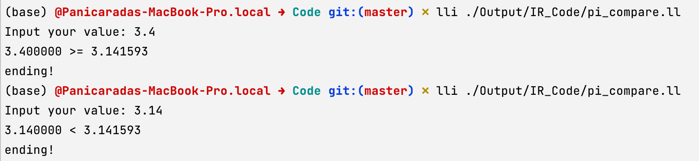
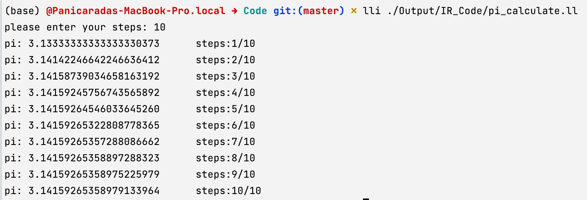

1. `pi_compare`：比较用户输入和$\pi$的相对大小

   ```pascal
   program pi_compare;
   const 
   	pi = 3.1415926;
   var
   	value : real;
   begin
   	write("Input your value: ");
   	read("%lf", value);
   
   	if value >= pi then begin
   		writeln("%lf >= %lf", value, pi);
   	end
   	else begin
   		writeln("%lf < %lf", value, pi);
   	end;
   	writeln("ending!");
   end
   .
   ```

   生成的IR

   ```java
   ; ModuleID = 'main'
   source_filename = "main"
   
   @0 = private unnamed_addr constant [19 x i8] c"Input your value: \00", align 1
   @1 = private unnamed_addr constant [4 x i8] c"%lf\00", align 1
   @2 = private unnamed_addr constant [12 x i8] c"%lf >= %lf\0A\00", align 1
   @3 = private unnamed_addr constant [11 x i8] c"%lf < %lf\0A\00", align 1
   @4 = private unnamed_addr constant [9 x i8] c"ending!\0A\00", align 1
   
   declare i32 @printf(i8*, ...)
   
   declare i32 @scanf(i8*, ...)
   
   define internal void @main() {
   main_entry:
     %value = alloca double, align 8
     %0 = call i32 (i8*, ...) @printf(i8* getelementptr inbounds ([19 x i8], [19 x i8]* @0, i32 0, i32 0))
     %1 = call i32 (i8*, ...) @scanf(i8* getelementptr inbounds ([4 x i8], [4 x i8]* @1, i32 0, i32 0), double* %value)
     %value1 = load double, double* %value, align 8
     %fge_tmp_ = fcmp oge double %value1, 0x400921FB4D12D84A
     br i1 %fge_tmp_, label %if, label %else
   
   if:                                               ; preds = %main_entry
     %value2 = load double, double* %value, align 8
     %2 = call i32 (i8*, ...) @printf(i8* getelementptr inbounds ([12 x i8], [12 x i8]* @2, i32 0, i32 0), double %value2, double 0x400921FB4D12D84A)
     br label %after
   
   else:                                             ; preds = %main_entry
     %value3 = load double, double* %value, align 8
     %3 = call i32 (i8*, ...) @printf(i8* getelementptr inbounds ([11 x i8], [11 x i8]* @3, i32 0, i32 0), double %value3, double 0x400921FB4D12D84A)
     br label %after
   
   after:                                            ; preds = %else, %if
     %4 = call i32 (i8*, ...) @printf(i8* getelementptr inbounds ([9 x i8], [9 x i8]* @4, i32 0, i32 0))
     ret void
   }
   
   ```

   翻译成MIPS

   ```assembly
   	.text
   	.abicalls
   	.option	pic0
   	.section	.mdebug.abi32,"",@progbits
   	.nan	legacy
   	.text
   	.file	"main"
   	.section	.rodata.cst8,"aM",@progbits,8
   	.p2align	3                               # -- Begin function main
   $CPI0_0:
   	.8byte	0x400921fb4d12d84a              # double 3.1415926000000001
   	.text
   	.p2align	2
   	.type	main,@function
   	.set	nomicromips
   	.set	nomips16
   	.ent	main
   main:                                   # @main
   	.cfi_startproc
   	.frame	$sp,40,$ra
   	.mask 	0x80000000,-4
   	.fmask	0x00000000,0
   	.set	noreorder
   	.set	nomacro
   	.set	noat
   # %bb.0:                                # %main_entry
   	addiu	$sp, $sp, -40
   	.cfi_def_cfa_offset 40
   	sw	$ra, 36($sp)                    # 4-byte Folded Spill
   	.cfi_offset 31, -4
   	lui	$1, %hi($__unnamed_1)
   	jal	printf
   	addiu	$4, $1, %lo($__unnamed_1)
   	lui	$1, %hi($__unnamed_2)
   	addiu	$4, $1, %lo($__unnamed_2)
   	jal	scanf
   	addiu	$5, $sp, 24
   	lui	$1, %hi($CPI0_0)
   	ldc1	$f0, %lo($CPI0_0)($1)
   	ldc1	$f2, 24($sp)
   	c.ult.d	$f2, $f0
   	bc1t	$BB0_2
   	nop
   # %bb.1:                                # %if
   	ldc1	$f0, 24($sp)
   	lui	$1, 19730
   	ori	$1, $1, 55370
   	sw	$1, 20($sp)
   	lui	$1, 16393
   	ori	$1, $1, 8699
   	sw	$1, 16($sp)
   	lui	$1, %hi($__unnamed_3)
   	addiu	$4, $1, %lo($__unnamed_3)
   	mfc1	$6, $f1
   	jal	printf
   	mfc1	$7, $f0
   	j	$BB0_3
   	nop
   $BB0_2:                                 # %else
   	ldc1	$f0, 24($sp)
   	lui	$1, 19730
   	ori	$1, $1, 55370
   	sw	$1, 20($sp)
   	lui	$1, 16393
   	ori	$1, $1, 8699
   	sw	$1, 16($sp)
   	lui	$1, %hi($__unnamed_4)
   	addiu	$4, $1, %lo($__unnamed_4)
   	mfc1	$6, $f1
   	jal	printf
   	mfc1	$7, $f0
   $BB0_3:                                 # %after
   	lui	$1, %hi($__unnamed_5)
   	jal	printf
   	addiu	$4, $1, %lo($__unnamed_5)
   	lw	$ra, 36($sp)                    # 4-byte Folded Reload
   	jr	$ra
   	addiu	$sp, $sp, 40
   	.set	at
   	.set	macro
   	.set	reorder
   	.end	main
   $func_end0:
   	.size	main, ($func_end0)-main
   	.cfi_endproc
                                           # -- End function
   	.type	$__unnamed_1,@object            # @0
   	.section	.rodata.str1.1,"aMS",@progbits,1
   $__unnamed_1:
   	.asciz	"Input your value: "
   	.size	$__unnamed_1, 19
   
   	.type	$__unnamed_2,@object            # @1
   $__unnamed_2:
   	.asciz	"%lf"
   	.size	$__unnamed_2, 4
   
   	.type	$__unnamed_3,@object            # @2
   $__unnamed_3:
   	.asciz	"%lf >= %lf\n"
   	.size	$__unnamed_3, 12
   
   	.type	$__unnamed_4,@object            # @3
   $__unnamed_4:
   	.asciz	"%lf < %lf\n"
   	.size	$__unnamed_4, 11
   
   	.type	$__unnamed_5,@object            # @4
   $__unnamed_5:
   	.asciz	"ending!\n"
   	.size	$__unnamed_5, 9
   
   	.section	".note.GNU-stack","",@progbits
   	.text
   
   ```

   运行结果：

   

2. 用BBP公式计算$\pi$
   $$
   \pi = \sum\limits_{k=0}^{\infty}[\frac{1}{16^{k}}(\frac{4}{8k+1}-\frac{2}{8k+4}-\frac{1}{8k+5}-\frac{1}{8k+6})]
   $$
   spl代码：

   ```pascal
   program pi_calculate;
   var
   	pi 	  : real;
   	temp  : real;
   	factor: real;
   	index : integer;
   	steps : integer;
   begin
   	write("please enter your steps: ");
   	read("%d", steps);
   	index := 0;
   	pi    := 0;
   	factor:= 1;
   	for index := 0 to steps-1 do
   	begin
   		temp := 8 * index;
   		pi := pi + factor * (4.0/(temp + 1) - 2.0/(temp+4) - 1.0/(temp+5)-1.0/(temp+6));
   		// index := index + 1;
   		factor := factor / 16;
   		writeln("pi: %.20f	steps:%d/%d", pi, index+1, steps);
   	end;
   end
   .
   ```

   生成的IR

   ```java
   ; ModuleID = 'main'
   source_filename = "main"
   
   @0 = private unnamed_addr constant [26 x i8] c"please enter your steps: \00", align 1
   @1 = private unnamed_addr constant [3 x i8] c"%d\00", align 1
   
   declare i32 @printf(i8*, ...)
   
   declare i32 @scanf(i8*, ...)
   
   define internal void @main() {
   main_entry:
     %index = alloca i32, align 4
     %factor = alloca double, align 8
     %steps = alloca i32, align 4
     %temp = alloca double, align 8
     %pi = alloca double, align 8
     %0 = call i32 (i8*, ...) @printf(i8* getelementptr inbounds ([26 x i8], [26 x i8]* @0, i32 0, i32 0))
     %1 = call i32 (i8*, ...) @scanf(i8* getelementptr inbounds ([3 x i8], [3 x i8]* @1, i32 0, i32 0), i32* %steps)
     store i32 0, i32* %index, align 4
     store double 0.000000e+00, double* %pi, align 8
     store double 1.000000e+00, double* %factor, align 8
     ret void
   }
   ```

   运行结果：

   

3. 函数

   