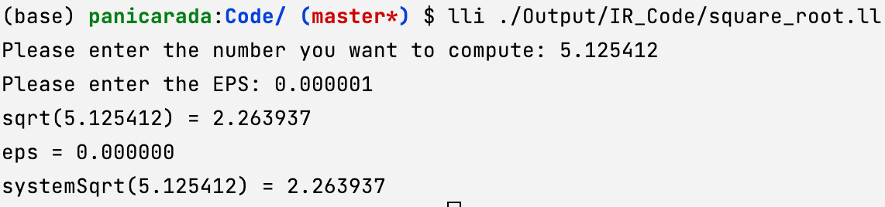
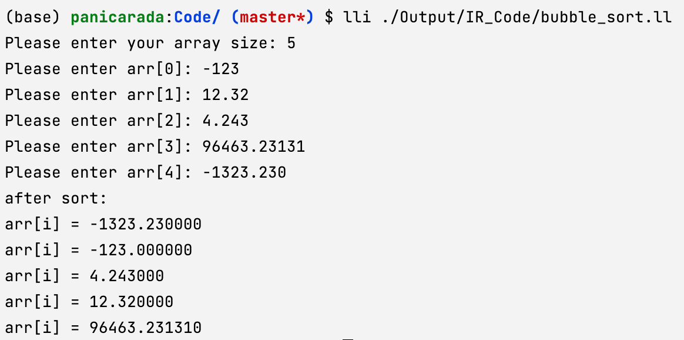

1. `pi_compare`：比较用户输入和$\pi$的相对大小

   ```pascal
   program pi_compare;
   const 
   	pi = 3.1415926;
   var
   	value : real;
   begin
   	write("Input your value: ");
   	read("%lf", value);
   
   	if value >= pi then begin
   		writeln("%lf >= %lf", value, pi);
   	end
   	else begin
   		writeln("%lf < %lf", value, pi);
   	end;
   	writeln("ending!");
   end
   .
   ```

   生成的IR

   ```java
   ; ModuleID = 'main'
   source_filename = "main"
   
   @0 = private unnamed_addr constant [19 x i8] c"Input your value: \00", align 1
   @1 = private unnamed_addr constant [4 x i8] c"%lf\00", align 1
   @2 = private unnamed_addr constant [12 x i8] c"%lf >= %lf\0A\00", align 1
   @3 = private unnamed_addr constant [11 x i8] c"%lf < %lf\0A\00", align 1
   @4 = private unnamed_addr constant [9 x i8] c"ending!\0A\00", align 1
   
   declare i32 @printf(i8*, ...)
   
   declare i32 @scanf(i8*, ...)
   
   define internal void @main() {
   main_entry:
     %value = alloca double, align 8
     %0 = call i32 (i8*, ...) @printf(i8* getelementptr inbounds ([19 x i8], [19 x i8]* @0, i32 0, i32 0))
     %1 = call i32 (i8*, ...) @scanf(i8* getelementptr inbounds ([4 x i8], [4 x i8]* @1, i32 0, i32 0), double* %value)
     %value1 = load double, double* %value, align 8
     %fge_tmp_ = fcmp oge double %value1, 0x400921FB4D12D84A
     br i1 %fge_tmp_, label %if, label %else
   
   if:                                               ; preds = %main_entry
     %value2 = load double, double* %value, align 8
     %2 = call i32 (i8*, ...) @printf(i8* getelementptr inbounds ([12 x i8], [12 x i8]* @2, i32 0, i32 0), double %value2, double 0x400921FB4D12D84A)
     br label %after
   
   else:                                             ; preds = %main_entry
     %value3 = load double, double* %value, align 8
     %3 = call i32 (i8*, ...) @printf(i8* getelementptr inbounds ([11 x i8], [11 x i8]* @3, i32 0, i32 0), double %value3, double 0x400921FB4D12D84A)
     br label %after
   
   after:                                            ; preds = %else, %if
     %4 = call i32 (i8*, ...) @printf(i8* getelementptr inbounds ([9 x i8], [9 x i8]* @4, i32 0, i32 0))
     ret void
   }
   
   ```

   翻译成MIPS

   ```assembly
   	.text
   	.abicalls
   	.option	pic0
   	.section	.mdebug.abi32,"",@progbits
   	.nan	legacy
   	.text
   	.file	"main"
   	.section	.rodata.cst8,"aM",@progbits,8
   	.p2align	3                               # -- Begin function main
   $CPI0_0:
   	.8byte	0x400921fb4d12d84a              # double 3.1415926000000001
   	.text
   	.p2align	2
   	.type	main,@function
   	.set	nomicromips
   	.set	nomips16
   	.ent	main
   main:                                   # @main
   	.cfi_startproc
   	.frame	$sp,40,$ra
   	.mask 	0x80000000,-4
   	.fmask	0x00000000,0
   	.set	noreorder
   	.set	nomacro
   	.set	noat
   # %bb.0:                                # %main_entry
   	addiu	$sp, $sp, -40
   	.cfi_def_cfa_offset 40
   	sw	$ra, 36($sp)                    # 4-byte Folded Spill
   	.cfi_offset 31, -4
   	lui	$1, %hi($__unnamed_1)
   	jal	printf
   	addiu	$4, $1, %lo($__unnamed_1)
   	lui	$1, %hi($__unnamed_2)
   	addiu	$4, $1, %lo($__unnamed_2)
   	jal	scanf
   	addiu	$5, $sp, 24
   	lui	$1, %hi($CPI0_0)
   	ldc1	$f0, %lo($CPI0_0)($1)
   	ldc1	$f2, 24($sp)
   	c.ult.d	$f2, $f0
   	bc1t	$BB0_2
   	nop
   # %bb.1:                                # %if
   	ldc1	$f0, 24($sp)
   	lui	$1, 19730
   	ori	$1, $1, 55370
   	sw	$1, 20($sp)
   	lui	$1, 16393
   	ori	$1, $1, 8699
   	sw	$1, 16($sp)
   	lui	$1, %hi($__unnamed_3)
   	addiu	$4, $1, %lo($__unnamed_3)
   	mfc1	$6, $f1
   	jal	printf
   	mfc1	$7, $f0
   	j	$BB0_3
   	nop
   $BB0_2:                                 # %else
   	ldc1	$f0, 24($sp)
   	lui	$1, 19730
   	ori	$1, $1, 55370
   	sw	$1, 20($sp)
   	lui	$1, 16393
   	ori	$1, $1, 8699
   	sw	$1, 16($sp)
   	lui	$1, %hi($__unnamed_4)
   	addiu	$4, $1, %lo($__unnamed_4)
   	mfc1	$6, $f1
   	jal	printf
   	mfc1	$7, $f0
   $BB0_3:                                 # %after
   	lui	$1, %hi($__unnamed_5)
   	jal	printf
   	addiu	$4, $1, %lo($__unnamed_5)
   	lw	$ra, 36($sp)                    # 4-byte Folded Reload
   	jr	$ra
   	addiu	$sp, $sp, 40
   	.set	at
   	.set	macro
   	.set	reorder
   	.end	main
   $func_end0:
   	.size	main, ($func_end0)-main
   	.cfi_endproc
                                           # -- End function
   	.type	$__unnamed_1,@object            # @0
   	.section	.rodata.str1.1,"aMS",@progbits,1
   $__unnamed_1:
   	.asciz	"Input your value: "
   	.size	$__unnamed_1, 19
   
   	.type	$__unnamed_2,@object            # @1
   $__unnamed_2:
   	.asciz	"%lf"
   	.size	$__unnamed_2, 4
   
   	.type	$__unnamed_3,@object            # @2
   $__unnamed_3:
   	.asciz	"%lf >= %lf\n"
   	.size	$__unnamed_3, 12
   
   	.type	$__unnamed_4,@object            # @3
   $__unnamed_4:
   	.asciz	"%lf < %lf\n"
   	.size	$__unnamed_4, 11
   
   	.type	$__unnamed_5,@object            # @4
   $__unnamed_5:
   	.asciz	"ending!\n"
   	.size	$__unnamed_5, 9
   
   	.section	".note.GNU-stack","",@progbits
   	.text
   
   ```

   运行结果：

   

2. 用BBP公式计算$\pi$
   $$
   \pi = \sum\limits_{k=0}^{\infty}[\frac{1}{16^{k}}(\frac{4}{8k+1}-\frac{2}{8k+4}-\frac{1}{8k+5}-\frac{1}{8k+6})]
   $$
   spl代码：

   ```pascal
   program pi_calculate;
   var
   	pi 	  : real;
   	temp  : real;
   	factor: real;
   	index : integer;
   	steps : integer;
   begin
   	write("please enter your steps: ");
   	read("%d", steps);
   	index := 0;
   	pi    := 0;
   	factor:= 1;
   	for index := 0 to steps-1 do
   	begin
   		temp := 8 * index;
   		pi := pi + factor * (4.0/(temp + 1) - 2.0/(temp+4) - 1.0/(temp+5)-1.0/(temp+6));
   		// index := index + 1;
   		factor := factor / 16;
   		writeln("pi: %.20f	steps:%d/%d", pi, index+1, steps);
   	end;
   end
   .
   ```

   生成的IR

   ```java
   ; ModuleID = 'main'
   source_filename = "main"
   
   @0 = private unnamed_addr constant [26 x i8] c"please enter your steps: \00", align 1
   @1 = private unnamed_addr constant [3 x i8] c"%d\00", align 1
   
   declare i32 @printf(i8*, ...)
   
   declare i32 @scanf(i8*, ...)
   
   define internal void @main() {
   main_entry:
     %index = alloca i32, align 4
     %factor = alloca double, align 8
     %steps = alloca i32, align 4
     %temp = alloca double, align 8
     %pi = alloca double, align 8
     %0 = call i32 (i8*, ...) @printf(i8* getelementptr inbounds ([26 x i8], [26 x i8]* @0, i32 0, i32 0))
     %1 = call i32 (i8*, ...) @scanf(i8* getelementptr inbounds ([3 x i8], [3 x i8]* @1, i32 0, i32 0), i32* %steps)
     store i32 0, i32* %index, align 4
     store double 0.000000e+00, double* %pi, align 8
     store double 1.000000e+00, double* %factor, align 8
     ret void
   }
   ```

   运行结果：

   

3. 平方根

  ```pascal
  program square_root;
  var
  	x : real;
  	eps : real;
  	EPS : real;
  
  
  function mySquareRoot(
  	x : real;
  var
  	eps: real;
  	EPS: real
  	) : real;
  begin
  	mySquareRoot := x;
  	repeat
  		mySquareRoot := (mySquareRoot + x / mySquareRoot) / 2;
  		eps := mySquareRoot * mySquareRoot - x;
  	until eps <= EPS;
  end
  ;
  
  
  begin
  	read("Please enter the number you want to compute: ", x);
  	read("Please enter the EPS: ", EPS);
  
  	writeln("sqrt(", x, ") = ", mySquareRoot(x, eps, EPS));
  	writeln("eps = ", eps);
  	writeln("systemSqrt(", x, ") = ", sqrt(x));
  end
  .
  ```
  
  
  
  
  
  ```java
  ; ModuleID = 'main'
  source_filename = "main"
  
  @string_tmp_ = private unnamed_addr constant [46 x i8] c"Please enter the number you want to compute: \00", align 1
  @format = private unnamed_addr constant [3 x i8] c"%s\00", align 1
  @format.1 = private unnamed_addr constant [4 x i8] c"%lf\00", align 1
  @string_tmp_.2 = private unnamed_addr constant [23 x i8] c"Please enter the EPS: \00", align 1
  @format.3 = private unnamed_addr constant [3 x i8] c"%s\00", align 1
  @format.4 = private unnamed_addr constant [4 x i8] c"%lf\00", align 1
  @string_tmp_.5 = private unnamed_addr constant [6 x i8] c"sqrt(\00", align 1
  @string_tmp_.6 = private unnamed_addr constant [5 x i8] c") = \00", align 1
  @format.7 = private unnamed_addr constant [12 x i8] c"%s%lf%s%lf\0A\00", align 1
  @string_tmp_.8 = private unnamed_addr constant [7 x i8] c"eps = \00", align 1
  @format.9 = private unnamed_addr constant [7 x i8] c"%s%lf\0A\00", align 1
  @string_tmp_.10 = private unnamed_addr constant [12 x i8] c"systemSqrt(\00", align 1
  @string_tmp_.11 = private unnamed_addr constant [5 x i8] c") = \00", align 1
  @format.12 = private unnamed_addr constant [12 x i8] c"%s%lf%s%lf\0A\00", align 1
  
  declare i32 @printf(i8*, ...)
  
  declare i32 @scanf(i8*, ...)
  
  define void @main() {
  main_entry:
    %eps = alloca double, align 8
    %x = alloca double, align 8
    %EPS = alloca double, align 8
    %0 = call i32 (i8*, ...) @printf(i8* getelementptr inbounds ([3 x i8], [3 x i8]* @format, i32 0, i32 0), i8* getelementptr inbounds ([46 x i8], [46 x i8]* @string_tmp_, i32 0, i32 0))
    %1 = call i32 (i8*, ...) @scanf(i8* getelementptr inbounds ([4 x i8], [4 x i8]* @format.1, i32 0, i32 0), double* %x)
    %2 = call i32 (i8*, ...) @printf(i8* getelementptr inbounds ([3 x i8], [3 x i8]* @format.3, i32 0, i32 0), i8* getelementptr inbounds ([23 x i8], [23 x i8]* @string_tmp_.2, i32 0, i32 0))
    %3 = call i32 (i8*, ...) @scanf(i8* getelementptr inbounds ([4 x i8], [4 x i8]* @format.4, i32 0, i32 0), double* %EPS)
    %x1 = load double, double* %x, align 8
    %x2 = load double, double* %x, align 8
    %EPS3 = load double, double* %EPS, align 8
    %4 = call double (double, double*, double, ...) @mySquareRoot(double %x2, double* %eps, double %EPS3)
    %5 = call i32 (i8*, ...) @printf(i8* getelementptr inbounds ([12 x i8], [12 x i8]* @format.7, i32 0, i32 0), i8* getelementptr inbounds ([6 x i8], [6 x i8]* @string_tmp_.5, i32 0, i32 0), double %x1, i8* getelementptr inbounds ([5 x i8], [5 x i8]* @string_tmp_.6, i32 0, i32 0), double %4)
    %eps4 = load double, double* %eps, align 8
    %6 = call i32 (i8*, ...) @printf(i8* getelementptr inbounds ([7 x i8], [7 x i8]* @format.9, i32 0, i32 0), i8* getelementptr inbounds ([7 x i8], [7 x i8]* @string_tmp_.8, i32 0, i32 0), double %eps4)
    %x5 = load double, double* %x, align 8
    %x6 = load double, double* %x, align 8
    %7 = call double (double, ...) @sqrt(double %x6)
    %8 = call i32 (i8*, ...) @printf(i8* getelementptr inbounds ([12 x i8], [12 x i8]* @format.12, i32 0, i32 0), i8* getelementptr inbounds ([12 x i8], [12 x i8]* @string_tmp_.10, i32 0, i32 0), double %x5, i8* getelementptr inbounds ([5 x i8], [5 x i8]* @string_tmp_.11, i32 0, i32 0), double %7)
    ret void
  }
  
  define internal double @mySquareRoot(double %0, double* %1, double %2, ...) {
  mySquareRoot:
    %x = alloca double, align 8
    store double %0, double* %x, align 8
    %EPS = alloca double, align 8
    store double %2, double* %EPS, align 8
    %mySquareRoot1 = alloca double, align 8
    %x2 = load double, double* %x, align 8
    store double %x2, double* %mySquareRoot1, align 8
    br label %loop
  
  loop:                                             ; preds = %loop, %mySquareRoot
    %mySquareRoot3 = load double, double* %mySquareRoot1, align 8
    %x4 = load double, double* %x, align 8
    %mySquareRoot5 = load double, double* %mySquareRoot1, align 8
    %fdiv_tmp_ = fdiv double %x4, %mySquareRoot5
    %fadd_tmp_ = fadd double %mySquareRoot3, %fdiv_tmp_
    %fdiv_tmp_6 = fdiv double %fadd_tmp_, 2.000000e+00
    store double %fdiv_tmp_6, double* %mySquareRoot1, align 8
    %mySquareRoot7 = load double, double* %mySquareRoot1, align 8
    %mySquareRoot8 = load double, double* %mySquareRoot1, align 8
    %fmul_tmp_ = fmul double %mySquareRoot7, %mySquareRoot8
    %x9 = load double, double* %x, align 8
    %fsub_tmp_ = fsub double %fmul_tmp_, %x9
    store double %fsub_tmp_, double* %1, align 8
    %eps = load double, double* %1, align 8
    %EPS10 = load double, double* %EPS, align 8
    %fle_tmp_ = fcmp ole double %eps, %EPS10
    br i1 %fle_tmp_, label %after, label %loop
  
  after:                                            ; preds = %loop
    %3 = load double, double* %mySquareRoot1, align 8
    ret double %3
  }
  
  define double @fabs(double %0, ...) {
  fabs:
    %ret_ = alloca double, align 8
    %fle_tmp_ = fcmp olt double %0, 0.000000e+00
    br i1 %fle_tmp_, label %if_lt_0_, label %else_
  
  if_lt_0_:                                         ; preds = %fabs
    %fneg_tmp_ = fneg double %0
    store double %fneg_tmp_, double* %ret_, align 8
    br label %after_
  
  else_:                                            ; preds = %fabs
    store double %0, double* %ret_, align 8
    br label %after_
  
  after_:                                           ; preds = %else_, %if_lt_0_
    %load_tmp_ = load double, double* %ret_, align 8
    ret double %load_tmp_
  }
  
  define double @sqrt(double %0, ...) {
  sqrt:
    %ret_ = alloca double, align 8
    store double %0, double* %ret_, align 8
    %1 = load double, double* %ret_, align 8
    br label %loop_
  
  loop_:                                            ; preds = %loop_, %sqrt
    %fdiv_tmp_ = fdiv double %1, %0
    %fadd_tmp_ = fadd double %1, %fdiv_tmp_
    %2 = fdiv double %fadd_tmp_, 2.000000e+00
    store double %2, double* %ret_, align 8
    %3 = load double, double* %ret_, align 8
    %fmul_tmp_ = fmul double %3, %3
    %fsub_tmp_ = fsub double %fmul_tmp_, %0
    %4 = call double (double, ...) @fabs(double %fsub_tmp_)
    %fle_tmp_ = fcmp ole double %4, 1.000000e-05
    br i1 %fle_tmp_, label %loop_, label %after_
  
  after_:                                           ; preds = %loop_
    ret double %3
  }
  
  ```
  
  
  
   

4. 冒泡排序

   ```pascal
   program bubble_sort;
   const
   	ZERO = 0;
   	MAX_LEN = 100;
   type
   	Array = array[ZERO .. MAX_LEN] of real;
   var
   	i, j : integer;
   	temp : real;
   	size : integer;
   	arr  : Array;
   
   
   procedure swap(
   	temp : real;
   var
   	x, y : real
   );
   begin
   	temp := x;
   	x := y;
   	y := temp;
   end;
   
   procedure sort(
   	i, j : integer;
   	temp : real;
   var	arr : Array;
   	size : integer
   );
   
   begin
   	for i := 0 to size-1 do
   	begin
   		for j := i downto 1 do
   		begin
   			if (arr[j] < arr[j-1]) then
   			begin	// 交换，气泡上浮
   				swap(temp, arr[j], arr[j-1]);
   			end;
   		end;
   	end;
   end;
   
   begin
   	read("Please enter your array size: ", size);
   	for i := 1 to size do begin
   		write("Please enter arr[", i-1, "]: ");
   		read("", arr[i-1]);
   	end;
   	sort(i, j, temp, arr, size);
   	writeln("after sort: ");
   	i := 0;
   	repeat
   		writeln("arr[i] = ", arr[i]);
   		i := i + 1;
   	until i = size;
   end
   .
   ```
   
   ```java
   ; ModuleID = 'main'
   source_filename = "main"
   
   @string_tmp_ = private unnamed_addr constant [31 x i8] c"Please enter your array size: \00", align 1
   @format = private unnamed_addr constant [3 x i8] c"%s\00", align 1
   @format.1 = private unnamed_addr constant [3 x i8] c"%d\00", align 1
   @string_tmp_.2 = private unnamed_addr constant [18 x i8] c"Please enter arr[\00", align 1
   @string_tmp_.3 = private unnamed_addr constant [4 x i8] c"]: \00", align 1
   @format.4 = private unnamed_addr constant [7 x i8] c"%s%d%s\00", align 1
   @string_tmp_.5 = private unnamed_addr constant [1 x i8] zeroinitializer, align 1
   @format.6 = private unnamed_addr constant [3 x i8] c"%s\00", align 1
   @format.7 = private unnamed_addr constant [4 x i8] c"%lf\00", align 1
   @string_tmp_.8 = private unnamed_addr constant [13 x i8] c"after sort: \00", align 1
   @format.9 = private unnamed_addr constant [4 x i8] c"%s\0A\00", align 1
   @string_tmp_.10 = private unnamed_addr constant [10 x i8] c"arr[i] = \00", align 1
   @format.11 = private unnamed_addr constant [7 x i8] c"%s%lf\0A\00", align 1
   
   declare i32 @printf(i8*, ...)
   
   declare i32 @scanf(i8*, ...)
   
   define void @main() {
   main_entry:
     %size = alloca i32, align 4
     %temp = alloca double, align 8
     %j = alloca i32, align 4
     %i = alloca i32, align 4
     %arr = alloca [100 x double], align 8
     %0 = call i32 (i8*, ...) @printf(i8* getelementptr inbounds ([3 x i8], [3 x i8]* @format, i32 0, i32 0), i8* getelementptr inbounds ([31 x i8], [31 x i8]* @string_tmp_, i32 0, i32 0))
     %1 = call i32 (i8*, ...) @scanf(i8* getelementptr inbounds ([3 x i8], [3 x i8]* @format.1, i32 0, i32 0), i32* %size)
     %size1 = load i32, i32* %size, align 4
     store i32 1, i32* %i, align 4
     br label %loop_condition
   
   loop_condition:                                   ; preds = %loop_body, %main_entry
     %i2 = load i32, i32* %i, align 4
     %ile_tmp_ = icmp sle i32 %i2, %size1
     br i1 %ile_tmp_, label %loop_body, label %after
   
   loop_body:                                        ; preds = %loop_condition
     %i3 = load i32, i32* %i, align 4
     %isub_tmp_ = sub i32 %i3, 1
     %2 = call i32 (i8*, ...) @printf(i8* getelementptr inbounds ([7 x i8], [7 x i8]* @format.4, i32 0, i32 0), i8* getelementptr inbounds ([18 x i8], [18 x i8]* @string_tmp_.2, i32 0, i32 0), i32 %isub_tmp_, i8* getelementptr inbounds ([4 x i8], [4 x i8]* @string_tmp_.3, i32 0, i32 0))
     %i4 = load i32, i32* %i, align 4
     %isub_tmp_5 = sub i32 %i4, 1
     %3 = getelementptr [100 x double], [100 x double]* %arr, i32 0, i32 %isub_tmp_5
     %4 = call i32 (i8*, ...) @printf(i8* getelementptr inbounds ([3 x i8], [3 x i8]* @format.6, i32 0, i32 0), i8* getelementptr inbounds ([1 x i8], [1 x i8]* @string_tmp_.5, i32 0, i32 0))
     %5 = call i32 (i8*, ...) @scanf(i8* getelementptr inbounds ([4 x i8], [4 x i8]* @format.7, i32 0, i32 0), double* %3)
     %iadd_tmp_ = add i32 %i2, 1
     store i32 %iadd_tmp_, i32* %i, align 4
     br label %loop_condition
   
   after:                                            ; preds = %loop_condition
     %i6 = load i32, i32* %i, align 4
     %j7 = load i32, i32* %j, align 4
     %temp8 = load double, double* %temp, align 8
     %size9 = load i32, i32* %size, align 4
     call void (i32, i32, double, [100 x double]*, i32, ...) @sort(i32 %i6, i32 %j7, double %temp8, [100 x double]* %arr, i32 %size9)
     %6 = call i32 (i8*, ...) @printf(i8* getelementptr inbounds ([4 x i8], [4 x i8]* @format.9, i32 0, i32 0), i8* getelementptr inbounds ([13 x i8], [13 x i8]* @string_tmp_.8, i32 0, i32 0))
     store i32 0, i32* %i, align 4
     br label %loop
   
   loop:                                             ; preds = %loop, %after
     %i11 = load i32, i32* %i, align 4
     %7 = getelementptr [100 x double], [100 x double]* %arr, i32 0, i32 %i11
     %8 = load double, double* %7, align 8
     %9 = call i32 (i8*, ...) @printf(i8* getelementptr inbounds ([7 x i8], [7 x i8]* @format.11, i32 0, i32 0), i8* getelementptr inbounds ([10 x i8], [10 x i8]* @string_tmp_.10, i32 0, i32 0), double %8)
     %i12 = load i32, i32* %i, align 4
     %iadd_tmp_13 = add i32 %i12, 1
     store i32 %iadd_tmp_13, i32* %i, align 4
     %i14 = load i32, i32* %i, align 4
     %size15 = load i32, i32* %size, align 4
     %ieq_tmp_ = icmp eq i32 %i14, %size15
     br i1 %ieq_tmp_, label %after10, label %loop
   
   after10:                                          ; preds = %loop
     ret void
   }
   
   define internal void @swap(double %0, double* %1, double* %2, ...) {
   swap:
     %temp = alloca double, align 8
     store double %0, double* %temp, align 8
     %x = load double, double* %1, align 8
     store double %x, double* %temp, align 8
     %y = load double, double* %2, align 8
     store double %y, double* %1, align 8
     %temp1 = load double, double* %temp, align 8
     store double %temp1, double* %2, align 8
     ret void
   }
   
   define internal void @sort(i32 %0, i32 %1, double %2, [100 x double]* %3, i32 %4, ...) {
   sort:
     %i = alloca i32, align 4
     store i32 %0, i32* %i, align 4
     %j = alloca i32, align 4
     store i32 %1, i32* %j, align 4
     %temp = alloca double, align 8
     store double %2, double* %temp, align 8
     %size = alloca i32, align 4
     store i32 %4, i32* %size, align 4
     %size1 = load i32, i32* %size, align 4
     %isub_tmp_ = sub i32 %size1, 1
     store i32 0, i32* %i, align 4
     br label %loop_condition
   
   loop_condition:                                   ; preds = %after6, %sort
     %i2 = load i32, i32* %i, align 4
     %ile_tmp_ = icmp sle i32 %i2, %isub_tmp_
     br i1 %ile_tmp_, label %loop_body, label %after
   
   loop_body:                                        ; preds = %loop_condition
     %i3 = load i32, i32* %i, align 4
     store i32 %i3, i32* %j, align 4
     br label %loop_condition4
   
   after:                                            ; preds = %loop_condition
     ret void
   
   loop_condition4:                                  ; preds = %after11, %loop_body
     %j7 = load i32, i32* %j, align 4
     %ige_tmp_ = icmp sge i32 %j7, 1
     br i1 %ige_tmp_, label %loop_body5, label %after6
   
   loop_body5:                                       ; preds = %loop_condition4
     %j8 = load i32, i32* %j, align 4
     %5 = getelementptr [100 x double], [100 x double]* %3, i32 0, i32 %j8
     %6 = load double, double* %5, align 8
     %j9 = load i32, i32* %j, align 4
     %isub_tmp_10 = sub i32 %j9, 1
     %7 = getelementptr [100 x double], [100 x double]* %3, i32 0, i32 %isub_tmp_10
     %8 = load double, double* %7, align 8
     %flt_tmp_ = fcmp olt double %6, %8
     br i1 %flt_tmp_, label %if, label %else
   
   after6:                                           ; preds = %loop_condition4
     %iadd_tmp_ = add i32 %i2, 1
     store i32 %iadd_tmp_, i32* %i, align 4
     br label %loop_condition
   
   if:                                               ; preds = %loop_body5
     %temp12 = load double, double* %temp, align 8
     %j13 = load i32, i32* %j, align 4
     %9 = getelementptr [100 x double], [100 x double]* %3, i32 0, i32 %j13
     %j14 = load i32, i32* %j, align 4
     %isub_tmp_15 = sub i32 %j14, 1
     %10 = getelementptr [100 x double], [100 x double]* %3, i32 0, i32 %isub_tmp_15
     call void (double, double*, double*, ...) @swap(double %temp12, double* %9, double* %10)
     br label %after11
   
   else:                                             ; preds = %loop_body5
     br label %after11
   
   after11:                                          ; preds = %else, %if
     %isub_tmp_16 = sub i32 %j7, 1
     store i32 %isub_tmp_16, i32* %j, align 4
     br label %loop_condition4
   }
   ```
   
   运行结果：
   
   